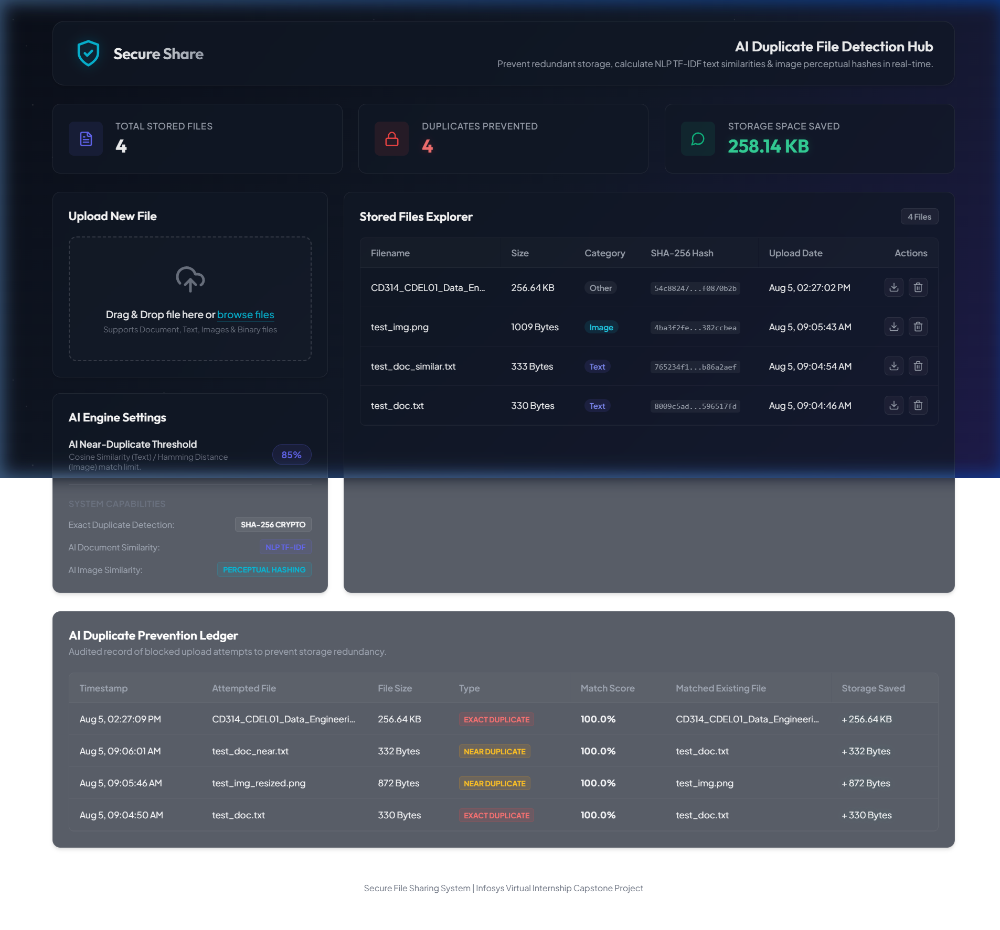
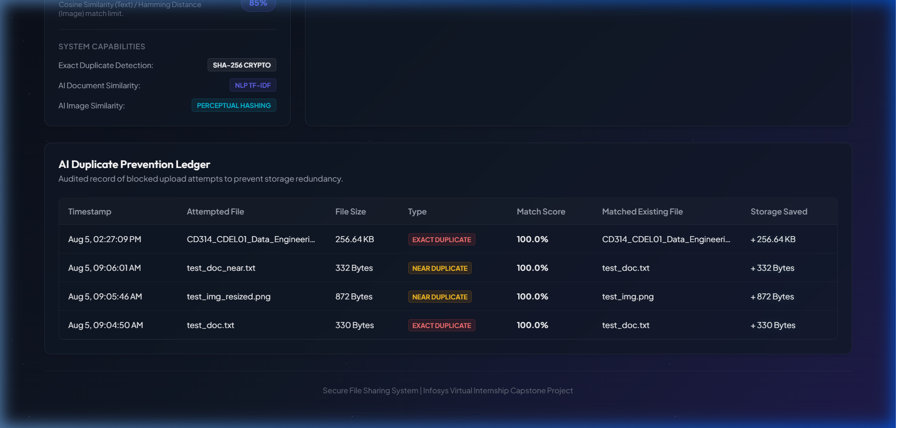

# Secure File Sharing System — AI Duplicate File Detection Engine

An intelligent duplicate and similarity detection module for secure file sharing platforms. Built with FastAPI, SQLite, NLP TF-IDF, Perceptual Image Hashing (aHash), and SHA-256 cryptographic hashing.

---

## 📸 Project Screenshots

### AI Duplicate File Detection Hub Dashboard


### AI Duplicate Prevention Ledger


---

## ✨ Features

- **Cryptographic Exact Matching (SHA-256)**: Instantly detects byte-for-byte duplicate files prior to storage upload.
- **NLP Text Similarity (TF-IDF & Cosine Similarity)**: Identifies near-duplicate text documents based on content analysis and configurable thresholds.
- **Perceptual Image Hashing (aHash)**: Detects resized, recompressed, or visually similar image uploads using Hamming distance comparison.
- **Real-Time Prevention Ledger**: Audit log tracking all blocked duplicate upload attempts along with storage space saved.
- **Interactive UI Dashboard**: Modern dark-mode interface with live metrics, upload drag-and-drop, and file management.

---

## 📁 Repository Structure

```
.
├── client/                      # Client UI Applications
│   ├── frontend/                # Dashboard UI (HTML, CSS, JS)
│   └── src/                     # React / Vite Client Application
├── server/                      # Server Applications & APIs
│   └── backend/                 # AI Duplicate Detection FastAPI Module
│       ├── database.py          # SQLite connection & CRUD operations
│       ├── duplicate_detector.py # SHA-256, TF-IDF, aHash algorithms
│       ├── main.py              # FastAPI endpoints & static file server
│       ├── models.py            # Pydantic schemas
│       └── test_duplicate_detector.py # Unit tests
├── storage/                     # Unique stored files directory
├── metadata.db                  # SQLite database tracking file metadata & audit logs
├── dashboard_screenshot.png     # Dashboard screenshot
├── duplicate_prevention_ledger.png # Audit ledger screenshot
└── run.py                       # Application starter script
```

---

## 🚀 Quick Start

### 1. Requirements
- Python 3.10+
- Dependencies: `fastapi`, `uvicorn`, `pillow`, `python-dotenv`, `sqlalchemy`

### 2. Run Application
Run the launcher script from the workspace root:

```bash
python run.py
```

Or run the AI Duplicate Engine server directly:

```bash
python -m uvicorn server.backend.main:app --host 127.0.0.1 --port 8000
```

Access the Dashboard UI at `http://127.0.0.1:8000`.

### 3. Run Unit Tests
```bash
python -m unittest server/backend/test_duplicate_detector.py
```
