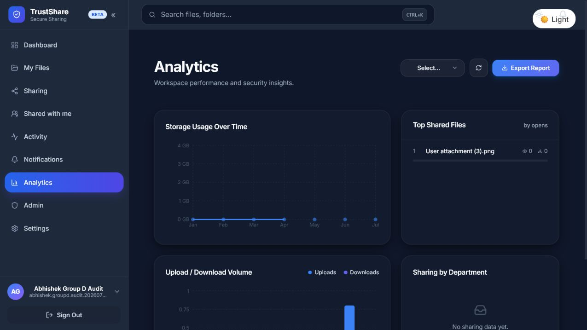
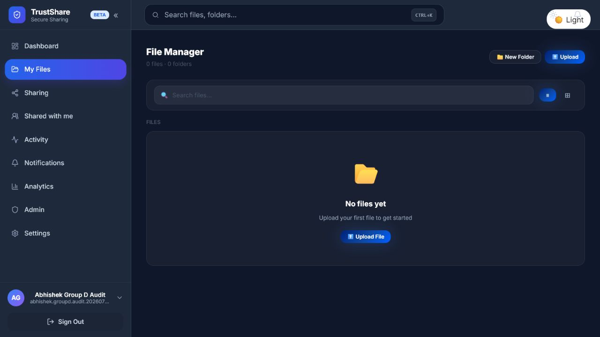
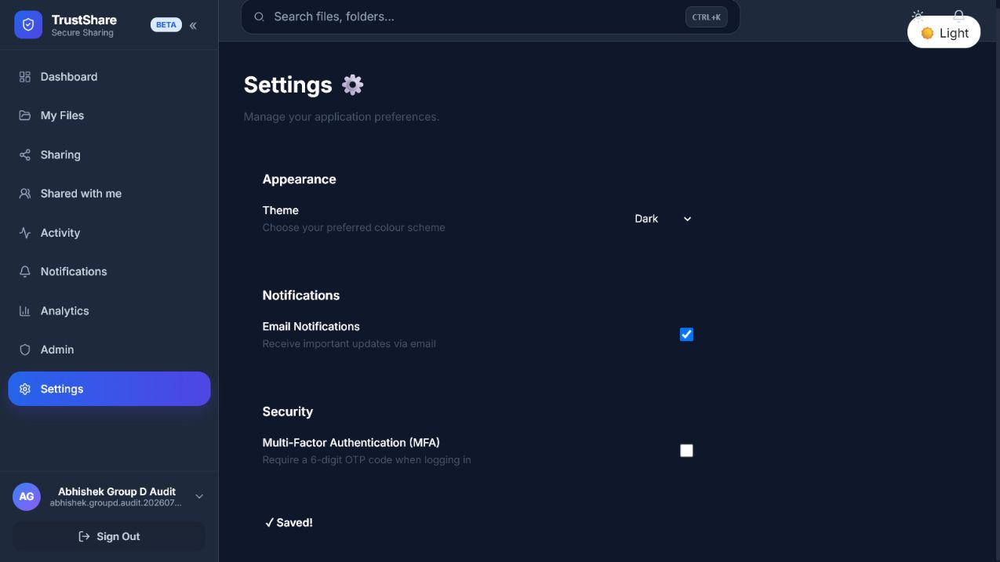
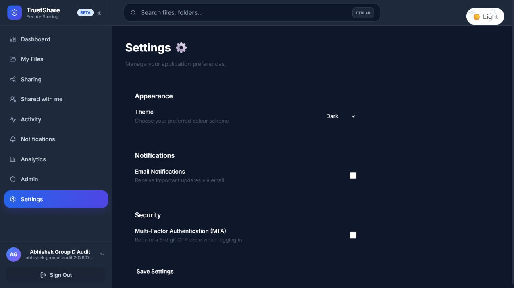
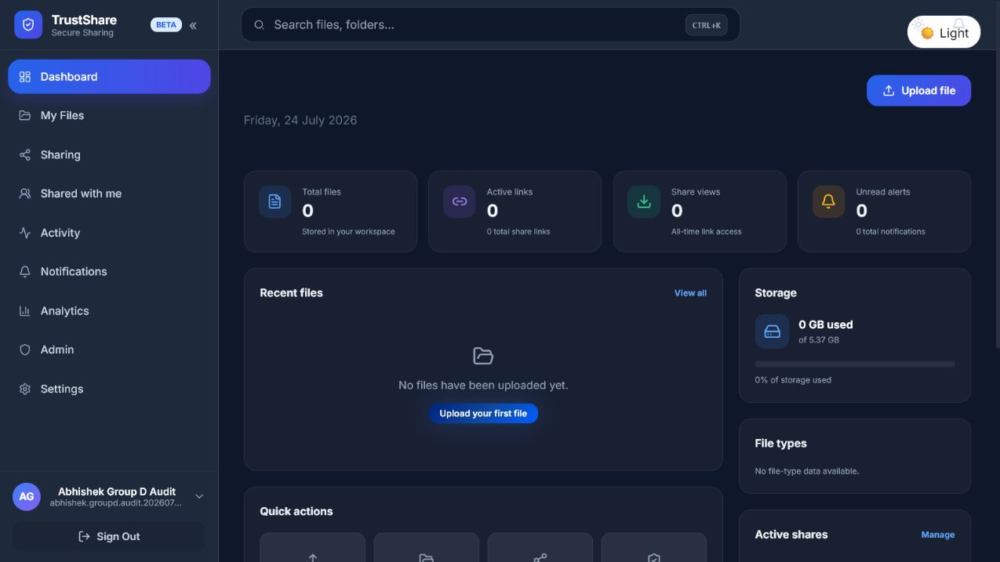
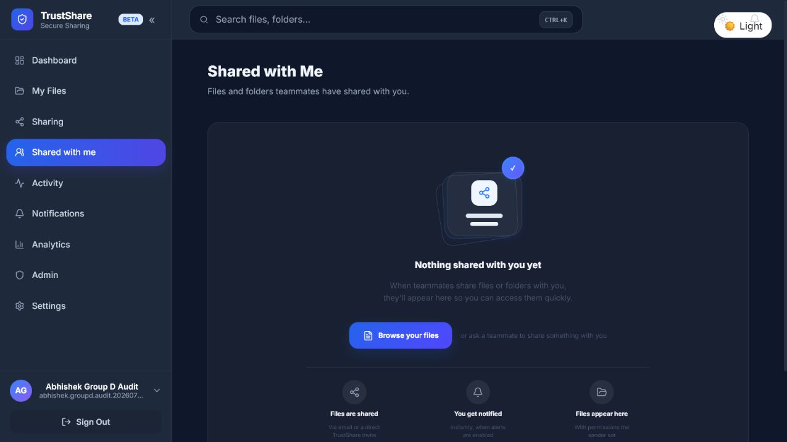
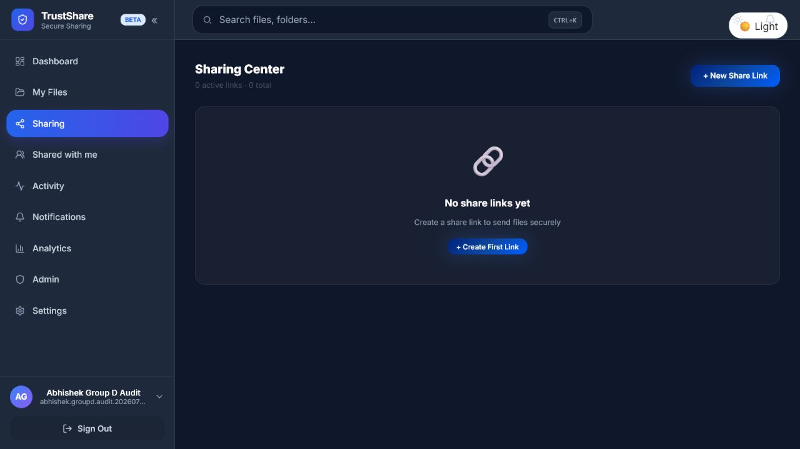
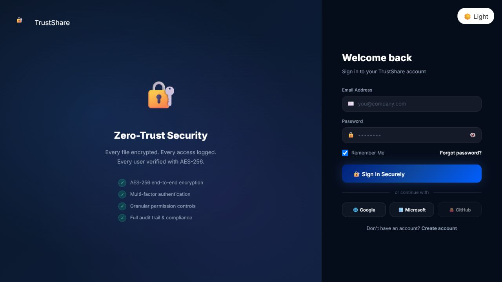

# Group D merged-modules anomaly audit

Audit date: **24 July 2026**

Audited branch: **`main-group-D`**

Audited commit: **`47bb953324e64eda0768e184b733d5b00c146ffe`**

## Purpose and scope

This document records anomalies found while reviewing and locally exercising the modules already merged into Group D. Open and draft pull requests were excluded from the source audit. The following assigned/demo modules were checked:

- Dashboard
- Shared With Me
- Deployment
- Encryption & Security
- Analytics
- Page Layout Redesign
- User Authentication
- Settings

The source audit used an isolated deployment-branch copy because the merged branch does not currently compile. The labelled UI evidence below was captured directly from the live Render deployment at **https://trustshare-group-d.onrender.com** using a temporary audit account. No screenshot in the live-evidence section was generated or mocked.

## Executive summary

The audit reproduced **five P1 findings** and **four P2 findings**. The most urgent group-wide problems are:

1. The merged frontend cannot create a production build because `Navbar.js` contains conflicting component implementations.
2. The merged backend cannot compile because `swagger_login` declares `request` twice.
3. `/api/users/` and `/api/users/{id}` disclose user information without authentication.
4. A fresh database creates Analytics tables without the configuration seed data required by the Analytics summary.
5. The merged branch has no GitHub Actions workflow and no frontend test files to prevent these integration failures.

## Changes required across the whole Group D project

### P1 — Restore a buildable merged baseline

- Reconcile the two `Navbar` implementations in `client/src/layout/Navbar.js`.
- Remove the duplicate `request` argument in `server/src/auth/controller.py`.
- Require frontend build and backend compile checks before merge.

### P1 — Apply consistent API authorization

- Protect the user-directory routes with authentication.
- Restrict directory-wide user listing and system statistics to administrators or an explicitly tenant-scoped role.
- Keep backend role checks as the security boundary even when navigation items are hidden.

### P1 — Make database initialization repeatable

- Add versioned migrations instead of relying only on `Base.metadata.create_all()`.
- Seed required Analytics configuration idempotently during migration/startup.
- Verify a fresh database with an automated smoke test.

### P2 — Add a shared quality gate

- Frontend production build and lint.
- Backend compilation plus unit/integration tests.
- API contract smoke tests for all merged modules.
- Fresh-database migration and seed verification.
- Dependency and security scanning with an agreed severity policy.

## Module-specific findings

| Module | Result | Finding | Priority |
|---|---|---|---|
| Dashboard | Loads on the isolated runtime | No Dashboard-specific defect reproduced; the merged build failures block its normal demo. | Group-wide blockers |
| Shared With Me | Incomplete workflow | Receiver listing/download exists, but there is no sender-side permission grant/revoke API or invite workflow. | P1 |
| Deployment | Local health check passes | Working deployment branch builds and its backend tests pass; dependency and quality-gate findings remain. | P2 |
| Encryption & Security | User data exposed | User-directory endpoints return user details without a token. | P1 |
| Analytics | UI returns an error | Summary returns 500 on a fresh database; a member can still read global users and system statistics. | P1 |
| Page Layout Redesign | Merged frontend blocked | Conflicting Navbar implementation prevents the production build. | P1 |
| User Authentication | Merged backend blocked | Duplicate `request` parameter prevents Python compilation and API startup. | P1 |
| Settings | Partially functional | Email Notifications can show “Saved!” but the value is neither sent to the backend nor persisted locally. | P2 |

## Labelled live-deployment evidence

Capture source for every image in this section: **https://trustshare-group-d.onrender.com** on **24 July 2026**. These are raw browser screenshots of the deployed application; labels and explanations are kept outside the images.

### Anomaly 01 — Analytics data-isolation dispute

A newly created member account with no files can open Analytics and sees `User attachment (3).png` under Top Shared Files.

Comparison: the same account's Dashboard and File Manager both report zero files.

### Anomaly 02 — Settings reports Saved but loses the value

Email Notifications was enabled and the deployed UI displayed `Saved!`.

Reloading the deployed Settings route returns Email Notifications to disabled.

Initial state before the test:

### Anomaly 03 — Member sees a non-functional Admin navigation item

The standard member sidebar displays an Admin link. Opening `/admin` redirects the member to Dashboard, leaving a visible but non-functional navigation item.

### Anomaly 04 — Shared With Me promises a workflow the deployed Sharing page does not provide

Shared With Me describes email/direct TrustShare invitations and sender-set permissions.

The deployed Sharing Center exposes share-link creation but no teammate invitation or permission grant/revoke action.

### Live authentication verification — not classified as an anomaly

The deployed login page responds successfully. It is retained only as deployment/authentication verification.

The frontend build conflict, backend syntax error, public API authorization, missing migrations/seed data, and missing quality gates are source/build findings and cannot be truthfully demonstrated by screenshots of a working deployed UI. They remain documented above without fabricated live screenshots.

## Verification performed

- Confirmed the audited commit matches the current GitHub `main-group-D` branch tip.
- Reproduced the merged frontend production-build failure.
- Reproduced the merged backend Python compilation failure.
- Built the isolated deployment frontend successfully.
- Ran the isolated backend suite: **13 passed** with **11 deprecation warnings**.
- Started the combined frontend/backend locally and verified `/health` returned **200**.
- Exercised the relevant pages with disposable admin and member accounts.
- Captured the labelled anomaly evidence directly from the live Render deployment with a temporary member account.
- Verified unauthenticated and member-authenticated API behavior.
- Inspected a fresh SQLite database for tables, migrations, and Analytics seed rows.

## Non-goals

This pull request is documentation-only. It does not fix, modify, or resolve any application code, existing review comment, open pull request, deployment, database, or cloud resource.
