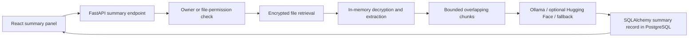

# Project Root

This repository contains the full-stack application:
- client/ - React frontend
- server/ - FastAPI backend

The dashboard follows the shared application structure:
- `client/src/pages/Dashboard.js` is the route-level page.
- `client/src/features/dashboard/` contains dashboard components, hooks, and services.
- `server/src/dashboard/` contains the dashboard controller, models, and database service.
- The authenticated `GET /api/dashboard/` endpoint loads all dashboard data from the application database.
# project root navigation 
cd project-root
# Start the server:
cd server
python -m src.main

# Start the client:
cd client
npm start

## PostgreSQL development environment

TrustShare uses PostgreSQL for development, integration, and production. SQLAlchemy is the application data layer and connects to PostgreSQL through `psycopg2`.

```powershell
cd project-root/server
Copy-Item .env.example .env
docker compose up --build
```

The Compose stack starts PostgreSQL 16, waits for its health check, and then starts FastAPI. Override `POSTGRES_DB`, `POSTGRES_USER`, and `POSTGRES_PASSWORD` outside source control when shared credentials are required. SQLite remains available only to isolated unit tests.

## AI-powered file summaries

Authorised users can generate summaries from **My Files** and **Shared With Me** without sending plaintext to the browser. Supported formats are `.txt`, `.md`, `.pdf`, `.docx`, `.pptx`, `.csv`, and `.xlsx`. Image-only PDFs return an explicit OCR-not-enabled message.



### Privacy and security

- Every endpoint requires JWT authentication and backend file authorisation.
- Encrypted files are decrypted only in backend memory; extracted text is neither persisted nor logged.
- External document processing is blocked unless `ALLOW_EXTERNAL_AI=true` and Hugging Face is explicitly selected.
- Document text is treated as untrusted prompt content. Summary prompts prohibit following document instructions or revealing configuration.
- Requests are rate-limited, file size and type are validated, and unchanged summaries are reused by checksum and options.
- Successful and failed jobs create safe activity records; completed jobs reuse the notification table.

### Local Ollama setup

1. Install Ollama and run `ollama pull qwen2.5:1.5b`.
2. Copy `server/.env.example` to `server/.env`.
3. Keep `AI_SUMMARY_PROVIDER=ollama` and start Ollama on `http://localhost:11434`.
4. Start FastAPI and React normally. If Ollama is offline and `ENABLE_SUMMARY_FALLBACK=true`, TrustShare clearly labels the deterministic extractive fallback.

Optional Hugging Face inference requires `AI_SUMMARY_PROVIDER=huggingface`, `ALLOW_EXTERNAL_AI=true`, `HF_API_TOKEN`, and `HF_SUMMARY_MODEL`. Never place the token in the client environment.

### Summary API

```http
POST /api/files/{file_id}/summaries
GET /api/files/{file_id}/summaries
GET /api/files/{file_id}/summaries/latest
GET /api/files/{file_id}/summaries/{summary_id}
POST /api/files/{file_id}/summaries/{summary_id}/regenerate
DELETE /api/files/{file_id}/summaries/{summary_id}
```

New jobs return `202`; identical completed results return `200` with `cached: true`. The frontend polls persisted `pending`/`processing` records until `completed` or `failed`.

### Database and tests

This repository does not use Alembic. Models are registered with the existing `Base.metadata.create_all()` initialization. Use a fresh database when schema definitions change until versioned migrations are introduced.

```powershell
cd server
python -m pip install -r requirements-dev.txt
pytest -q

cd ../client
npm ci
npm test -- --watchAll=false
npm run build
```

Known limitations: background work uses FastAPI `BackgroundTasks`, so running jobs are not retried after a process restart; local rate limiting is process-local; extractive fallback cannot reliably translate content; OCR is not implemented.
