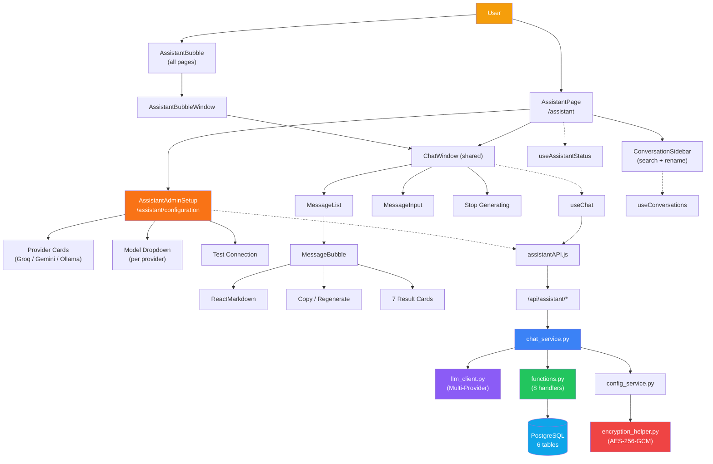
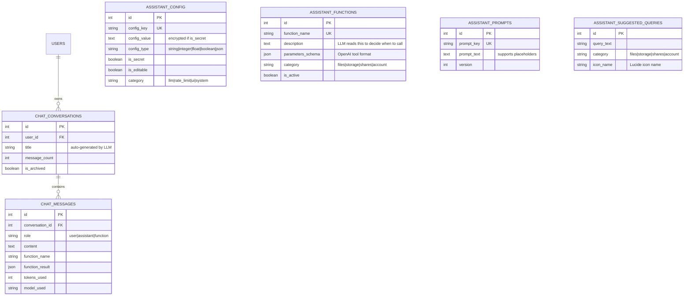

<div align="center">


### 🤖 TrustShare — Secure File-Sharing System

**An enterprise-grade AI assistant that turns natural language into real database queries.**

<br/>

<br/>


</div>


<br/>

> *"Ask anything about your files, storage, or shares — the AI fetches real data and answers in natural language. Multi-provider, encrypted, zero hardcoding."*

</div>

<br/>

## 📋 Table of Contents

<table>
<tr>
<td valign="top" width="50%">

**Overview**
- [🎯 Executive Summary](#-executive-summary)
- [✨ Key Highlights](#-key-highlights)
- [🏗️ System Architecture](#️-system-architecture)
- [🔗 Component Relationship Diagram](#-component-relationship-diagram)
- [🗄️ Entity Relationship Diagram](#️-entity-relationship-diagram)
- [📊 Feature Matrix](#-feature-matrix)
- [📁 Project Directory](#-project-directory)

</td>
<td valign="top" width="50%">

**Deep Dive**
- [🔌 API Endpoints & Functions](#-api-endpoints--functions)
- [🔐 Security Architecture](#-security-architecture)
- [⚙️ Configuration System](#️-configuration-system)
- [🎨 UI Components & UX](#-ui-components--ux)
- [🧪 Test Results](#-test-results)
- [🚀 Setup Instructions](#-setup-instructions)
- [👤 Credits & Author](#-credits--author)

</td>
</tr>
</table>


<div align="center">

━━━━━━━━━━━━━━━━━━━━━━━━━━━━━━━━━━━━━━━━━━━━━━━━━━━━━━━━━━━━━━━━━━━━

</div>

## 🎯 Feature Overview

**Assigned By:** Mentor  
**Feature:** #19 (AI Assistant Chatbot) + #20 (Natural Language Search)  
**Category:** AI Enhancement (Wow Factor)  
**PSD Alignment:** New capability  

| Detail | Value |
|:--|:--|
| **Developer** | Badal Kumar Rai |
| **Feature Branch** | `Group-D-Feature/AIChatAssistant-Badal` |
| **LLM Provider** | Groq (free tier) |
| **Default Model** | llama-3.3-70b-versatile |
| **Backend Files** | 21 new files |
| **Frontend Files** | 29 new files |
| **DB Tables Added** | 6 new tables |
| **API Endpoints Added** | 12 endpoints |
| **Configurable via UI** | ✅ Yes (admin panel) |
| **Config Storage** | 100% database (no `.env` for feature configs) |
| **API Key Storage** | Encrypted with AES-256-GCM |


<div align="center">

━━━━━━━━━━━━━━━━━━━━━━━━━━━━━━━━━━━━━━━━━━━━━━━━━━━━━━━━━━━━━━━━━━━━

</div>

## 🎯 Executive Summary

The **AI Assistant Module** brings natural language intelligence to TrustShare. Users type questions like *"how much storage do I have?"* or *"show me PDFs I uploaded last week"* — and the AI calls real database functions, returns actual data, and formats beautiful responses.

Built with a **multi-provider architecture** (Groq, Google Gemini, Ollama), the system supports seamless provider switching, encrypted API key storage, and complete database-driven configuration — ensuring anyone can set up and customize the AI without touching code.

### 💼 Business Impact

| Metric | Value |
|:--|:--|
| 🤖 **Intelligence** | LLM function calling with 8 real database operations |
| 🔄 **Providers** | 3 LLM providers (Groq, Gemini, Ollama) — switch with one click |
| 🔐 **Security** | AES-256-GCM encrypted API keys with AAD binding |
| ⚙️ **Configuration** | 30+ settings in DB — admin UI for everything, zero .env dependency |
| 🎨 **User Experience** | Dual UI (full page + floating bubble) with 7 rich result cards |
| 🧪 **Quality** | 47 automated tests covering encryption, functions, RBAC, isolation |

<br/>

## ✨ Key Highlights

<table>
<tr>
<td width="33%" valign="top" align="center">

### 🤖
### Function Calling
LLM analyzes user intent and calls the right function — `get_storage_info`, `list_files`, `find_shares` — returning real PostgreSQL data.

</td>
<td width="33%" valign="top" align="center">

### 🔄
### Multi-Provider
Groq for speed, Gemini for volume, Ollama for privacy. Admin switches providers with one click — no code changes needed.

</td>
<td width="33%" valign="top" align="center">

### 🔐
### Enterprise Security
API keys encrypted with AES-256-GCM. Per-user conversation isolation. Admin-only configuration. Secrets never exposed to frontend.

</td>
</tr>
<tr><td colspan="3"><br/></td></tr>
<tr>
<td valign="top" align="center">

### ⚙️
### Zero Hardcoding
30+ configs, 12+ prompts, 10 suggestions, 8 function schemas — all in PostgreSQL. Editable via admin UI without redeployment.

</td>
<td valign="top" align="center">

### 💬
### Dual Chat UI
Full-page `/assistant` with conversation sidebar + floating bubble on every page. Markdown, copy, regenerate, stop generating.

</td>
<td valign="top" align="center">

### 🧪
### 47 Tests Passing
Encryption round-trip, config caching, all 8 functions, RBAC enforcement, conversation isolation — comprehensive backend coverage.

</td>
</tr>
</table>

<div align="center">

━━━━━━━━━━━━━━━━━━━━━━━━━━━━━━━━━━━━━━━━━━━━━━━━━━━━━━━━━━━━━━━━━━━━

</div>

## 🏗️ System Architecture

<details open>
<summary><b>🤖 Chat Message Flow (Function Calling)</b> — click to collapse</summary>

```
┌──────────────────────────────────────────────────────────────┐
│                     USER SENDS MESSAGE                       │
│                                                              │
│  "How much storage do I have?"                               │
│       ↓                                                      │
│  POST /api/assistant/chat                                    │
│       ↓                                                      │
│  ┌─ Rate Limiter (from DB config) ──────────────────────┐    │
│  └──────────────────────────────────────────────────────┘    │
│       ↓                                                      │
│  ┌─ chat_service.process_chat() ────────────────────────┐    │
│  │                                                      │    │
│  │  1. Load system prompt from DB                       │    │
│  │  2. Save user message to DB                          │    │
│  │  3. Build clean LLM context:                         │    │
│  │     [system prompt] + [current message only]         │    │
│  │     (no history — prevents context pollution)        │    │
│  │  4. Load 8 active functions from DB                  │    │
│  │                                                      │    │
│  │  ┌─ FUNCTION CALLING LOOP ───────────────────────┐   │    │
│  │  │                                               │   │    │
│  │  │  Send to LLM: messages + 8 tool definitions   │   │    │
│  │  │       ↓                                       │   │    │
│  │  │  LLM returns: tool_call(get_storage_info, {}) │   │    │
│  │  │       ↓                                       │   │    │
│  │  │  Coerce parameter types (string→int/bool)     │   │    │
│  │  │  Execute function → real PostgreSQL query      │   │    │
│  │  │  Send result back to LLM                       │   │    │
│  │  │       ↓                                       │   │    │
│  │  │  LLM returns: "You have 2.7 MB used of 5 GB" │   │    │
│  │  │                                               │   │    │
│  │  └───────────────────────────────────────────────┘   │    │
│  │                                                      │    │
│  │  5. Save assistant response to DB                    │    │
│  │  6. Auto-generate conversation title                 │    │
│  └──────────────────────────────────────────────────────┘    │
│       ↓                                                      │
│  Response: { message, function_calls, tokens_used }          │
│       ↓                                                      │
│  Frontend renders: text + StorageCard with progress bar      │
└──────────────────────────────────────────────────────────────┘
```

</details>

<details>
<summary><b>🔐 API Key Encryption Flow</b> — click to expand</summary>

```
ADMIN SAVES API KEY
    ↓
PUT /api/assistant/admin/config/LLM_API_KEY
    ↓
config_service.set_value()
    ├── Detect is_secret=True for this config
    ├── encrypt_config_value(plain_key)
    │   ├── Load master_key from master_key.py
    │   ├── AES-256-GCM encrypt with AAD binding
    │   └── Base64 encode + "enc_v1:" prefix
    └── Store in DB: "enc_v1:k/S6SRIINUXetLLX+ZagE/w..."

RUNTIME USES API KEY
    ↓
llm_client.chat_completion()
    ├── config_service.get("LLM_API_KEY")
    ├── Detect "enc_v1:" prefix → decrypt with master key
    └── Use decrypted key in HTTP Authorization header

ADMIN VIEWS CONFIG
    ↓
GET /api/assistant/admin/config
    └── For secrets: return "••••••••••••tAha" (masked, never raw)
```

</details>

<details>
<summary><b>🔄 Multi-Provider Switching</b> — click to expand</summary>

```
Admin clicks provider card in UI
    ↓
POST /api/assistant/admin/switch-provider
    ├── Validates provider exists in LLM_AVAILABLE_PROVIDERS config
    ├── Atomically updates: LLM_PROVIDER + LLM_BASE_URL + LLM_MODEL
    ├── Encrypts API key if provided
    └── Clears config cache → immediate effect

┌─────────────────────────────────────────────────────────────┐
│  All providers use OpenAI-compatible API format              │
│  Only base_url and auth header differ                        │
│                                                              │
│  Groq:   api.groq.com/openai/v1       Bearer gsk_...        │
│  Gemini: generativelanguage.googleapis.com/v1beta/openai     │
│  Ollama: localhost:11434/v1            No auth (local)       │
└─────────────────────────────────────────────────────────────┘
```

</details>

<br/>

## 🔗 Component Relationship Diagram



<div align="center">

━━━━━━━━━━━━━━━━━━━━━━━━━━━━━━━━━━━━━━━━━━━━━━━━━━━━━━━━━━━━━━━━━━━━

</div>

## 🗄️ Entity Relationship Diagram



<div align="center">

━━━━━━━━━━━━━━━━━━━━━━━━━━━━━━━━━━━━━━━━━━━━━━━━━━━━━━━━━━━━━━━━━━━━

</div>

## 📊 Feature Matrix

### 🔹 Backend Features

| # | Feature | Category | Impact |
|:--:|:--|:--|:--:|
| 1 | Multi-provider LLM (Groq, Gemini, Ollama) | Intelligence | 🔴 Critical |
| 2 | Function calling with 8 handlers | Intelligence | 🔴 Critical |
| 3 | AES-256-GCM API key encryption | Security | 🔴 Critical |
| 4 | Per-user conversation isolation | Security | 🔴 Critical |
| 5 | DB-driven configuration (30+ configs) | Architecture | 🔴 Critical |
| 6 | Clean LLM context (no history pollution) | Intelligence | 🔴 High |
| 7 | Type coercion for function parameters | Reliability | 🟠 High |
| 8 | Rate limiting per user (from DB) | Security | 🟠 High |
| 9 | Idempotent seeders (safe on every startup) | DevOps | 🟠 Medium |
| 10 | Auto-generated conversation titles | UX | 🟠 Medium |
| 11 | Atomic provider switching | Architecture | 🟠 Medium |
| 12 | 12+ customizable prompts in DB | Flexibility | 🟠 Medium |

### 🔸 Frontend Features

| # | Feature | Category | Impact |
|:--:|:--|:--|:--:|
| 13 | Full-page chat at `/assistant` | UI | 🔴 Critical |
| 14 | Floating bubble on all pages | UI | 🔴 High |
| 15 | Premium admin setup with provider cards | Admin | 🔴 High |
| 16 | 7 rich result cards | UX | 🔴 High |
| 17 | Markdown rendering (bold, lists, code, tables) | UX | 🟠 High |
| 18 | Conversation sidebar (date-grouped, search, rename) | UX | 🟠 High |
| 19 | Copy message button | UX | 🟠 Medium |
| 20 | Regenerate response button | UX | 🟠 Medium |
| 21 | Stop generating button | UX | 🟠 Medium |
| 22 | Auto-updating model dropdown per provider | Admin | 🟠 Medium |
| 23 | Test connection with timing | Admin | 🟠 Medium |
| 24 | Bubble conversation persistence (sessionStorage) | UX | 🟠 Medium |
| 25 | URL-based routing with breadcrumbs | Navigation | 🟠 Medium |
| 26 | Bubble auto-close on outside click / navigation | UX | 🟡 Low |
| 27 | Token usage badges (togglable) | Transparency | 🟡 Low |
| 28 | Suggested queries from DB (10 examples) | Onboarding | 🟡 Low |

<div align="center">

━━━━━━━━━━━━━━━━━━━━━━━━━━━━━━━━━━━━━━━━━━━━━━━━━━━━━━━━━━━━━━━━━━━━

</div>

## 📁 Project Directory

<details open>
<summary><b>🗂️ Backend Files (22 new)</b> — click to collapse</summary>

```
server/src/assistant/                    🆕 NEW MODULE
├── __init__.py
├── PROJECT_STRUCTURE.md
├── controller.py                        7 user endpoints
├── admin_controller.py                  10 admin endpoints
├── chat_service.py                      Orchestration + clean LLM context
├── conversation_service.py              Chat CRUD
├── config_service.py                    DB config loader (60s cache)
├── llm_client.py                        Multi-provider LLM wrapper
├── functions.py                         8 handlers + type coercion
├── encryption_helper.py                 AES-256-GCM for secrets
├── models.py                            Pydantic schemas
└── seed/
    ├── __init__.py                      Master seeder
    ├── seed_configs.py                  30+ default configs
    ├── seed_functions.py                8 function definitions
    ├── seed_prompts.py                  12+ system prompts
    └── seed_suggested_queries.py        10 example queries

server/src/entities/                     🆕 6 new entities
├── assistant_config.py
├── assistant_function.py
├── assistant_prompt.py
├── assistant_suggested_query.py
├── chat_conversation.py
└── chat_message.py

server/tests/
└── test_assistant_service.py            🆕 47 tests
```

</details>

<details>
<summary><b>🗂️ Frontend Files (29 new)</b> — click to expand</summary>

```
client/src/features/assistant/           🆕 NEW MODULE
├── PROJECT_STRUCTURE.md
├── assistant.css                        ~1450 lines premium CSS
├── AssistantPage.js                     URL-routed (chat + config)
├── AssistantAdminSetup.js               Multi-provider admin UI
├── AssistantBubble.js                   Floating button + persistence
├── AssistantBubbleWindow.js             Compact chat window
│
├── components/
│   ├── ChatWindow.js                    Shared chat (page + bubble)
│   ├── MessageList.js                   Auto-scroll + animations
│   ├── MessageBubble.js                 Markdown + copy + regenerate
│   ├── MessageInput.js                  Auto-resize + shortcuts
│   ├── TypingIndicator.js               Bouncing dots
│   ├── SuggestedQueries.js              Category-grouped buttons
│   ├── ConversationSidebar.js           Date-grouped + search
│   ├── ConversationItem.js              Double-click rename
│   ├── EmptyState.js                    Welcome screen
│   ├── NotConfiguredState.js            Setup required
│   └── result-cards/
│       ├── ResultCardRouter.js
│       ├── FileListCard.js
│       ├── StorageCard.js
│       ├── StorageBreakdownCard.js
│       ├── SharesCard.js
│       ├── ProfileCard.js
│       ├── SessionsCard.js
│       └── NotificationsCard.js
│
├── hooks/
│   ├── useAssistantStatus.js
│   ├── useConversations.js
│   ├── useChat.js
│   └── useSuggestions.js
│
├── services/
│   └── assistantAPI.js                  14 API methods
│
└── utils/
    └── assistantEvents.js               Cross-component event bus
```

</details>

<details>
<summary><b>🗂️ Modified Files</b> — click to expand</summary>

```
server/src/database/init_db.py           ✏️  Registered assistant seeders
server/src/api.py                        ✏️  Registered 2 new routers
server/src/security/rate_limiter.py      ✏️  Added 3 assistant rate limits

client/src/pages/Assistant.js            🆕  Router wrapper
client/src/App.js                        ✏️  Added /assistant routes
client/src/layout/Layout.js              ✏️  Renders <AssistantBubble />
client/src/layout/Sidebar.js             ✏️  Added nav link
client/src/layout/Breadcrumbs.js         ✏️  Added labels
client/src/layout/PageTitle.js           ✏️  Added tab title
client/src/context/AuthContext.js        ✏️  Clears assistant session on logout
client/src/utils/api.js                  ✏️  Clears assistant session on 401
```
</details>

### Documentation (2 files)

```
docs/Ai_Assistant_Module_Report(Badal)      🆕 This file
```


### 📊 File Statistics

| Type | Count |
|:--|:--:|
| 🆕 **Files Created** | 51+ |
| ✏️ **Files Modified** | 11 |
| 🗄️ **DB Tables Created** | 6 |
| **📦 Total Impact** | **62+ files** |

<div align="center">

━━━━━━━━━━━━━━━━━━━━━━━━━━━━━━━━━━━━━━━━━━━━━━━━━━━━━━━━━━━━━━━━━━━━

</div>

## 🔌 API Endpoints & Functions

### 👤 User-Facing (`/api/assistant/`)

| Method | Endpoint | Purpose |
|:--|:--|:--|
| GET | `/status` | Check if assistant is enabled + configured |
| GET | `/suggestions` | Get suggested queries for UI |
| POST | `/chat` | Send message, get AI response with function calling |
| GET | `/conversations` | List user's conversations |
| GET | `/conversations/{id}/messages` | Get all messages in a conversation |
| PATCH | `/conversations/{id}` | Rename a conversation |
| DELETE | `/conversations/{id}` | Archive a conversation |

### 🔐 Admin-Only (`/api/assistant/admin/`)

| Method | Endpoint | Purpose |
|:--|:--|:--|
| GET | `/config` | Get all configs grouped by category |
| GET | `/config/{category}` | Get configs for one category |
| PUT | `/config/{key}` | Update a single config value |
| POST | `/config/bulk` | Bulk update multiple configs |
| POST | `/test-connection` | Test LLM API connection with timing |
| GET | `/providers` | Get available LLM providers |
| GET | `/models/{provider}` | Get models for a specific provider |
| POST | `/switch-provider` | Atomically switch provider + model + key |
| GET | `/models` | Get current provider's models |
| POST | `/cache/clear` | Force config cache refresh |

### 🛠️ LLM-Callable Functions (8)

| Function | Category | Example Query | What It Does |
|:--|:--|:--|:--|
| `list_files` | Files | "show my recent PDFs" | Filters by type, date, size, encryption |
| `search_files` | Files | "find the Q4 report" | Name-based search |
| `get_storage_info` | Storage | "how much space left?" | Usage, quota, percentage |
| `get_storage_breakdown` | Storage | "what's using my storage?" | By category (docs, media, etc.) |
| `find_shares` | Shares | "who did I share with?" | Direct shares + share links |
| `get_user_profile` | Account | "my account info" | Name, email, role, plan, MFA |
| `list_active_sessions` | Account | "my logged-in devices" | Session list with device info |
| `get_notifications` | Account | "any unread notifications?" | Notification list |

<div align="center">

━━━━━━━━━━━━━━━━━━━━━━━━━━━━━━━━━━━━━━━━━━━━━━━━━━━━━━━━━━━━━━━━━━━━

</div>

## 🔐 Security Architecture

| Layer | Implementation |
|:--|:--|
| **API Key Storage** | AES-256-GCM encrypted with AAD binding (`enc_v1:` prefix) |
| **Master Key** | From existing `master_key.py` infrastructure |
| **Frontend Exposure** | Never — only masked display (`••••••tAha`) |
| **Admin Access** | `require_admin` dependency on all config endpoints |
| **User Isolation** | Conversations filtered by `user_id` in every query |
| **Rate Limiting** | Per-user, configurable from DB (`RATE_LIMIT_PER_MINUTE`) |
| **Session Cleanup** | Assistant data cleared from sessionStorage on logout |
| **Logging** | No secrets in logs — only error types and masked prefixes |
| **Type Safety** | Function parameter coercion prevents schema mismatches |

<div align="center">

━━━━━━━━━━━━━━━━━━━━━━━━━━━━━━━━━━━━━━━━━━━━━━━━━━━━━━━━━━━━━━━━━━━━

</div>

## ⚙️ Configuration System

All 30+ configs stored in the `assistant_config` table. Admin edits everything via the premium UI — no code changes, no `.env` files, no SQL needed.

<details>
<summary><b>📋 Full Config Reference (30+ values)</b> — click to expand</summary>

### LLM Category
| Key | Type | Default | Description |
|:--|:--|:--|:--|
| `LLM_PROVIDER` | string | `groq` | Active provider |
| `LLM_MODEL` | string | `llama-3.3-70b-versatile` | Active model |
| `LLM_API_KEY` | secret | (empty) | Encrypted API key |
| `LLM_BASE_URL` | string | `https://api.groq.com/openai/v1` | Provider endpoint |
| `LLM_MAX_TOKENS` | integer | `1024` | Max response tokens |
| `LLM_TEMPERATURE` | float | `0.7` | Creativity level |
| `LLM_TIMEOUT_SECONDS` | integer | `30` | Request timeout |
| `LLM_AVAILABLE_PROVIDERS` | json | 3 providers | Provider list for admin dropdown |
| `LLM_MODELS_BY_PROVIDER` | json | 16 models | Models grouped by provider |
| `LLM_TITLE_MAX_LENGTH` | integer | `100` | Auto-title length cap |
| `LLM_TEST_MESSAGE` | string | `Reply with exactly: OK` | Connection test message |
| `LLM_TEST_SYSTEM_MESSAGE` | string | `You are a test bot.` | Connection test system prompt |
| `LLM_TEST_MAX_TOKENS` | integer | `5` | Connection test token limit |

### Rate Limit Category
| Key | Type | Default | Description |
|:--|:--|:--|:--|
| `RATE_LIMIT_PER_MINUTE` | integer | `20` | Messages per user per minute |
| `MAX_MESSAGE_LENGTH` | integer | `2000` | Max chars per message |
| `CONVERSATION_HISTORY_LIMIT` | integer | `10` | Messages kept in LLM context |
| `MAX_FUNCTION_CALL_ITERATIONS` | integer | `5` | Safety loop limit |
| `DEFAULT_FUNCTION_LIMIT` | integer | `10` | Default items per function |
| `MAX_FUNCTION_LIMIT` | integer | `50` | Max items per function |

### UI Category
| Key | Type | Default | Description |
|:--|:--|:--|:--|
| `ENABLE_ASSISTANT` | boolean | `true` | Master on/off switch |
| `ENABLE_BUBBLE` | boolean | `true` | Show floating bubble |
| `BOT_NAME` | string | `TrustShare Assistant` | Display name |
| `BOT_TAGLINE` | string | `AI-powered file assistant` | Subtitle |
| `BOT_AVATAR_ICON` | string | `Sparkles` | Lucide icon name |
| `SHOW_SUGGESTED_QUERIES` | boolean | `true` | Show quick-start buttons |
| `ENABLE_MARKDOWN` | boolean | `true` | Render markdown in responses |
| `SHOW_TOKEN_USAGE` | boolean | `false` | Show tokens below messages |

### System Category
| Key | Type | Default | Description |
|:--|:--|:--|:--|
| `SCHEMA_VERSION` | integer | `1` | Module schema version |
| `CONFIG_CACHE_TTL_SECONDS` | integer | `60` | Config cache duration |

</details>

### Multi-Provider Options

| Provider | Best For | Auth | Free Quota |
|:--|:--|:--|:--|
| **Groq** | Fast responses (~500ms) | API key | 100K tokens/day per model |
| **Google Gemini** | High volume | API key | 1500 requests/day |
| **Ollama** | Privacy / Offline | None (local) | Unlimited |

<div align="center">

━━━━━━━━━━━━━━━━━━━━━━━━━━━━━━━━━━━━━━━━━━━━━━━━━━━━━━━━━━━━━━━━━━━━

</div>

## 🎨 UI Components & UX

### Chat Interface

| Component | Description |
|:--|:--|
| **AssistantPage** | Full-page chat with conversation sidebar, header, admin config access |
| **AssistantBubble** | Floating button on all pages, auto-closes on outside click / navigation |
| **ChatWindow** | Shared chat area used by both page and bubble |
| **MessageBubble** | Renders user / assistant / function messages with markdown + actions |
| **ConversationSidebar** | Date-grouped list with search, rename (double-click), archive |
| **SuggestedQueries** | 10 example queries from DB, grouped by category |

### Admin Interface

| Component | Description |
|:--|:--|
| **AssistantAdminSetup** | Wide premium layout with gradient header |
| **Provider Cards** | 3 selectable cards (Groq / Gemini / Ollama) with checkmark |
| **Model Dropdown** | Custom animated dropdown, auto-updates per provider |
| **Test Connection** | One-click test with response timing display |
| **API Key Input** | Toggle visibility, encrypted before storage |

### 7 Result Cards

| Card | Renders When | Shows |
|:--|:--|:--|
| **StorageCard** | `get_storage_info` | Progress bar, quota, plan badge |
| **StorageBreakdownCard** | `get_storage_breakdown` | Category bars with percentages |
| **FileListCard** | `list_files` / `search_files` | File rows with type icons, sizes, dates |
| **SharesCard** | `find_shares` | Direct shares + share links with badges |
| **ProfileCard** | `get_user_profile` | Avatar, info rows, MFA status |
| **SessionsCard** | `list_active_sessions` | Device list with current session badge |
| **NotificationsCard** | `get_notifications` | Notification list with read/unread dots |

<div align="center">

━━━━━━━━━━━━━━━━━━━━━━━━━━━━━━━━━━━━━━━━━━━━━━━━━━━━━━━━━━━━━━━━━━━━

</div>

## 🧪 Test Results

```
Backend (pytest): 47 passed in 7.22s ✅
```

<details>
<summary><b>📊 Test Coverage Detail</b> — click to expand</summary>

| Test Class | Tests | What It Covers |
|:--|:--:|:--|
| **TestEncryptionHelper** | 9 | AES-256-GCM round trip, double-encrypt prevention, masking, None handling |
| **TestConfigService** | 7 | Type casting (int/float/bool/json), caching, secret protection, defaults |
| **TestFunctionHandlers** | 9 | All 8 functions + unknown function error handling |
| **TestPublicEndpoints** | 5 | Status check, suggestions, auth requirements, empty conversation list |
| **TestConversationManagement** | 5 | Cross-user isolation, rename, archive, unauthorized access (404) |
| **TestAdminEndpoints** | 7 | RBAC (403 for non-admin), config CRUD, bulk update, models, cache clear |
| **TestSeededData** | 5 | Configs seeded (30+), functions (8), prompts (12+), queries (10), API key row |
| **Total** | **47** | **All passing ✅** |

</details>

<div align="center">

━━━━━━━━━━━━━━━━━━━━━━━━━━━━━━━━━━━━━━━━━━━━━━━━━━━━━━━━━━━━━━━━━━━━

</div>

## 🚀 Setup Instructions

```
1. Pull branch → backend starts → seeders auto-create 6 tables +
   insert 30+ configs, 8 functions, 12+ prompts, 10 suggestions

2. npm install in client/ (adds react-markdown + remark-gfm)

3. Log in as admin → navigate to /assistant

4. Click "Configure" → select provider:
   • Groq:   Free key at console.groq.com/keys
   • Gemini: Free key at aistudio.google.com/app/apikey
   • Ollama: Install from ollama.com, no key needed

5. Click "Test Connection" → verify ✅

6. Save → all users can immediately start chatting

No .env edits. No SQL commands. No code changes. Zero downtime.
```

<div align="center">

━━━━━━━━━━━━━━━━━━━━━━━━━━━━━━━━━━━━━━━━━━━━━━━━━━━━━━━━━━━━━━━━━━━━

</div>

## 👤 Credits & Author

<div align="center">


### **Badal Kumar Rai**

[](mailto:badalrai242@gmail.com)
[](https://linkedin.com/in/badal-rai/)
[](https://github.com/badalrai21)

<br/>

| Detail | Value |
|:--|:--|
| **Feature Branch** | `Group-D-Feature/AIChat-Assistant-Badal` |
| **Module** | AI Assistant (Feature #19 + #20) |
| **Project** | TrustShare — Secure File-Sharing System |
| **Scope** | LLM chatbot, function calling, multi-provider, admin UI |

</div>

### 📈 Module Metrics

| Metric | Value | | Metric | Value |
|:--|:--:|:--:|:--|:--:|
| Files Created | 51+ | | LLM Providers | 3 |
| Files Modified | 11 | | Callable Functions | 8 |
| DB Tables | 6 | | Result Card Types | 7 |
| API Endpoints | 17 | | Backend Tests | 47 |
| DB Configs | 30+ | | System Prompts | 12+ |
| DB Prompts | 12+ | | Suggested Queries | 10 |
| CSS Lines | ~1450 | | Known Bugs | 0 |

### 🛠️ Technologies

<div align="center">


**React + Framer Motion** for fluid chat animations
**FastAPI + SQLAlchemy** for function calling backend
**PostgreSQL** for all data + config storage
**AES-256-GCM** for API key encryption
**Groq / Gemini / Ollama** for multi-provider LLM

</div>

<br/>

<div align="center">

## 🏆 Module Status: Production Ready

**51+ files · 6 DB tables · 17 endpoints · 8 functions · 3 providers · 30+ configs · 47 tests · Zero hardcoding**

*Part of the TrustShare Secure File-Sharing System*

<br/>


</div>