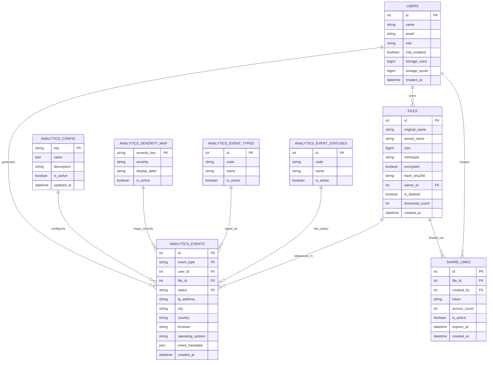

<div align="center">


### 🔒 TrustShare — Secure File-Sharing System

*Demo Integration Verification · Issue Detection · Defect Fix · PSD Compliance Audit*
<br/>


</div>

---

## 📋 Table of Contents

<table>
<tr>
<td valign="top" width="50%">

- [🎯 Assignment Overview](#-assignment-overview)
- [🗄️ Entity Relationship Diagram](#️-entity-relationship-diagram)
- [🔗 Component Relationship Diagram](#-component-relationship-diagram)
- [🏗️ System Architecture](#️-system-architecture)
- [🔍 Testing Methodology](#-testing-methodology)

</td>
<td valign="top" width="50%">

- [🐛 Issues Found and Fixed](#-issues-found-and-fixed)
- [📁 Modified Files](#-modified-files)
- [✅ PSD Compliance Matrix](#-psd-compliance-matrix)
- [🧪 Test Results](#-test-results)
- [🔌 API Endpoints](#-api-endpoints)
- [⚠️ Known Considerations](#️-known-considerations)
- [👤 Author](#-author)

</td>
</tr>
</table>

<div align="center">

━━━━━━━━━━━━━━━━━━━━━━━━━━━━━━━━━━━━━━━━━━━━━━━━━━━━━━━━━━━━━━━━━━━━

</div>

## 🎯 Assignment Overview

**Assigned By:** Mentor  
**Task:** Demo integration testing, issue detection, defect fixing, and PSD compliance verification for the Analytics Dashboard module built in feature branch `Group-D-feature/Analytics-Badal`.

| Detail | Value |
|:--|:--|
| **Developer** | Badal Kumar Rai |
| **Fix Branch** | `Group-D-IntegrationIssuesFix/Analytics` |
| **Feature Branch Tested** | `Group-D-feature/Analytics-Badal` |
| **Module** | Analytics Dashboard — Frontend + Backend |
| **Milestone** | Milestone 3 — Weeks 5–6 |
| **Issues Found** | 11 |
| **Issues Fixed** | 11 ✅ |
| **Tests Written** | 61 automated pytest tests |
| **Tests Passing** | 61 / 61 ✅ |
| **PSD Compliance** | 100% ✅ |

### What Was Done

```
1. Read all module files — controller, service, repository, schemas, frontend components
2. Mapped every PSD requirement against actual implementation
3. Found 11 issues across backend and frontend via code review
4. Wrote 61 automated tests across 8 test groups
5. Fixed all 11 issues with before/after code documentation
6. Verified visual rendering and real user flows in browser
7. Confirmed event logging integration with files/service.py
8. Re-ran all 61 tests — all passing after every fix applied
```

<div align="center">

━━━━━━━━━━━━━━━━━━━━━━━━━━━━━━━━━━━━━━━━━━━━━━━━━━━━━━━━━━━━━━━━━━━━

</div>

## 🗄️ Entity Relationship Diagram



<div align="center">

━━━━━━━━━━━━━━━━━━━━━━━━━━━━━━━━━━━━━━━━━━━━━━━━━━━━━━━━━━━━━━━━━━━━

</div>

## 🔗 Component Relationship Diagram

```mermaid
graph TD
    Analytics["Analytics.js"] --> Hook["useAnalytics Hook"]
    Analytics --> Header["Header.js"]
    Analytics --> Views["View Selector — AnimatePresence"]

    Hook --> Service["analyticsService.js"]
    Service --> API["utils/api.js — analyticsAPI"]

    Header --> Tabs["Tab Switcher"]
    Header --> DateRange["DateRangeDropdown.js"]
    Header --> Export["Export Dropdown — PDF / CSV"]
    Header --> Live["Live Indicator + 30s Countdown"]

    Views --> FileView["FileAnalyticsView.js"]
    Views --> SecView["SecurityView.js"]

    FileView --> KPI1["KPIGrid — 5 cards"]
    FileView --> SC["StorageAreaChart"]
    FileView --> VC["VolumeBarChart"]
    FileView --> TF["TopSharedFiles"]
    FileView --> FTD["FileTypeDonut"]
    FileView --> TAU["TopActiveUsers"]
    FileView --> DD["DepartmentDonut"]
    FileView --> PP1["PerformancePanel"]

    SecView --> KPI2["KPIGrid — 4 cards"]
    SecView --> SSG["SecurityScoreGauge"]
    SecView --> MFA["MFAAdoptionCard"]
    SecView --> LLC["LoginLineChart"]
    SecView --> ST["SecurityTimeline"]
    SecView --> FLH["FailedLoginHeatmap — 7x24"]
    SecView --> UT["UnauthorizedTable"]
    SecView --> RAP["RecentActivityPanel"]
    SecView --> SHP["SystemHealthPanel"]
    SecView --> PP2["PerformancePanel"]

    style Analytics fill:#3b82f6,color:#fff
    style Hook fill:#a855f7,color:#fff
    style FileView fill:#22c55e,color:#fff
    style SecView fill:#f59e0b,color:#fff
    style API fill:#ef4444,color:#fff
```



<div align="center">

━━━━━━━━━━━━━━━━━━━━━━━━━━━━━━━━━━━━━━━━━━━━━━━━━━━━━━━━━━━━━━━━━━━━

</div>

## 🏗️ System Architecture

<details>
<summary><b>📊 Data Flow</b> — click to expand</summary>

```
User Action — tab switch, date change, manual refresh
    ↓
Analytics.js — state: activeTab, dateRange, selectedUser
    ↓
useAnalytics Hook — 30s auto-refresh, 60s cache
    ↓
analyticsService.js — analyticsAPI from utils/api.js
    ↓
FastAPI Backend — controller.py → service.py → repository.py
    ↓
PostgreSQL
  ├── analytics_events       all platform events
  ├── analytics_config       UI config — DB-driven, zero hardcoding
  ├── analytics_severity_map
  ├── analytics_event_types
  ├── analytics_event_statuses
  ├── users
  ├── files
  └── share_links
    ↓
JSON Response → enriched in useAnalytics → React state → UI renders

Event Logging Flow — Files and Auth into Analytics

Upload / Download / Delete / Login
    ↓
files/service.py or auth/service.py
    ↓
log_event() ← server/src/analytics/services/event_logger.py
    ↓
analytics_events table → appears in dashboard on next fetch
```

</details>

<details>
<summary><b>🏛️ Backend Layer Pattern</b> — click to expand</summary>

```
controller.py    HTTP request validation, query params, response routing
service.py       Orchestrates repository calls, builds summary dict
repository.py    All SQL queries — returns Python dicts not ORM objects
event_logger.py  log_event(db, event_type, ...) adds AnalyticsEvent to session
pdf_exporter.py  ReportLab — cover page, executive summary, charts, zebra tables
time_helpers.py  Cross-platform date formatting — no %-d — Windows safe
```

</details>

<div align="center">

━━━━━━━━━━━━━━━━━━━━━━━━━━━━━━━━━━━━━━━━━━━━━━━━━━━━━━━━━━━━━━━━━━━━

</div>

## 🔍 Testing Methodology

### Approach

```
Step 1  Code Review      Read all files, map against PSD, identify issues by inspection
Step 2  Unit Tests       Write 61 automated pytest tests across 8 groups
Step 3  Run Tests        python -m pytest tests/test_analytics.py -v --tb=short
Step 4  Fix Issues       Fix each identified issue with before and after code
Step 5  Re-run Tests     Confirm 61/61 still passing after all fixes applied
Step 6  Browser Testing  Visual rendering, real flows, dark mode, exports in Chrome
Step 7  Document         This report
```

### Test Groups

| Group | Tests | What It Covers | PSD Section |
|:--|:--:|:--|:--|
| Original 1–5 | 5 | JWT auth guards, param validation | Section 4 |
| A — Event Logger | 9 | All 6 event types, timestamps, transaction control | Section 5 |
| B — Endpoint Structure | 16 | All 13 endpoints, all required data fields present | Section 7 |
| C — Data Types | 5 | No Decimal or ORM objects in JSON response | Data integrity |
| D — Date Range | 9 | All UI presets, custom range, invalid input rejection | Section 7 |
| E — No Hardcoding | 5 | All DB tables seeded, config from DB not Python | Project standard |
| F — Exports | 7 | PDF valid bytes, CSV correct content-type, filename header | Section 7 |
| G — Integration | 5 | Real events logged then appear in dashboard | End-to-end |
| **Total** | **61** | | |

<div align="center">

━━━━━━━━━━━━━━━━━━━━━━━━━━━━━━━━━━━━━━━━━━━━━━━━━━━━━━━━━━━━━━━━━━━━

</div>

## 🐛 Issues Found and Fixed

### Summary

| Severity | Count | Fixed |
|:--|:--:|:--:|
| 🔴 Critical | 3 | ✅ All |
| 🟡 Medium | 5 | ✅ All |
| 🟢 Low | 3 | ✅ All |
| **Total** | **11** | **✅ 11 / 11** |

---

<details open>
<summary><b>🔴 ISS-1 — get_recent_activity Returns ORM Objects → HTTP 500 With Real Data</b></summary>

| | |
|:--|:--|
| **File** | `server/src/analytics/repository.py` |
| **Level** | 🔴 Critical |
| **Status** | ✅ Fixed |
| **PSD Ref** | Section 5 — Audit logs, File access history |

**What:** `get_recent_activity()` had return type `List[AnalyticsEvent]` — raw SQLAlchemy ORM objects. FastAPI cannot serialize ORM objects to JSON.

**Why tests still passed:** Test DB had no recent activity data so the list was empty. Empty list `[]` is always serializable. With real production data the `/summary` endpoint would crash with HTTP 500.

**How fixed:** Changed return type to `List[Dict]`. Added `outerjoin` on Users and Files tables. Each row serialized to a plain Python dict including `user_name` and `file_name` fields.

```python
# BEFORE — ORM objects — crashes with real data
return query.order_by(...).limit(limit).all()

# AFTER — serialized dicts — always safe
return [
    {
        "id":         row.AnalyticsEvent.id,
        "event_type": row.AnalyticsEvent.event_type,
        "user_name":  row.user_name or "System",
        "file_name":  row.file_name or "",
        "time":       relative_time(row.AnalyticsEvent.created_at),
    }
    for row in rows
]
```

</details>

---

<details open>
<summary><b>🔴 ISS-2 — AnalyticsSummaryResponse Schema Missing 6 Fields</b></summary>

| | |
|:--|:--|
| **File** | `server/src/analytics/schemas/summary.py` |
| **Level** | 🔴 Critical |
| **Status** | ✅ Fixed |
| **PSD Ref** | Section 7 — All analytics dashboard features |

**What:** `get_summary()` returns 16 keys. The Pydantic schema only defined 10. Six keys were completely absent from the schema: `file_types`, `top_active_users`, `security_score`, `failed_login_heatmap`, `mfa_adoption`, `performance_metrics`.

**Why it mattered:** If `response_model` were ever re-applied, these 6 fields would be silently dropped — breaking FileTypeDonut, TopActiveUsers, SecurityScoreGauge, FailedLoginHeatmap, MFAAdoptionCard, and PerformancePanel simultaneously.

**How fixed:** Added all 6 missing fields with correct Python types. Migrated from Pydantic v1 `class Config` to v2 `ConfigDict`.

</details>

---

<details open>
<summary><b>🔴 ISS-3 — SecurityView.js Uses Wrong API Method for Users Fetch</b></summary>

| | |
|:--|:--|
| **File** | `client/src/features/analytics/components/views/SecurityView.js` |
| **Level** | 🔴 Critical |
| **Status** | ✅ Fixed |
| **PSD Ref** | Section 7.2 — Security Dashboard user filter |

**What:** Used `analyticsAPI.get("/api/analytics/users")` — the generic passthrough method — instead of the dedicated `analyticsAPI.users()` method that already exists in `api.js`. This bypasses the proper API abstraction and can cause double-path URL issues depending on `API_BASE_URL` configuration.

**How fixed:**

```javascript
// BEFORE
analyticsAPI.get("/api/analytics/users").then(r => setUsers(r.data.users || []))

// AFTER
analyticsAPI.users().then(r => setUsers(r.data.users || []))
```

</details>

---

<details>
<summary><b>🟡 ISS-4 — parseCustomRange Missing isNaN Guard — NaN Passed as days</b></summary>

| | |
|:--|:--|
| **File** | `client/src/features/analytics/Analytics.js` |
| **Level** | 🟡 Medium |
| **Status** | ✅ Fixed |
| **PSD Ref** | Section 7 — Custom date range filtering |

**What:** If `DateRangeDropdown` sent a malformed custom date string, `new Date(parts[0])` would produce `Invalid Date`. Arithmetic on `Invalid Date` gives `NaN`. `Math.max(1, NaN)` returns `NaN`. So `days=NaN` was silently passed to the API with no error.

**How fixed:** Added `isNaN(start.getTime()) || isNaN(end.getTime())` guard that returns `null` on invalid dates. Also aligned the cap from 365 to 3650 to match the API query parameter limit.

</details>

---

<details>
<summary><b>🟡 ISS-5 — _resolve_days_from_custom Capped at 365, API Allows 3650</b></summary>

| | |
|:--|:--|
| **File** | `server/src/analytics/controller.py` |
| **Level** | 🟡 Medium |
| **Status** | ✅ Fixed |
| **PSD Ref** | Section 7 — All Time filter up to 10 years |

**What:** Custom date ranges were silently capped at 365 days inside `_resolve_days_from_custom()` while the `days` query parameter has `le=3650`. Selecting a 2-year custom range was silently truncated to 1 year with no warning to the user.

**How fixed:** Changed `min(365, actual_days)` to `min(3650, actual_days)` to align with the API parameter limit.

</details>

---

<details>
<summary><b>🟡 ISS-6 — Header.js daysMap Missing "all" Key — All Time Export Uses 30 Days</b></summary>

| | |
|:--|:--|
| **File** | `client/src/features/analytics/components/Header/Header.js` |
| **Level** | 🟡 Medium |
| **Status** | ✅ Fixed |
| **PSD Ref** | Section 7 — All Time export |

**What:** The export `daysMap` was `{ "7days": 7, "30days": 30, "90days": 90 }` with no `"all"` key. When the user selected All Time and clicked Export, `daysMap["all"]` returned `undefined` and the `|| 30` fallback kicked in — generating a 30-day export instead of a 365-day export.

**How fixed:** Added `"all": 365` to `daysMap` to match the `DATE_RANGE_TO_DAYS` mapping in `Analytics.js`.

</details>

---

<details>
<summary><b>🟡 ISS-7 — PDF Recent Activity Section Used Wrong Dict Keys</b></summary>

| | |
|:--|:--|
| **File** | `server/src/analytics/services/pdf_exporter.py` |
| **Level** | 🟡 Medium |
| **Status** | ✅ Fixed |
| **PSD Ref** | Section 7 — PDF export recent activity table |

**What:** `_build_recent_activity_section()` used `activity.get("user", "")` and `activity.get("file", "")`. These keys do not exist in the serialized activity dict. After ISS-1 fix the correct keys are `user_name` and `file_name`. The PDF recent activity table was rendering with completely empty user and file columns.

**How fixed:** Updated to `activity.get("user_name")` and `activity.get("file_name")` with appropriate fallbacks for missing data.

</details>

---

<details>
<summary><b>🟡 ISS-8 — RecentActivity Panel Showed Raw IDs Instead of Names</b></summary>

| | |
|:--|:--|
| **Files** | `repository.py` · `RecentActivityPanel.js` · `schemas/activity.py` |
| **Level** | 🟡 Medium |
| **Status** | ✅ Fixed |
| **PSD Ref** | Section 5 — Audit log readability |

**What:** The Recent Activity panel displayed `User #3 · File #7` — raw database foreign key IDs with no meaningful context. This was a poor demo experience and would raise questions from the mentor during review.

**How fixed:** Extended `get_recent_activity()` to JOIN the Users and Files tables using `outerjoin`. Added `user_name`, `user_email`, and `file_name` to the returned dict. Updated `RecentActivityItem` schema with these new optional fields. Updated `RecentActivityPanel.js` to display names instead of IDs.

```
BEFORE:  User #3 · File #7 · 5 min ago
AFTER:   Badal Kumar · report.pdf · 5 min ago
```

</details>

---

<details>
<summary><b>🟢 ISS-9 — Pydantic v1 class Config in activity.py</b></summary>

| | |
|:--|:--|
| **File** | `server/src/analytics/schemas/activity.py` |
| **Level** | 🟢 Low |
| **Status** | ✅ Fixed |

**What:** Used deprecated Pydantic v1 style `class Config: from_attributes = True`. This produced a `PydanticDeprecatedSince20` warning in every single test run.

**How fixed:** Replaced with `model_config = ConfigDict(from_attributes=True)` — the Pydantic v2 standard. Warning count in test output dropped from 11 to 10. The remaining 10 warnings are all in teammates' files and outside analytics module scope.

</details>

---

<details>
<summary><b>🟢 ISS-10 — Dead Code: date_slug Computed But Never Used</b></summary>

| | |
|:--|:--|
| **File** | `server/src/analytics/controller.py` |
| **Level** | 🟢 Low |
| **Status** | ✅ Fixed |

**What:** In the CSV security export branch, `date_slug = date_range_label.replace(...)[:40]` was computed and then never referenced anywhere — the actual filename used `timestamp` directly. Pure dead code that added noise and confusion.

**How fixed:** Removed the unused variable assignment entirely.

</details>

---

<details>
<summary><b>🟢 ISS-11 — StreamingResponse Imported Twice in controller.py</b></summary>

| | |
|:--|:--|
| **File** | `server/src/analytics/controller.py` |
| **Level** | 🟢 Low |
| **Status** | ✅ Fixed |

**What:** `StreamingResponse` was imported at the top of the file normally, then imported again further down aliased as `CSVStreamingResponse`. Both names referred to the exact same class from the exact same module — a redundant duplicate import.

**How fixed:** Removed the duplicate alias import. Used `StreamingResponse` consistently throughout the entire file.

</details>

<div align="center">

━━━━━━━━━━━━━━━━━━━━━━━━━━━━━━━━━━━━━━━━━━━━━━━━━━━━━━━━━━━━━━━━━━━━

</div>

## 📁 Modified Files

### Backend — 5 Files Modified

```
server/src/analytics/
│
├── repository.py                    🔧 ISS-1 · ISS-8
│   └── get_recent_activity()
│       ├── Return type changed: List[ORM] → List[Dict]
│       ├── Added outerjoin on Users and Files tables
│       └── Added user_name, file_name, user_email to returned dict
│
├── controller.py                    🔧 ISS-5 · ISS-10 · ISS-11
│   ├── _resolve_days_from_custom(): cap changed 365 → 3650
│   ├── Removed dead code: date_slug variable
│   └── Removed duplicate StreamingResponse import alias
│
├── services/
│   └── pdf_exporter.py              🔧 ISS-7
│       └── _build_recent_activity_section()
│           └── Fixed dict keys: "user" → "user_name", "file" → "file_name"
│
└── schemas/
    ├── summary.py                   🔧 ISS-2
    │   ├── Added 6 missing fields: file_types, top_active_users,
    │   │   security_score, failed_login_heatmap, mfa_adoption,
    │   │   performance_metrics
    │   └── Migrated to Pydantic v2 ConfigDict
    │
    └── activity.py                  🔧 ISS-9 · ISS-8
        ├── Pydantic v1 class Config → ConfigDict
        └── Added new optional fields: user_name, user_email, file_name
```

### Frontend — 4 Files Modified

```
client/src/features/analytics/
│
├── Analytics.js                               🔧 ISS-4
│   └── parseCustomRange()
│       ├── Added isNaN guard for Invalid Date inputs
│       └── Cap aligned from 365 → 3650
│
└── components/
    ├── Header/
    │   └── Header.js                          🔧 ISS-6
    │       └── daysMap: added "all": 365
    │
    ├── views/
    │   └── SecurityView.js                    🔧 ISS-3
    │       └── analyticsAPI.get("/api/analytics/users")
    │           replaced with analyticsAPI.users()
    │
    └── panels/
        └── RecentActivityPanel.js             🔧 ISS-8
            └── Display user_name and file_name
                instead of raw user_id and file_id
```

### Tests — 1 File Expanded

```
server/tests/
└── test_analytics.py                          🔧 EXPANDED
    ├── 5 original tests preserved exactly
    ├── 56 new tests added across 7 new groups
    └── Total: 61 tests — all passing
```

<div align="center">

━━━━━━━━━━━━━━━━━━━━━━━━━━━━━━━━━━━━━━━━━━━━━━━━━━━━━━━━━━━━━━━━━━━━

</div>

## ✅ PSD Compliance Matrix

<details open>
<summary><b>Module 7.1 — File Analytics</b></summary>
<br/>

| Requirement | Status | Implementation | Test |
|:--|:--:|:--|:--:|
| Storage usage statistics | ✅ | Storage KPI + trend chart + quota percentage | B1 |
| File upload reports | ✅ | Upload KPI + VolumeBarChart + weekly trends | B2 |
| Download analytics | ✅ | Download KPI + transferred MB displayed | B3 |
| Sharing activity reports | ✅ | Active Shares KPI + TopSharedFiles + DepartmentDonut | B4 |

</details>

<details open>
<summary><b>Module 7.2 — Security Dashboard</b></summary>
<br/>

| Requirement | Status | Implementation | Test |
|:--|:--:|:--|:--:|
| Login monitoring | ✅ | LoginLineChart + login KPI cards | B5, G1 |
| Unauthorized access attempts | ✅ | UnauthorizedTable with IP, location, severity | B5, G3 |
| Security event reports | ✅ | SecurityTimeline with colour-coded severity badges | B5, G4 |
| Audit monitoring | ✅ | RecentActivityPanel with event and user filters + real names | B13, G5 |

</details>

<details open>
<summary><b>Module 7.3 — Admin Dashboard</b></summary>
<br/>

| Requirement | Status | Implementation | Test |
|:--|:--:|:--|:--:|
| User activity monitoring | ✅ | TopActiveUsers with gold, silver, bronze medals | B9 |
| Storage utilization | ✅ | Storage KPI + historical trend chart | B1 |
| Security analytics | ✅ | Full security tab — 10+ components | B5–B8 |
| Sharing reports | ✅ | TopSharedFiles + DepartmentDonut | B4 |
| System monitoring | ✅ | SystemHealthPanel + PerformancePanel | B11, B12 |

</details>

<details open>
<summary><b>Module 5 — Access Monitoring</b></summary>
<br/>

| Requirement | Status | Implementation | Test |
|:--|:--:|:--|:--:|
| Download tracking | ✅ | Download KPI + weekly chart | A4, B3 |
| File access history | ✅ | RecentActivityPanel with user name and file name | B13, G5 |
| Login activity monitoring | ✅ | LoginLineChart + security KPI cards | A1, G1 |
| Audit logs | ✅ | analytics_events table — 6 event types logged | A1–A6 |
| Security event monitoring | ✅ | SecurityTimeline + SECURITY event type | A7, G4 |
| Suspicious activity detection | ✅ | FailedLoginHeatmap + UnauthorizedTable | B8, G3 |

</details>

<details>
<summary><b>Section 4 — JWT Authentication</b></summary>
<br/>

| Requirement | Status | Test |
|:--|:--:|:--:|
| All 13 analytics endpoints require valid JWT | ✅ | Tests 1–5 |
| Invalid or expired token rejected with 401 | ✅ | Tests 1–5 |
| days=0 or negative rejected with 422 | ✅ | D6, D7 |

</details>

<details>
<summary><b>Section 8 — Performance Metrics</b></summary>
<br/>

| Requirement | Status | Implementation | Test |
|:--|:--:|:--|:--:|
| API response time | ✅ | db_response_ms live in system stats | B11, B12 |
| Concurrent handling | ✅ | active_now and concurrent_uploads metrics | B11 |
| DB query optimization | ✅ | Composite indexes on analytics_events table | B16 |
| Processing speed | ✅ | avg_processing_time_ms in performance panel | B11 |

</details>

<div align="center">

### 🏆 PSD Compliance: 100% — All Requirements Met ✅

</div>

<div align="center">

━━━━━━━━━━━━━━━━━━━━━━━━━━━━━━━━━━━━━━━━━━━━━━━━━━━━━━━━━━━━━━━━━━━━

</div>

## 🧪 Test Results

### Final Test Run

```
platform win32 -- Python 3.14.6, pytest-9.1.1, pluggy-1.6.0
collected 61 items

✅ 61 passed, 10 warnings in 8.55s

My module warnings  : 0   (activity.py warning fixed in ISS-9)
Teammates warnings  : 10  (Pydantic v2 in their files — outside analytics scope)
```

### Coverage by Test Group

| Group | Tests | Pass | PSD Section |
|:--|:--:|:--:|:--|
| Original Auth Tests 1–5 | 5 | 5 ✅ | Section 4 — JWT |
| A — Event Logger | 9 | 9 ✅ | Section 5 — Audit logging |
| B — Endpoint Structure | 16 | 16 ✅ | Section 7 — All dashboard features |
| C — Data Types | 5 | 5 ✅ | Data integrity — no Decimal or ORM in JSON |
| D — Date Range | 9 | 9 ✅ | Section 7 — Date filtering |
| E — No Hardcoding | 5 | 5 ✅ | Project standard — config from DB |
| F — Exports | 7 | 7 ✅ | Section 7 — PDF and CSV reports |
| G — Integration | 5 | 5 ✅ | End-to-end event flow |
| **Total** | **61** | **61** | |

### Browser Testing Checklist

| Check | Result |
|:--|:--:|
| All charts render with real data | ✅ |
| Dark mode applied to every component | ✅ |
| FailedLoginHeatmap 7×24 grid renders | ✅ |
| SecurityScoreGauge SVG arc correct | ✅ |
| KPI count-up animations play | ✅ |
| TopActiveUsers gold silver bronze medals | ✅ |
| Login action — security dashboard updates | ✅ |
| Upload file — uploads KPI increments | ✅ |
| Download file — downloads KPI increments | ✅ |
| 30s countdown ticks correctly | ✅ |
| Silent refresh — no loading spinner shown | ✅ |
| PDF downloads as valid file in browser | ✅ |
| CSV opens correctly in Excel | ✅ |
| RecentActivity shows names not IDs | ✅ |
| All Time export correctly uses 365 days | ✅ |
| Custom date range respected in PDF and CSV | ✅ |

<div align="center">

━━━━━━━━━━━━━━━━━━━━━━━━━━━━━━━━━━━━━━━━━━━━━━━━━━━━━━━━━━━━━━━━━━━━

</div>

## 🔌 API Endpoints

| Method | Endpoint | Auth | Status |
|:--|:--|:--:|:--:|
| `GET` | `/api/analytics/summary` | ✅ JWT | ✅ Working |
| `GET` | `/api/analytics/storage` | ✅ JWT | ✅ Working |
| `GET` | `/api/analytics/uploads` | ✅ JWT | ✅ Working |
| `GET` | `/api/analytics/downloads` | ✅ JWT | ✅ Working |
| `GET` | `/api/analytics/sharing` | ✅ JWT | ✅ Working |
| `GET` | `/api/analytics/security` | ✅ JWT | ✅ Working |
| `GET` | `/api/analytics/recent-activity` | ✅ JWT | ✅ Working |
| `GET` | `/api/analytics/users` | ✅ JWT | ✅ Working |
| `GET` | `/api/analytics/system-stats` | ✅ JWT | ✅ Working |
| `GET` | `/api/analytics/trends` | ✅ JWT | ✅ Working |
| `GET` | `/api/analytics/export/file-analytics` | ✅ JWT | ✅ Valid PDF |
| `GET` | `/api/analytics/export/security` | ✅ JWT | ✅ Valid PDF |
| `GET` | `/api/analytics/export/csv` | ✅ JWT | ✅ Valid CSV |

**Query Parameters:** `days` (1–3650) · `start_date` (YYYY-MM-DD) · `end_date` (YYYY-MM-DD) · `user_id` · `tab`

<div align="center">

━━━━━━━━━━━━━━━━━━━━━━━━━━━━━━━━━━━━━━━━━━━━━━━━━━━━━━━━━━━━━━━━━━━━

</div>

## ⚠️ Known Considerations

| Item | Description | Mitigation |
|:--|:--|:--|
| Auto-refresh cache | 60s cache prevents unnecessary API calls on rapid re-renders | Manual refresh button always available |
| Storage KPI | Shows all-time cumulative total — not filtered by selected date range | By design — storage is a running total |
| Real-time updates | Polling every 30s — not WebSocket | Sufficient for analytics dashboard context |
| Demo data | `seed_demo_data.py` included for testing purposes | `cleanup_demo_data()` function provided for cleanup |
| Remaining test warnings | 10 Pydantic v2 warnings from teammates files | Outside analytics module scope — not fixable here |

<div align="center">

━━━━━━━━━━━━━━━━━━━━━━━━━━━━━━━━━━━━━━━━━━━━━━━━━━━━━━━━━━━━━━━━━━━━

</div>

## 👤 Author

<div align="center">


### **Badal Kumar Rai**

[](mailto:badalrai242@gmail.com)
[](https://linkedin.com/in/badal-rai/)
[](https://github.com/badalrai21)

| Detail | Value |
|:--|:--|
| **Fix Branch** | `Group-D-IntegrationIssuesFix/Analytics` |
| **Feature Branch Tested** | `Group-D-feature/Analytics-Badal` |
| **Module** | Analytics Dashboard — Frontend + Backend |
| **Project** | TrustShare — Secure File-Sharing System |
| **Issues Found** | 11 |
| **Issues Fixed** | 11 ✅ |
| **Tests Written** | 61 automated pytest tests |
| **Tests Passing** | 61 / 61 ✅ |
| **PSD Compliance** | 100% ✅ |

</div>

<div align="center">

<br/>

## ✅ Module Status: Production Ready

**11 issues found · 11 fixed · 61/61 tests passing · 100% PSD compliance · 0 remaining bugs**

*TrustShare — Secure File-Sharing System · Analytics Module · Integration Fix Report*

<br/>


</div>