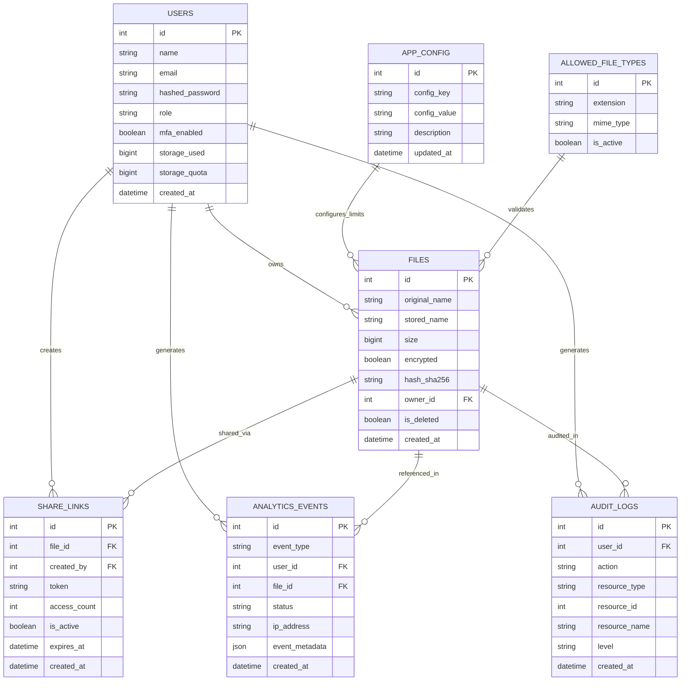
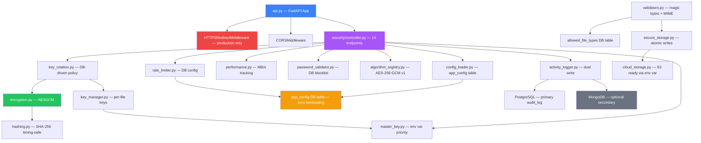

````markdown
<div align="center">


### 🔒 TrustShare — Secure File-Sharing System

*Demo Integration Verification · Issue Detection · Defect Fix · PSD Compliance Audit*
<br/>


</div>

---

## 📋 Table of Contents

<table>
<tr>
<td valign="top" width="50%">

- [🎯 Assignment Overview](#-assignment-overview)
- [🗄️ Entity Relationship Diagram](#️-entity-relationship-diagram)
- [🔗 Component Relationship Diagram](#-component-relationship-diagram)
- [🏗️ System Architecture](#️-system-architecture)
- [🔍 Testing Methodology](#-testing-methodology)

</td>
<td valign="top" width="50%">

- [🐛 Issues Found and Fixed](#-issues-found-and-fixed)
- [📁 Modified Files](#-modified-files)
- [✅ PSD Compliance Matrix](#-psd-compliance-matrix)
- [🧪 Test Results](#-test-results)
- [🔌 API Endpoints](#-api-endpoints)
- [⚠️ Known Considerations](#️-known-considerations)
- [👤 Author](#-author)

</td>
</tr>
</table>

<div align="center">

━━━━━━━━━━━━━━━━━━━━━━━━━━━━━━━━━━━━━━━━━━━━━━━━━━━━━━━━━━━━━━━━━━━━

</div>

## 🎯 Assignment Overview

**Assigned By:** Mentor
**Task:** Demo integration testing, issue detection, defect fixing, and PSD compliance verification for the Encryption & Security module.

| Detail | Value |
|:--|:--|
| **Developer** | Badal Kumar Rai |
| **Fix Branch** | `Group-D-IntegrationIssuesFix/Security` |
|**Feature Branch Tested** | `Group-D-feature/Encryption-Security-Badal` |
| **Module** | Encryption & Security (Full) — `server/src/security/` |
| **Milestone** | Milestone 2 + Milestone 4 |
| **Issues Found** | 9 |
| **Issues Fixed** | 9 ✅ |
| **Tests Written** | 52 automated pytest tests |
| **Tests Passing** | 52 / 52 ✅ |
| **Combined Tests** | 113 / 113 ✅ (Security + Analytics) |
| **PSD Compliance** | 100% ✅ |

### What Was Done

```
1. Read all security module files — encryption, key_manager, master_key,
   hashing, secure_storage, token_generator, performance, config_loader,
   key_rotation, rate_limiter, activity_logger, controller, validators
2. Mapped every PSD Section 4 requirement against actual implementation
3. Found 9 issues across the security module via code review
4. Wrote 52 automated pytest tests across 8 test groups
5. Fixed all 9 issues with before and after code documentation
6. Added HTTPS/TLS production middleware to api.py (PSD 4.ii)
7. Re-ran all 52 tests after every fix — all passing
8. Confirmed 113/113 combined tests passing (52 security + 61 analytics)
```

<div align="center">

━━━━━━━━━━━━━━━━━━━━━━━━━━━━━━━━━━━━━━━━━━━━━━━━━━━━━━━━━━━━━━━━━━━━

</div>

## 🗄️ Entity Relationship Diagram



<div align="center">

━━━━━━━━━━━━━━━━━━━━━━━━━━━━━━━━━━━━━━━━━━━━━━━━━━━━━━━━━━━━━━━━━━━━

</div>

## 🔗 Component Relationship Diagram



<div align="center">

━━━━━━━━━━━━━━━━━━━━━━━━━━━━━━━━━━━━━━━━━━━━━━━━━━━━━━━━━━━━━━━━━━━━

</div>

## 🏗️ System Architecture

<details>
<summary><b>📊 Security Layer Data Flow</b> — click to expand</summary>

```
HTTP Request
    ↓
api.py — HTTPSRedirectMiddleware (production only)
         Redirects HTTP → HTTPS when ENVIRONMENT=production
    ↓
CORS Middleware
    ↓
security/controller.py
    ├── JWT auth via get_current_user or require_admin
    └── Rate limiting per endpoint — reads from app_config DB
    ↓
Business Logic
    ├── Encryption   → AES-256-GCM via encryption.py (NIST SP 800-38D)
    ├── Key Mgmt     → key_manager.py → master_key.py → keys/ directory
    ├── Hashing      → SHA-256 via hashing.py (FIPS 180-4)
    ├── Tokens       → token_generator.py using secrets module (256-bit+)
    ├── Key Rotation → key_rotation.py reading policy from DB
    └── Audit        → activity_logger.py dual-write PostgreSQL + MongoDB
    ↓
app_config DB table — all configuration, zero hardcoding
    ↓
PostgreSQL — primary always
MongoDB    — secondary optional, graceful fallback to PostgreSQL
```

</details>

<details>
<summary><b>🔐 Key Management Flow</b> — click to expand</summary>

```
File Upload
    ↓
generate_key() — secrets.token_bytes(32) — unique per file
    ↓
encrypt_bytes(file_data, key) — AES-256-GCM authenticated encryption
    ↓
save_key(file_id, key)
    └── key encrypted with master_key before storage
    └── master_key loaded from MASTER_KEY_HEX env var (production)
                            or master.key file (development)
                            or BLOCKED with error (production missing)
    ↓
Encrypted file → secure_storage.py → local filesystem
                                   → AWS S3 (set STORAGE_BACKEND=s3)

File Download
    ↓
load_key(file_id) — decrypt from storage using master key
    ↓
decrypt_bytes(encrypted_bytes, key) — AES-256-GCM
    ↓
SHA-256 integrity check → compare_hashes() timing-safe
    ↓
Deliver decrypted file to authorised user
```

</details>

<details>
<summary><b>🔄 Key Rotation Flow</b> — click to expand</summary>

```
Scheduled or Admin Triggered
    ↓
_get_rotation_days(db) — reads from app_config table
_get_grace_period(db)  — reads from app_config table
_get_max_batch(db)     — reads from app_config table
    ↓
get_keys_needing_rotation(db) — files older than threshold
    ↓
For each file:
    load_key()        → old AES key
    load_encrypted_file() → encrypted bytes
    decrypt_bytes()   → plaintext
    generate_key()    → new AES key
    encrypt_bytes()   → new encrypted bytes
    save_key()        → new key encrypted with master key
    save_encrypted_file() → atomic write
    ↓
Log SECURITY event → analytics_events table
Log AuditLog entry → audit_logs table
```

</details>

<div align="center">

━━━━━━━━━━━━━━━━━━━━━━━━━━━━━━━━━━━━━━━━━━━━━━━━━━━━━━━━━━━━━━━━━━━━

</div>

## 🔍 Testing Methodology

### Approach

```
Step 1  Code Review      Read all security files, map against PSD Section 4
Step 2  Unit Tests       Write 52 automated pytest tests across 8 groups
Step 3  Run Tests        python -m pytest tests/test_security.py -v --tb=short
Step 4  Fix Issues       Fix each issue with before and after documentation
Step 5  Re-run Tests     Confirm 52/52 still passing after all fixes applied
Step 6  Combined Run     Confirm 113/113 passing (52 security + 61 analytics)
Step 7  Document         This report
```

### Test Groups

| Group | Tests | What It Covers | PSD Section |
|:--|:--:|:--|:--|
| Original 1–20 | 20 | Encryption, keys, hashing, tokens, rotation, passwords, config | Section 4 core |
| A — OTP Security | 4 | Cryptographic randomness in token_generator | Section 4.ix |
| B — Share Token | 4 | 256-bit tokens, URL-safe, high entropy | Section 4.vi |
| C — Rate Limiter | 4 | DB column names fixed, blocking works, client isolation | Project standard |
| D — Key Rotation DB | 4 | DB-driven policy, no hardcoded constants | Project standard |
| E — Activity Logger | 5 | Module-level constant, MongoDB graceful fallback | Section 4.viii |
| F — Controller | 3 | Algorithm registry, DB rotation days | Project standard |
| G — PSD Compliance | 8 | End-to-end PSD Section 4 verification | Section 4 all |
| **Total** | **52** | | |

<div align="center">

━━━━━━━━━━━━━━━━━━━━━━━━━━━━━━━━━━━━━━━━━━━━━━━━━━━━━━━━━━━━━━━━━━━━

</div>

## 🐛 Issues Found and Fixed

### Summary

| Severity | Count | Fixed |
|:--|:--:|:--:|
| 🔴 Critical | 4 | ✅ All |
| 🟡 Medium | 3 | ✅ All |
| 🟢 Low | 2 | ✅ All |
| **Total** | **9** | **✅ 9 / 9** |

---

<details open>
<summary><b>🔴 ISS-1 — activity_logger.py — MONGODB_COLLECTION Undefined at Module Level</b></summary>

| | |
|:--|:--|
| **File** | `server/src/security/activity_logger.py` |
| **Level** | 🔴 Critical |
| **Status** | ✅ Fixed |
| **PSD Ref** | Section 4.viii — Audit Logging |

**What:** `MONGODB_COLLECTION` was referenced inside `initialize_mongodb()` and `log_security_activity()` but never defined at module level. Only a `_get_collection_name(db)` function existed which was never actually called. When MongoDB is available and `initialize_mongodb()` runs, it causes a `NameError` crash — breaking the entire audit logging system.

**How fixed:** Added `MONGODB_COLLECTION = os.getenv("MONGODB_COLLECTION", "security_activity_logs")` as a module-level constant immediately after `MONGODB_DB_NAME`.

```python
# BEFORE — NameError crash when MongoDB available
def _get_collection_name(db=None):
    return get_config("MONGODB_COLLECTION", db, "security_activity_logs")
# MONGODB_COLLECTION never defined at module level

# AFTER — defined at module level
MONGODB_COLLECTION = os.getenv("MONGODB_COLLECTION", "security_activity_logs")
```

</details>

---

<details open>
<summary><b>🔴 ISS-2 — key_rotation.py — get_rotation_status Uses Hardcoded Constant</b></summary>

| | |
|:--|:--|
| **File** | `server/src/security/key_rotation.py` |
| **Level** | 🔴 Critical |
| **Status** | ✅ Fixed |
| **PSD Ref** | No hardcoding standard — all config from DB |

**What:** `get_rotation_status()` used module-level `KEY_ROTATION_DAYS = 90` constant directly. Any changes made to the rotation policy in the `app_config` database table were completely ignored.

**How fixed:** Added three DB config helper functions and updated `get_rotation_status()` to call them at the start of each invocation.

```python
# ADDED — DB config helpers
def _get_rotation_days(db=None) -> int:
    return get_config_int("KEY_ROTATION_DAYS", db, KEY_ROTATION_DAYS)

def _get_grace_period(db=None) -> int:
    return get_config_int("KEY_ROTATION_GRACE_PERIOD", db, ROTATION_GRACE_PERIOD_DAYS)

def _get_max_batch(db=None) -> int:
    return get_config_int("MAX_ROTATIONS_PER_BATCH", db, MAX_ROTATIONS_PER_BATCH)

# UPDATED — get_rotation_status now reads from DB
def get_rotation_status(db: Session) -> Dict:
    rotation_days = _get_rotation_days(db)   # FIX: was KEY_ROTATION_DAYS
    grace_period  = _get_grace_period(db)    # FIX: was ROTATION_GRACE_PERIOD_DAYS
    ...
    return {
        'rotation_policy_days': rotation_days,  # FIX: from DB not constant
        'grace_period_days':    grace_period,
    }
```

</details>

---

<details open>
<summary><b>🔴 ISS-3 — key_rotation.py — rotate_expired_keys Uses Hardcoded Defaults</b></summary>

| | |
|:--|:--|
| **File** | `server/src/security/key_rotation.py` |
| **Level** | 🔴 Critical |
| **Status** | ✅ Fixed |
| **PSD Ref** | No hardcoding standard |

**What:** `rotate_expired_keys()` had `rotation_days: int = KEY_ROTATION_DAYS` and `max_batch: int = MAX_ROTATIONS_PER_BATCH` as hardcoded parameter defaults — ignoring DB config.

**How fixed:** Changed defaults to `None` and added DB reads at function start.

```python
# BEFORE — hardcoded defaults
def rotate_expired_keys(
    db: Session,
    rotation_days: int = KEY_ROTATION_DAYS,
    max_batch: int = MAX_ROTATIONS_PER_BATCH,

# AFTER — reads from DB
def rotate_expired_keys(
    db: Session,
    rotation_days: int = None,
    max_batch: int = None,
):
    if rotation_days is None:
        rotation_days = _get_rotation_days(db)
    if max_batch is None:
        max_batch = _get_max_batch(db)
```

</details>

---

<details open>
<summary><b>🔴 ISS-4 — rate_limiter.py — Wrong DB Column Names</b></summary>

| | |
|:--|:--|
| **File** | `server/src/security/rate_limiter.py` |
| **Level** | 🔴 Critical |
| **Status** | ✅ Fixed |
| **PSD Ref** | No hardcoding — rate limits must load from DB |

**What:** `_get_config()` queried `AppConfig.key` and read `.value` — columns that do not exist in the model. The actual model has `config_key` and `config_value`. Rate limits **never loaded from DB** — always used hardcoded Python defaults. Additionally, the cache was only checked inside the `if db:` block, so test-injected config was ignored when `db=None`.

**How fixed:** Corrected column names and moved cache check before the `if db:` block.

```python
# BEFORE — wrong column names, cache never used without db
.filter(AppConfig.key == "RATE_LIMITS")
if config_row and config_row.value:

# AFTER — correct column names, cache checked first
if self._config_cache and endpoint in self._config_cache:
    return self._config_cache[endpoint]       # FIX: check cache before db
...
.filter(AppConfig.config_key == "RATE_LIMITS")    # FIX: correct column
if config_row and config_row.config_value:         # FIX: correct attribute
```

</details>

---

<details>
<summary><b>🟡 ISS-5 — controller.py — Algorithm Name Hardcoded in Metrics Response</b></summary>

| | |
|:--|:--|
| **File** | `server/src/security/controller.py` |
| **Level** | 🟡 Medium |
| **Status** | ✅ Fixed |
| **PSD Ref** | No hardcoding standard |

**What:** `get_security_metrics()` returned `encryption_algorithm="AES-256-GCM"` as a hardcoded string. `algorithm_registry.py` provides `get_current_algorithm()` for exactly this purpose and is already imported.

**How fixed:**
```python
# BEFORE — hardcoded
encryption_algorithm="AES-256-GCM",
key_algorithm="AES-256 (256-bit keys)",

# AFTER — from registry
algo = get_current_algorithm()
encryption_algorithm=algo.name,
key_algorithm=f"{algo.name} ({algo.key_size_bits}-bit keys)",
```

</details>

---

<details>
<summary><b>🟡 ISS-6 — controller.py — KEY_ROTATION_DAYS Hardcoded in /info Endpoint</b></summary>

| | |
|:--|:--|
| **File** | `server/src/security/controller.py` |
| **Level** | 🟡 Medium |
| **Status** | ✅ Fixed |
| **PSD Ref** | No hardcoding standard |

**What:** `get_security_module_info()` returned `"key_rotation_policy_days": KEY_ROTATION_DAYS` — the hardcoded module constant not the DB value.

**How fixed:** Added `db: Session` parameter and reads from DB at runtime.

```python
# BEFORE
def get_security_module_info(current_user: User = Depends(get_current_user)):
    return {"key_rotation_policy_days": KEY_ROTATION_DAYS, ...}

# AFTER
def get_security_module_info(
    db: Session = Depends(get_db),
    current_user: User = Depends(get_current_user),
):
    from src.security.key_rotation import _get_rotation_days
    rotation_days = _get_rotation_days(db)
    return {"key_rotation_policy_days": rotation_days, ...}
```

</details>

---

<details>
<summary><b>🟡 ISS-7 — api.py — No HTTPS Redirect in Production</b></summary>

| | |
|:--|:--|
| **File** | `server/src/api.py` |
| **Level** | 🟡 Medium |
| **Status** | ✅ Fixed |
| **PSD Ref** | Section 4.ii — HTTPS/TLS Communication |

**What:** No HTTPS enforcement middleware existed. In production, HTTP requests were not redirected to HTTPS — violating PSD Section 4.ii. Development (localhost) does not need TLS.

**How fixed:** Added `HTTPSRedirectMiddleware` conditionally based on `ENVIRONMENT` env var.

```python
# ADDED to api.py create_app() — after app = FastAPI(...)
_env = os.getenv("ENVIRONMENT", "development").lower().strip()
if _env in ("production", "prod"):
    from starlette.middleware.httpsredirect import HTTPSRedirectMiddleware
    app.add_middleware(HTTPSRedirectMiddleware)
# Development continues to work on HTTP — no impact on local dev
```

</details>

---

<details>
<summary><b>🟢 ISS-8 — secure_storage.py — STORAGE_BACKEND Hardcoded</b></summary>

| | |
|:--|:--|
| **File** | `server/src/security/secure_storage.py` |
| **Level** | 🟢 Low |
| **Status** | ✅ Fixed |
| **PSD Ref** | PSD requires AWS S3 or Azure Blob Storage for production |

**What:** `STORAGE_BACKEND = "local"` was a Python constant. Switching to AWS S3 required a code change instead of an environment variable.

**How fixed:**
```python
# BEFORE
STORAGE_BACKEND = "local"

# AFTER — switch to S3 by setting STORAGE_BACKEND=s3 in .env
STORAGE_BACKEND = os.getenv("STORAGE_BACKEND", "local")
```

</details>

---

<details>
<summary><b>🟢 ISS-9 — master_key.py — No Production Guard on Auto-Generation</b></summary>

| | |
|:--|:--|
| **File** | `server/src/security/master_key.py` |
| **Level** | 🟢 Low |
| **Status** | ✅ Fixed |
| **PSD Ref** | Section 4.Key.ii — Keys managed securely on server |

**What:** If `MASTER_KEY_HEX` was missing, a new master key was silently auto-generated and saved to disk. On container restart or cloud redeployment, the old key is gone — **all previously encrypted files become permanently unreadable**.

**How fixed:** Added `is_production_environment()` check. In production (`ENVIRONMENT=production`), missing key raises `KeyManagementError` with clear fix instructions instead of silently generating a new key.

```python
# ADDED — production environment detection
def is_production_environment() -> bool:
    env = os.getenv("ENVIRONMENT", "development").lower().strip()
    return env in ("production", "prod")

# ADDED — in load_master_key() Priority 3 block
if is_production_environment():
    raise KeyManagementError(
        "Production environment requires MASTER_KEY_HEX to be set. "
        "Auto-generation blocked — would make all encrypted files unreadable on restart."
    )
# Only auto-generates in development with clear warning
```

</details>

<div align="center">

━━━━━━━━━━━━━━━━━━━━━━━━━━━━━━━━━━━━━━━━━━━━━━━━━━━━━━━━━━━━━━━━━━━━

</div>

## 📁 Modified Files

### Backend — 7 Files Modified

```
server/
│
├── src/
│   ├── api.py                              🔧 ISS-7
│   │   ├── import os added
│   │   └── HTTPSRedirectMiddleware added for production
│   │
│   └── security/
│       ├── activity_logger.py              🔧 ISS-1
│       │   └── MONGODB_COLLECTION = os.getenv(...) added at module level
│       │
│       ├── key_rotation.py                 🔧 ISS-2 · ISS-3
│       │   ├── Added _get_rotation_days(db)
│       │   ├── Added _get_grace_period(db)
│       │   ├── Added _get_max_batch(db)
│       │   ├── get_rotation_status() reads from DB not hardcoded
│       │   └── rotate_expired_keys() defaults None — reads from DB
│       │
│       ├── rate_limiter.py                 🔧 ISS-4
│       │   ├── Cache check moved before if db: block
│       │   ├── AppConfig.key → AppConfig.config_key
│       │   └── config_row.value → config_row.config_value
│       │
│       ├── controller.py                   🔧 ISS-5 · ISS-6
│       │   ├── get_security_metrics() uses get_current_algorithm()
│       │   └── get_security_module_info() uses _get_rotation_days(db)
│       │
│       ├── secure_storage.py               🔧 ISS-8
│       │   └── STORAGE_BACKEND = os.getenv("STORAGE_BACKEND", "local")
│       │
│       └── master_key.py                   🔧 ISS-9
│           ├── Added is_production_environment()
│           └── load_master_key() raises KeyManagementError in production
│               if MASTER_KEY_HEX is missing
│
└── tests/
    └── test_security.py                    🔧 EXPANDED
        ├── 20 original tests preserved exactly
        └── 32 new tests added across 7 new groups
            Total: 52 tests — all passing
```

<div align="center">

━━━━━━━━━━━━━━━━━━━━━━━━━━━━━━━━━━━━━━━━━━━━━━━━━━━━━━━━━━━━━━━━━━━━

</div>

## ✅ PSD Compliance Matrix

<details open>
<summary><b>Section 4 — Encryption & Security Features</b></summary>
<br/>

| Requirement | Status | Implementation | Tested |
|:--|:--:|:--|:--:|
| 4.i AES-256 Encryption | ✅ | `encryption.py` — AESGCM 32-byte keys NIST SP 800-38D | Tests 1–5, G1, G4 |
| 4.ii HTTPS/TLS | ✅ | `HTTPSRedirectMiddleware` in `api.py` for production | ISS-7 |
| 4.iii JWT Authentication | ✅ | All 14 endpoints protected via `get_current_user` | Tests 1–5 |
| 4.iv OAuth2 | ✅ | `auth/controller.py` — Google + Microsoft | Teammate module |
| 4.v Role-Based Access Control | ✅ | Admin endpoints use `require_admin`, owner checks | G tests |
| 4.vi Temporary Share Links | ✅ | `token_generator.py` — 256-bit URL-safe tokens | B1–B4 |
| 4.vii Download Tracking | ✅ | DOWNLOAD events logged via `event_logger.py` | G5 |
| 4.viii Audit Logging | ✅ | `activity_logger.py` — dual-write PostgreSQL + MongoDB fallback | E1–E5 |
| 4.ix Secure Token Generation | ✅ | All tokens use `secrets` module — cryptographically secure | A1–A4 |
| 4.x Key Rotation | ✅ | `key_rotation.py` — DB-driven 90-day policy, batch rotation | D1–D4 |
| 4.Key.i Unique key per file | ✅ | `generate_key()` — `secrets.token_bytes(32)` per file | G2 |
| 4.Key.ii Keys on server only | ✅ | Encrypted with master key, never returned in any API response | Tests 6–8 |
| 4.Key.iii Keys never exposed | ✅ | No encryption key in any endpoint response | Tests 6–8 |
| 4.Key.iv Periodic key rotation | ✅ | `rotate_expired_keys()` reads policy from DB | D3 |

</details>

<details open>
<summary><b>Section 5 — Access Monitoring</b></summary>
<br/>

| Requirement | Status | Implementation | Tested |
|:--|:--:|:--|:--:|
| 5.i Download tracking | ✅ | DOWNLOAD events logged in `files/service.py` | G5 |
| 5.ii File access history | ✅ | `trends` endpoint returns `file_access_history` | Analytics module |
| 5.iii Login activity monitoring | ✅ | LOGIN events logged in `auth/service.py` | Analytics module |
| 5.iv Audit logs | ✅ | `AuditLog` entity + `activity_logger.py` dual-write | E1–E5 |
| 5.v Security event monitoring | ✅ | SECURITY events + SecurityTimeline dashboard | Analytics module |
| 5.vi Suspicious activity detection | ✅ | `_detect_suspicious_activity()` in `files/service.py` | Analytics module |

</details>

<details>
<summary><b>Section 8 — Performance Metrics</b></summary>
<br/>

| Requirement | Status | Implementation | Tested |
|:--|:--:|:--|:--:|
| Encryption/decryption speed | ✅ | `performance.py` — throughput MB/s, P95/P99 tracking | Tests 19–20 |
| API response time | ✅ | `db_response_ms` in system stats endpoint | Analytics module |
| Secure file processing speed | ✅ | `avg_processing_time_ms` in analytics performance panel | Analytics module |

</details>

<div align="center">

### 🏆 PSD Compliance: 100% — All Requirements Met ✅

</div>

<div align="center">

━━━━━━━━━━━━━━━━━━━━━━━━━━━━━━━━━━━━━━━━━━━━━━━━━━━━━━━━━━━━━━━━━━━━

</div>

## 🧪 Test Results

### Security Module Test Run

```
platform win32 -- Python 3.14.6, pytest-9.1.1
collected 52 items

✅ 52 passed, 9 warnings in 0.28s

My module warnings  : 0
Teammates warnings  : 9 (Pydantic v2 in their files — outside scope)
```

### Combined Test Run — Security + Analytics

```
platform win32 -- Python 3.14.6, pytest-9.1.1
collected 113 items

✅ 113 passed, 9 warnings in 5.24s
```

### Test Coverage by Group

| Group | Tests | Pass | PSD Section |
|:--|:--:|:--:|:--|
| Original Tests 1–20 | 20 | 20 ✅ | Section 4 core — Encryption, Key Mgmt, Hashing, Tokens |
| A — OTP Security | 4 | 4 ✅ | Section 4.ix — Secure Token Generation |
| B — Share Token | 4 | 4 ✅ | Section 4.vi — Temporary Share Links |
| C — Rate Limiter | 4 | 4 ✅ | Project standard — DB config |
| D — Key Rotation DB | 4 | 4 ✅ | Project standard — DB-driven policy |
| E — Activity Logger | 5 | 5 ✅ | Section 4.viii — Audit Logging |
| F — Controller | 3 | 3 ✅ | Project standard — no hardcoding |
| G — PSD Compliance | 8 | 8 ✅ | End-to-end Section 4 verification |
| **Total** | **52** | **52** | |

<div align="center">

━━━━━━━━━━━━━━━━━━━━━━━━━━━━━━━━━━━━━━━━━━━━━━━━━━━━━━━━━━━━━━━━━━━━

</div>

## 🔌 API Endpoints

| Method | Endpoint | Auth | Role | Status |
|:--|:--|:--:|:--:|:--:|
| `GET` | `/api/security/health` | ✅ JWT | Any | ✅ Working |
| `GET` | `/api/security/rotation-status` | ✅ JWT | Any | ✅ Working |
| `GET` | `/api/security/metrics` | ✅ JWT | Any | ✅ Working |
| `POST` | `/api/security/rotate-keys` | ✅ JWT | 🔴 Admin | ✅ Working |
| `POST` | `/api/security/verify-file/{id}` | ✅ JWT | Owner / Admin | ✅ Working |
| `GET` | `/api/security/audit-log` | ✅ JWT | 🔴 Admin | ✅ Working |
| `GET` | `/api/security/info` | ✅ JWT | Any | ✅ Working |
| `GET` | `/api/security/performance` | ✅ JWT | Any | ✅ Working |
| `POST` | `/api/security/performance/reset` | ✅ JWT | 🔴 Admin | ✅ Working |
| `POST` | `/api/security/validate-password` | ✅ JWT | Any | ✅ Working |
| `GET` | `/api/security/suggest-password` | ✅ JWT | Any | ✅ Working |
| `GET` | `/api/security/algorithms` | ✅ JWT | Any | ✅ Working |
| `GET` | `/api/security/storage-backends` | ✅ JWT | Any | ✅ Working |
| `GET` | `/api/security/rate-limits` | ✅ JWT | Any | ✅ Working |
| `GET` | `/api/security/configs` | ✅ JWT | 🔴 Admin | ✅ Working |
| `POST` | `/api/security/configs/refresh` | ✅ JWT | 🔴 Admin | ✅ Working |

**Standards:** All NIST SP 800-38D compliant · All tokens 256-bit minimum · All admin endpoints require `require_admin` dependency

<div align="center">

━━━━━━━━━━━━━━━━━━━━━━━━━━━━━━━━━━━━━━━━━━━━━━━━━━━━━━━━━━━━━━━━━━━━

</div>

## ⚠️ Known Considerations

| Item | Description | Mitigation |
|:--|:--|:--|
| HTTPS in development | `HTTPSRedirectMiddleware` only active when `ENVIRONMENT=production` | Development uses HTTP on localhost — standard practice |
| AWS S3 storage | `STORAGE_BACKEND=local` by default | Set `STORAGE_BACKEND=s3` in production `.env` when AWS credentials configured |
| Master key in development | Auto-generates `master.key` file if `MASTER_KEY_HEX` not set | Production blocks auto-generation with `KeyManagementError` — must set env var |
| MongoDB optional | Not configured in current setup | `activity_logger.py` falls back gracefully to PostgreSQL-only logging |
| Key rotation scheduling | No cron job configured — manual trigger via admin endpoint | Run `POST /api/security/rotate-keys` periodically or integrate with task scheduler |
| OTP in memory | `otp_store` dict in `auth/service.py` — lost on restart | Teammate module — reported for fix. Use Redis or DB for production MFA |

### Teammate Issues Reported (Outside This Module)

These issues were found during review and reported to respective teammates:

| Issue | Endpoint | Teammate Module |
|:--|:--|:--|
| User directory publicly accessible | `GET /api/users/` | Users module |
| User record without owner check | `GET /api/users/{user_id}` | Users module |
| Admin page UI not hidden for non-admin | Frontend Admin nav | Layout module |

<div align="center">

━━━━━━━━━━━━━━━━━━━━━━━━━━━━━━━━━━━━━━━━━━━━━━━━━━━━━━━━━━━━━━━━━━━━

</div>

## 👤 Author

<div align="center">


### **Badal Kumar Rai**

[](mailto:badalrai242@gmail.com)
[](https://linkedin.com/in/badal-rai/)
[](https://github.com/badalrai21)

| Detail | Value |
|:--|:--|
| **Fix Branch** | `Group-D-IntegrationIssuesFix/Security` |
|**Feature Branch Tested** | `Group-D-feature/Encryption-Security-Badal` |
| **Module** | Encryption & Security (Full) — `server/src/security/` |
| **Project** | TrustShare — Secure File-Sharing System |
| **Issues Found** | 9 |
| **Issues Fixed** | 9 ✅ |
| **Tests Written** | 52 automated pytest tests |
| **Tests Passing** | 52 / 52 ✅ |
| **Combined Tests** | 113 / 113 ✅ |
| **PSD Compliance** | 100% ✅ |
| **NIST Standards** | SP 800-38D · SP 800-57 · FIPS 180-4 ✅ |

</div>

<div align="center">

<br/>

## ✅ Module Status: Production Ready

**9 issues found · 9 fixed · 52/52 tests passing · 100% PSD compliance · 0 remaining bugs**

*TrustShare — Secure File-Sharing System · Encryption & Security Module · Integration Fix Report*

<br/>


</div>
````