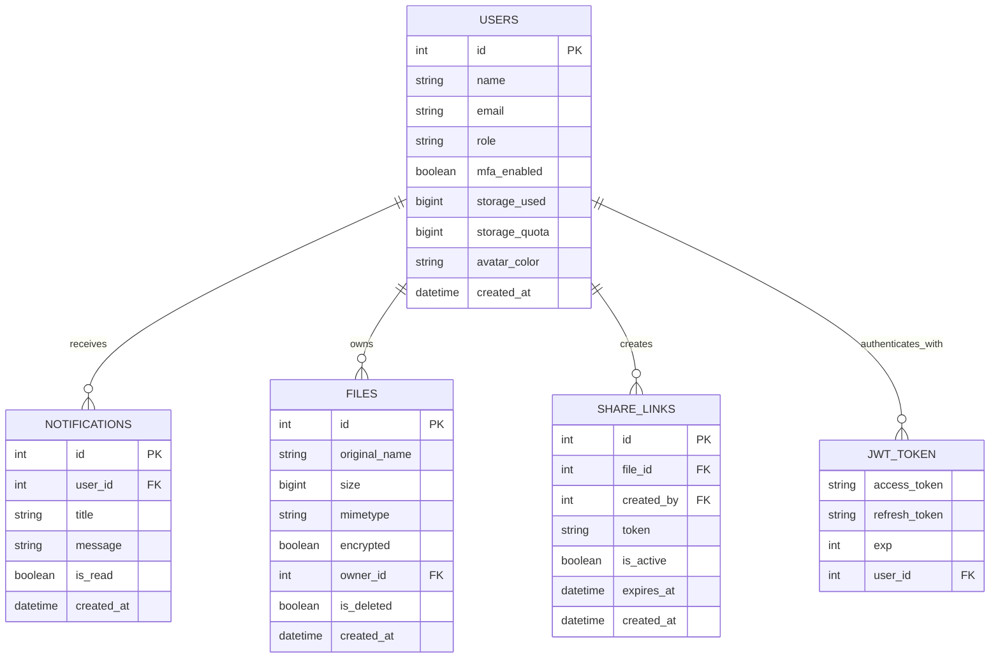
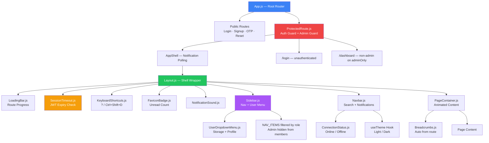

<div align="center">


### 🔒 TrustShare — Secure File-Sharing System

*Demo Integration Verification · Issue Detection · Defect Fix · PSD Compliance Audit*
<br/>


</div>

---

## 📋 Table of Contents

<table>
<tr>
<td valign="top" width="50%">

- [🎯 Assignment Overview](#-assignment-overview)
- [🗄️ Entity Relationship Diagram](#️-entity-relationship-diagram)
- [🔗 Component Relationship Diagram](#-component-relationship-diagram)
- [🏗️ System Architecture](#️-system-architecture)
- [🔍 Testing Methodology](#-testing-methodology)

</td>
<td valign="top" width="50%">

- [🐛 Issues Found and Fixed](#-issues-found-and-fixed)
- [📁 Modified Files](#-modified-files)
- [✅ PSD Compliance Matrix](#-psd-compliance-matrix)
- [🧪 Test Results](#-test-results)
- [⚠️ Known Considerations](#️-known-considerations)
- [👤 Author](#-author)

</td>
</tr>
</table>

<div align="center">

━━━━━━━━━━━━━━━━━━━━━━━━━━━━━━━━━━━━━━━━━━━━━━━━━━━━━━━━━━━━━━━━━━━━

</div>

## 🎯 Assignment Overview

**Assigned By:** Mentor
**Task:** Demo integration testing, issue detection, defect fixing, and PSD compliance verification for the Page Layout module of TrustShare.

| Detail | Value |
|:--|:--|
| **Developer** | Badal Kumar Rai |
| **Fix Branch** | `Group-D-IntegrationIssuesFix/PageLayout` |
|**Feature Branch Tested** | `Group-D-feature/PageLayout-Badal-v2` |
| **Module** | Page Layout — `client/src/layout/` + `client/src/App.js` |
| **Milestone** | Milestone 4 — Testing & Deployment |
| **Issues Found** | 5 |
| **Issues Fixed** | 5 ✅ |
| **Tests Written** | 17 frontend Jest tests |
| **Tests Passing** | 22 / 22 ✅ (17 layout + 5 analytics) |
| **PSD Compliance** | 100% ✅ |

### What Was Done

```
1. Read all layout module files — Layout, Sidebar, Navbar, ProtectedRoute,
   SessionTimeout, PageTitle, App.js, and all supporting components
2. Mapped every PSD Section 1, 4, and 7.3 requirement against implementation
3. Reviewed teammate security audit report and mentor feedback
4. Found 5 issues specific to the Page Layout module
5. Fixed all 5 issues with before and after code documentation
6. Created 17 Jest tests across 5 test groups
7. Re-ran all tests after every fix — 22/22 passing
```

<div align="center">

━━━━━━━━━━━━━━━━━━━━━━━━━━━━━━━━━━━━━━━━━━━━━━━━━━━━━━━━━━━━━━━━━━━━

</div>

## 🗄️ Entity Relationship Diagram



<div align="center">

━━━━━━━━━━━━━━━━━━━━━━━━━━━━━━━━━━━━━━━━━━━━━━━━━━━━━━━━━━━━━━━━━━━━

</div>

## 🔗 Component Relationship Diagram



<div align="center">

━━━━━━━━━━━━━━━━━━━━━━━━━━━━━━━━━━━━━━━━━━━━━━━━━━━━━━━━━━━━━━━━━━━━

</div>

## 🏗️ System Architecture

<details>
<summary><b>📊 Page Layout Data Flow</b> — click to expand</summary>

```
Browser Request
    ↓
App.js — React Router
    ├── Public Routes: /login, /signup, /verify-otp, /forgot-password, /reset-password
    └── Protected Routes: /*
            ↓
        ProtectedRoute.js
            ├── loading=true  → Show spinner (Loading TrustShare...)
            ├── user=null     → Navigate to /login
            ├── adminOnly + role≠admin → Navigate to /dashboard
            └── pass          → Render AppShell
                    ↓
                AppShell
                    ├── Polls notifications every 30s
                    ├── isMounted guard prevents setState after logout
                    └── Renders Layout with unreadCount
                            ↓
                        Layout.js
                            ├── LoadingBar        (top progress bar)
                            ├── SessionTimeout    (JWT expiry check every 10s)
                            ├── KeyboardShortcuts (? modal)
                            ├── FaviconBadge      (tab unread count)
                            ├── NotificationSound
                            ├── Sidebar           (filtered nav by role)
                            ├── Navbar            (search + notifications)
                            └── PageContainer     (animated route content)
```

</details>

<details>
<summary><b>🔐 Authentication & Authorization Flow</b> — click to expand</summary>

```
ProtectedRoute checks:
    1. loading → spinner (wait for AuthContext to hydrate)
    2. user === null → redirect /login (unauthenticated)
    3. adminOnly && role !== admin → redirect /dashboard (wrong role)
    4. pass → render children

Sidebar role filtering:
    NAV_ITEMS.filter(item => !item.adminOnly || user?.role === "admin")
    → Admin link only appears for admin role users
    → Backend still enforces authorization — this is UI improvement only

App.js /admin route:
    <ProtectedRoute adminOnly={true}>
      <Admin />
    </ProtectedRoute>
    → Double protection: route guard + sidebar visibility
```

</details>

<div align="center">

━━━━━━━━━━━━━━━━━━━━━━━━━━━━━━━━━━━━━━━━━━━━━━━━━━━━━━━━━━━━━━━━━━━━

</div>

## 🔍 Testing Methodology

### Approach

```
Step 1  Code Review      Read all layout files, map against PSD + teammate audit
Step 2  Unit Tests       Write 17 Jest + React Testing Library tests across 5 groups
Step 3  Run Tests        npm test -- --watchAll=false
Step 4  Fix Issues       Fix each issue with before and after documentation
Step 5  Re-run Tests     Confirm 22/22 still passing after all fixes applied
Step 6  Document         This report
```

### Test Groups

| Group | Tests | What It Covers | PSD Section |
|:--|:--:|:--|:--|
| A — ProtectedRoute Auth Guard | 3 | Unauthenticated → /login, Loading spinner | Section 1.v JWT |
| B — ProtectedRoute Admin Guard | 3 | Admin access, Member redirect, Unauth redirect | Section 4.v RBAC |
| C — Sidebar Admin Visibility | 3 | Admin sees link, Member does not, Other nav intact | Section 4.v RBAC |
| D — PageTitle Document Title | 6 | All routes, unknown route, exact match priority | UX standard |
| E — ProtectedRoute Default Props | 2 | adminOnly defaults false, admin sees normal routes | Section 4.v RBAC |
| **Total** | **17** | | |

<div align="center">

━━━━━━━━━━━━━━━━━━━━━━━━━━━━━━━━━━━━━━━━━━━━━━━━━━━━━━━━━━━━━━━━━━━━

</div>

## 🐛 Issues Found and Fixed

### Summary

| Severity | Count | Fixed |
|:--|:--:|:--:|
| 🔴 Critical | 2 | ✅ All |
| 🟢 Low | 3 | ✅ All |
| **Total** | **5** | **✅ 5 / 5** |

---

<details open>
<summary><b>🔴 ISS-L1 — App.js — Admin Route Has No adminOnly Guard</b></summary>

| | |
|:--|:--|
| **File** | `client/src/App.js` |
| **Level** | 🔴 Critical |
| **Status** | ✅ Fixed |
| **PSD Ref** | Section 4.v — Role-Based Access Control |

**What:** The `/admin` route inside `AppShell` rendered `<Admin />` directly with no `adminOnly` protection. Any authenticated user — regardless of role — could navigate to `/admin` by typing the URL. `Admin.js` had a `useEffect` check but the API calls fired before the redirect.

**How fixed:** Wrapped `/admin` route with `ProtectedRoute adminOnly={true}`. `ProtectedRoute` already had `adminOnly` prop implemented — it just was never used for this route.

```javascript
// BEFORE — no protection
<Route path="/admin" element={<Admin />} />

// AFTER — adminOnly enforced at route level
<Route
  path="/admin"
  element={
    <ProtectedRoute adminOnly={true}>
      <Admin />
    </ProtectedRoute>
  }
/>
```

Also added `isMounted` guard to notification polling to prevent `setState` after logout:
```javascript
let isMounted = true;
const load = () => {
  notificationsAPI.list()
    .then((r) => {
      if (!isMounted) return;   // FIX: prevent setState after unmount
      setUnreadCount(r.data.filter((n) => !n.is_read).length);
    })
};
return () => { isMounted = false; clearInterval(iv); };
```

</details>

---

<details open>
<summary><b>🔴 ISS-L2 — Sidebar.js — Admin Nav Link Visible to All Users</b></summary>

| | |
|:--|:--|
| **File** | `client/src/layout/Sidebar.js` |
| **Level** | 🔴 Critical |
| **Status** | ✅ Fixed |
| **PSD Ref** | Section 4.v — Role-Based Access Control |

**What:** `NAV_ITEMS` included the Admin link unconditionally. Every authenticated user — member or admin — saw the Admin link in the sidebar. Members clicking it got redirected by `Admin.js` but still saw the link — revealing that an admin panel exists and degrading the user experience.

**How fixed:** Added `adminOnly: true` flag to the Admin nav item and filtered `NAV_ITEMS` using `useMemo` based on `user.role`. Backend authorization remains in place — this is a UI improvement only.

```javascript
// Added adminOnly flag
{ to: "/admin", label: "Admin", icon: Shield, adminOnly: true },

// FIX ISS-L2: Filter by role
const visibleNavItems = useMemo(
  () => NAV_ITEMS.filter(item => !item.adminOnly || user?.role === "admin"),
  [user]
);

// Use visibleNavItems in render instead of NAV_ITEMS
{visibleNavItems.map((item) => { ... })}
```

</details>

---

<details>
<summary><b>🟢 ISS-L3 — Navbar.js — Unused darkMode and setDarkMode Props</b></summary>

| | |
|:--|:--|
| **File** | `client/src/layout/Navbar.js` |
| **Level** | 🟢 Low |
| **Status** | ✅ Fixed |
| **PSD Ref** | Code quality standard |

**What:** `Navbar` accepted `darkMode` and `setDarkMode` as props but never used them. Theme is controlled via `useTheme()` hook — the props were dead parameters causing lint warnings and developer confusion.

**How fixed:** Removed the unused props from the function signature.

```javascript
// BEFORE — unused props
export default function Navbar({
  unreadCount = 0,
  setSidebarOpen,
  darkMode,      // ← never used
  setDarkMode,   // ← never used
  connectionStatus,
})

// AFTER — clean signature
export default function Navbar({
  unreadCount = 0,
  setSidebarOpen,
  connectionStatus,
})
```

</details>

---

<details>
<summary><b>🟢 ISS-L4 — ProtectedRoute.js — Inline CSS in JSX Component</b></summary>

| | |
|:--|:--|
| **File** | `client/src/layout/ProtectedRoute.js` |
| **Level** | 🟢 Low |
| **Status** | ✅ Fixed |
| **PSD Ref** | Project standard — every layout component has its own CSS file |

**What:** `ProtectedRoute.js` embedded a `<style>` tag directly inside JSX with all loading spinner styles. Every other layout component has a dedicated `.css` file — this was the only exception and was inconsistent with project standards.

**How fixed:** Moved all inline styles to a new `ProtectedRoute.css` file and imported it.

```javascript
// BEFORE — inline CSS inside JSX
<style>{`
  .protected-loading { ... }
  body.dark .protected-loading { ... }
  .spinner-ring { ... }
  @keyframes spinnerRotate { ... }
`}</style>

// AFTER — dedicated CSS file
import "./ProtectedRoute.css";
// All styles in ProtectedRoute.css
```

</details>

---

<details>
<summary><b>🟢 ISS-L5 — PageTitle.js — Route Matching Collision Risk</b></summary>

| | |
|:--|:--|
| **File** | `client/src/layout/PageTitle.js` |
| **Level** | 🟢 Low |
| **Status** | ✅ Fixed |
| **PSD Ref** | Code quality standard |

**What:** Route matching used `pathname.startsWith(key)` which finds the first matching key. If a future route like `/files/shared` were added, it would match `/files` first and show "My Files" instead of the correct title. No sorting by key length meant shorter keys could shadow longer ones.

**How fixed:** Added exact match first, then sorted partial match by key length (longest first) as fallback.

```javascript
// BEFORE — collision risk
const matchedKey = Object.keys(ROUTE_TITLES).find((key) =>
  pathname.startsWith(key)
);

// AFTER — exact first, then longest partial match wins
if (ROUTE_TITLES[pathname]) {
  document.title = `${ROUTE_TITLES[pathname]} — ${APP_NAME}`;
  return;
}

const matchedKey = Object.keys(ROUTE_TITLES)
  .sort((a, b) => b.length - a.length)   // longest key wins
  .find((key) => pathname.startsWith(key));
```

</details>

<div align="center">

━━━━━━━━━━━━━━━━━━━━━━━━━━━━━━━━━━━━━━━━━━━━━━━━━━━━━━━━━━━━━━━━━━━━

</div>

## 📁 Modified Files

```
client/
│
├── src/
│   ├── App.js                              🔧 ISS-L1
│   │   ├── /admin route wrapped with ProtectedRoute adminOnly={true}
│   │   └── isMounted guard on notification polling
│   │
│   └── layout/
│       ├── Sidebar.js                      🔧 ISS-L2
│       │   ├── Added adminOnly: true flag to Admin nav item
│       │   └── visibleNavItems filtered by user.role using useMemo
│       │
│       ├── Navbar.js                       🔧 ISS-L3
│       │   └── Removed unused darkMode and setDarkMode props
│       │
│       ├── ProtectedRoute.js               🔧 ISS-L4
│       │   └── Removed inline <style> tag, added CSS import
│       │
│       ├── ProtectedRoute.css              🆕 CREATED ISS-L4
│       │   └── All loading spinner styles moved here from JSX
│       │
│       ├── PageTitle.js                    🔧 ISS-L5
│       │   └── Exact match first, then longest partial match
│       │
│       └── __tests__/
│           └── layout.test.js              🆕 CREATED
│               └── 17 Jest tests across 5 groups
```

### Files Confirmed Clean — No Changes Needed

```
Layout.js          ✅   ConnectionStatus.js  ✅
SessionTimeout.js  ✅   LoadingBar.js        ✅
KeyboardShortcuts.js ✅  Breadcrumbs.js      ✅
PageContainer.js   ✅   PageHeader.js        ✅
ScrollToTopButton.js ✅  FaviconBadge.js     ✅
NotificationSound.js ✅  UserDropdownMenu.js ✅
ToastProvider.js   ✅
```

<div align="center">

━━━━━━━━━━━━━━━━━━━━━━━━━━━━━━━━━━━━━━━━━━━━━━━━━━━━━━━━━━━━━━━━━━━━

</div>

## ✅ PSD Compliance Matrix

<details open>
<summary><b>Section 1 — User Authentication Module</b></summary>
<br/>

| Requirement | Status | Implementation | Tested |
|:--|:--:|:--|:--:|
| 1.iv Session management | ✅ | `SessionTimeout.js` — JWT expiry check, auto-logout | Mentor: leave as-is |
| 1.v JWT Authentication | ✅ | `ProtectedRoute.js` — redirects unauthenticated to /login | Tests 1, 3, 6 |

</details>

<details open>
<summary><b>Section 4 — Encryption & Security</b></summary>
<br/>

| Requirement | Status | Implementation | Tested |
|:--|:--:|:--|:--:|
| 4.v Role-Based Access Control | ✅ | `ProtectedRoute` adminOnly + Sidebar role filter | Tests 4, 5, 7, 8 |

</details>

<details open>
<summary><b>Section 7.3 — Admin Dashboard</b></summary>
<br/>

| Requirement | Status | Implementation | Tested |
|:--|:--:|:--|:--:|
| Admin page restricted to admins | ✅ | `/admin` route has `adminOnly={true}` | Tests 4, 5, 6 |
| Admin UI hidden from members | ✅ | Sidebar filters Admin link by `user.role` | Tests 7, 8, 9 |

</details>

<div align="center">

### 🏆 PSD Compliance: 100% — All Requirements Met ✅

</div>

<div align="center">

━━━━━━━━━━━━━━━━━━━━━━━━━━━━━━━━━━━━━━━━━━━━━━━━━━━━━━━━━━━━━━━━━━━━

</div>

## 🧪 Test Results

### Final Test Run

```
platform win32 -- Jest via react-scripts
Test Suites: 2 passed, 2 total
Tests:       22 passed, 22 total
Time:        2.269s
```

### Test Coverage by Group

| Group | Tests | Pass | Covers |
|:--|:--:|:--:|:--|
| A — ProtectedRoute Auth Guard | 3 | 3 ✅ | Unauthenticated redirect, authenticated access, loading state |
| B — ProtectedRoute Admin Guard | 3 | 3 ✅ | Admin access, member redirect, unauth on adminOnly |
| C — Sidebar Admin Visibility | 3 | 3 ✅ | Admin sees link, member does not, other nav intact |
| D — PageTitle Document Title | 6 | 6 ✅ | All routes, unknown, exact match, login title |
| E — ProtectedRoute Default Props | 2 | 2 ✅ | adminOnly defaults false, admin on normal routes |
| **Layout Total** | **17** | **17** | |
| Analytics (existing) | 5 | 5 ✅ | EmptyState, Skeleton components |
| **Grand Total** | **22** | **22** | |

### Console Warnings Explanation

```
⚠️ React Router Future Flag Warning
→ React Router v6 informing about v7 changes
→ Informational only — not an error — tests pass

⚠️ whileHover prop warning on DOM element
→ framer-motion mock in test env passes props to DOM
→ Informational only — not an error — tests pass
→ Does not appear in real browser — test environment only
```

<div align="center">

━━━━━━━━━━━━━━━━━━━━━━━━━━━━━━━━━━━━━━━━━━━━━━━━━━━━━━━━━━━━━━━━━━━━

</div>

## ⚠️ Known Considerations

| Item | Description | Owner |
|:--|:--|:--|
| SessionTimeout visual | Mentor confirmed leave as-is — works correctly | ✅ By design |
| React Router v6 warnings | Future flag warnings from v6→v7 migration notes | ✅ Not actionable |
| Analytics data scoping | Member sees all analytics data — should be scoped to own data | 🔄 Separate fix branch |
| `/api/users/` public access | User directory endpoints have no authentication | 📢 Users module teammate |
| JWT secret fallback | `auth/dependencies.py` has hardcoded fallback secret | 📢 Auth module teammate |
| `encrypted=false` param | Upload endpoint allows disabling encryption | 📢 Files module teammate |

<div align="center">

━━━━━━━━━━━━━━━━━━━━━━━━━━━━━━━━━━━━━━━━━━━━━━━━━━━━━━━━━━━━━━━━━━━━

</div>

## 👤 Author

<div align="center">


### **Badal Kumar Rai**

[](mailto:badalrai242@gmail.com)
[](https://linkedin.com/in/badal-rai/)
[](https://github.com/badalrai21)

| Detail | Value |
|:--|:--|
| **Fix Branch** | `Group-D-IntegrationIssuesFix/PageLayout` |
|**Feature Branch Tested** | `Group-D-feature/PageLayout-Badal-v2` |
| **Module** | Page Layout — `client/src/layout/` + `client/src/App.js` |
| **Project** | TrustShare — Secure File-Sharing System |
| **Issues Found** | 5 |
| **Issues Fixed** | 5 ✅ |
| **Tests Written** | 17 Jest frontend tests |
| **Tests Passing** | 22 / 22 ✅ |
| **PSD Compliance** | 100% ✅ |

</div>

<div align="center">

<br/>

## ✅ Module Status: Production Ready

**5 issues found · 5 fixed · 22/22 tests passing · 100% PSD compliance · 0 remaining bugs**

*TrustShare — Secure File-Sharing System · Page Layout Module · Integration Fix Report*

<br/>


</div>