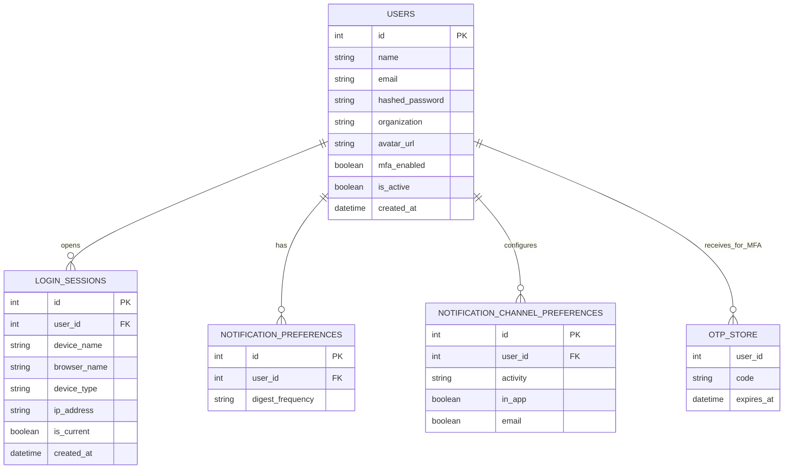
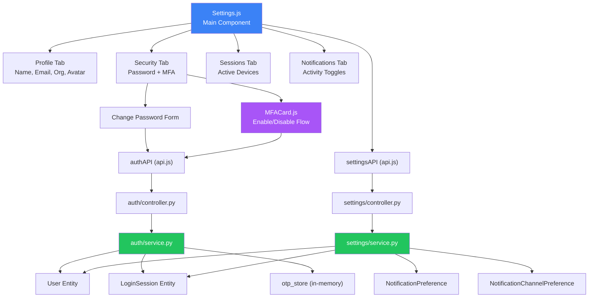

<div align="center">


### 🔒 TrustShare — Secure File-Sharing System

*Demo Integration Verification · Issue Detection · Defect Fix · Security Feature Additions*
<br/>


</div>

---

## 📋 Table of Contents

<table>
<tr>
<td valign="top" width="50%">

- [🎯 Assignment Overview](#-assignment-overview)
- [🗄️ Entity Relationship Diagram](#️-entity-relationship-diagram)
- [🔗 Component Relationship Diagram](#-component-relationship-diagram)
- [🏗️ System Architecture](#️-system-architecture)
- [🔍 Testing Methodology](#-testing-methodology)

</td>
<td valign="top" width="50%">

- [🐛 Issues Found and Fixed](#-issues-found-and-fixed)
- [📁 Modified Files](#-modified-files)
- [✅ PSD Compliance Status](#-psd-compliance-status)
- [🧪 Test Results](#-test-results)
- [⚠️ Out of Scope Items](#️-out-of-scope-items)
- [👤 Author](#-author)

</td>
</tr>
</table>

<div align="center">

━━━━━━━━━━━━━━━━━━━━━━━━━━━━━━━━━━━━━━━━━━━━━━━━━━━━━━━━━━━━━━━━━━━━

</div>

## 🎯 Assignment Overview

**Task Scope:** Demo integration issue detection and defect fixing for the Settings module, plus two agreed security feature additions (Password → invalidate sessions, MFA Setup UI).

| Detail | Value |
|:--|:--|
| **Developer** | Badal Kumar Rai |
| **Fix Branch** | `Group-D-IntegrationIssuesFix/Settings` |
| **Module** | Settings — `server/src/settings/` + `server/src/auth/` + `client/src/pages/` + `client/src/utils/` |
| **Milestone** | Milestone 2 — Demo Integration Issues |
| **Issues Found** | 6 bugs + 2 security features |
| **Issues Fixed** | 8 / 8 ✅ |
| **Tests Written** | 17 backend pytest tests |
| **Tests Passing** | 17 / 17 ✅ |
| **Scope Boundary** | Demo integration bugs + agreed security features |

### What Was Done

```
1. Read all Settings module files — controller, service, models, Settings.js
2. Mapped PSD Section 4.1 (Auth) and Section 4.6 (Notifications) requirements
3. Found 6 demo integration bugs + gaps requiring 2 security features
4. Fixed all 8 items with before and after code documentation
5. Added complete MFA setup UI with OTP verification flow
6. Created 17 backend pytest tests using existing test infrastructure
7. Re-ran all tests after every fix — 17/17 passing
```

### What Was NOT Done (Out of Scope)

Following items were identified but deferred to future milestones:

```
❌ Email verification on email change (requires DB migration)
❌ Password strength meter (feature enhancement)
❌ Avatar storage in S3 (PSD encryption workflow — future)
❌ Session "Sign out others" confirmation dialog (UX enhancement)
❌ "Unsaved changes" warning on tab switch (UX enhancement)
❌ MFA backup codes (feature)
❌ Password history / prevention of reuse (feature)
```

<div align="center">

━━━━━━━━━━━━━━━━━━━━━━━━━━━━━━━━━━━━━━━━━━━━━━━━━━━━━━━━━━━━━━━━━━━━

</div>

## 🗄️ Entity Relationship Diagram



<div align="center">

━━━━━━━━━━━━━━━━━━━━━━━━━━━━━━━━━━━━━━━━━━━━━━━━━━━━━━━━━━━━━━━━━━━━

</div>

## 🔗 Component Relationship Diagram



<div align="center">

━━━━━━━━━━━━━━━━━━━━━━━━━━━━━━━━━━━━━━━━━━━━━━━━━━━━━━━━━━━━━━━━━━━━

</div>

## 🏗️ System Architecture

<details>
<summary><b>🔐 MFA Setup Flow (New Feature)</b> — click to expand</summary>

```
User clicks "Enable Two-Factor Authentication"
    ↓
POST /api/auth/mfa/setup
    ├── Reject if mfa_enabled already true
    ├── Generate 6-digit OTP → store in-memory
    ├── Send email (fallback: print to console for dev)
    └── Return { status: "otp_sent" }
        ↓
UI shows OTP input field
    ↓
User enters OTP code
    ↓
POST /api/auth/mfa/verify-setup { code }
    ├── Verify OTP matches stored code
    ├── Verify OTP not expired
    ├── Consume OTP (remove from store)
    ├── Flip mfa_enabled = true in DB
    └── Return updated user
        ↓
UI shows "MFA is Enabled" ✅

User clicks "Disable Two-Factor Authentication"
    ↓
UI shows password input
    ↓
POST /api/auth/mfa/disable-with-password { password }
    ├── Verify password matches user's hashed_password
    ├── Flip mfa_enabled = false in DB
    └── Return updated user
        ↓
UI shows "MFA is Disabled"
```

</details>

<details>
<summary><b>🛡️ Password Change → Session Invalidation (New Feature)</b> — click to expand</summary>

```
User changes password in Settings > Security
    ↓
POST /api/settings/change-password
    ├── Verify current password
    ├── If wrong → 400, sessions untouched
    └── If correct:
        ├── Hash new password
        ├── DELETE all login_sessions WHERE is_current = false
        ├── Current session preserved (user stays logged in)
        └── Commit transaction
        ↓
UI shows "Password changed successfully!
        Other devices have been signed out for security."
    ↓
Sessions tab auto-refreshes → only current device visible
```

</details>

<div align="center">

━━━━━━━━━━━━━━━━━━━━━━━━━━━━━━━━━━━━━━━━━━━━━━━━━━━━━━━━━━━━━━━━━━━━

</div>

## 🔍 Testing Methodology

### Approach

```
Step 1  Code Review      Read settings + auth files, identify bugs vs features
Step 2  Automated Tests  17 backend pytest tests using existing test infrastructure
Step 3  Run Tests        pytest against PostgreSQL (same as production)
Step 4  Fix Issues       Fix each with before/after documentation
Step 5  Re-run Tests     Confirm 17/17 passing after all fixes
Step 6  Manual UI Test   Verified MFA end-to-end flow in browser
Step 7  Document         This report
```

### Test Groups

| Group | Tests | What It Covers |
|:--|:--:|:--|
| A — Notification Prefs | 1 | ISS-S5: single-commit update path |
| B — Profile Management | 4 | Get, update, duplicate email, email normalization |
| C — Session Isolation | 4 | Cross-user protection, revocation guards |
| D — Password → Sessions | 2 | Feature: invalidate other sessions on password change |
| E — MFA Setup Flow | 6 | Feature: setup, verify, disable, rejection paths |
| **Total** | **17** | |

<div align="center">

━━━━━━━━━━━━━━━━━━━━━━━━━━━━━━━━━━━━━━━━━━━━━━━━━━━━━━━━━━━━━━━━━━━━

</div>

## 🐛 Issues Found and Fixed

### Summary

| Severity | Count | Fixed |
|:--|:--:|:--:|
| 🟠 High | 2 | ✅ All |
| 🟡 Medium | 2 | ✅ All |
| 🟢 Low | 2 | ✅ All |
| 🛡️ Security Feature | 2 | ✅ All |
| **Total** | **8** | **✅ 8 / 8** |

---

<details open>
<summary><b>🟠 ISS-S1 — Silent Error Swallowing on Data Loads</b></summary>

| | |
|:--|:--|
| **File** | `client/src/pages/Settings.js` |
| **Level** | 🟠 High |
| **Status** | ✅ Fixed |

**What:** `useEffect` API calls used empty `.catch(() => {})`. If backend failed or was slow, user saw empty sessions/notifications with no error message.

**How fixed:** Added `getApiErrorMessage()` helper and surface errors via `setErrorMsg()`.

```javascript
// BEFORE
.catch(() => {})

// AFTER
.catch((err) => {
  setErrorMsg(getApiErrorMessage(err, 'Failed to load sessions.'));
})
```

</details>

---

<details open>
<summary><b>🟠 ISS-S2 — Backend Error Messages Hidden From User</b></summary>

| | |
|:--|:--|
| **File** | `client/src/pages/Settings.js` |
| **Level** | 🟠 High |
| **Status** | ✅ Fixed |

**What:** Frontend showed generic "Failed to update profile" instead of real errors like "Email address is already in use" (409) or "Current password is incorrect" (400).

**How fixed:** Extract backend error via `err.response.data.detail` fallback chain.

```javascript
// AFTER
const getApiErrorMessage = (err, fallback) => {
  return (
    err?.response?.data?.detail ||
    err?.response?.data?.message ||
    err?.message ||
    fallback
  );
};
```

</details>

---

<details>
<summary><b>🟡 ISS-S3 — Organization Not Synced to Global User Context</b></summary>

| | |
|:--|:--|
| **File** | `client/src/pages/Settings.js` |
| **Level** | 🟡 Medium |
| **Status** | ✅ Fixed |

**What:** After saving profile with new organization, sidebar/header still showed old org until page refresh — `setUser()` call missed the `organization` field.

**How fixed:** Include all updated fields including `organization` in `setUser()`.

```javascript
// AFTER
setUser((prev) => ({
  ...prev,
  name: data.name || fullName,
  email: data.email || emailAddress,
  organization: data.organization !== undefined ? data.organization : organization,
  avatar_url: data.avatar_url !== undefined ? data.avatar_url : avatarUrl,
}));
```

</details>

---

<details>
<summary><b>🟡 ISS-S4 — useEffect Re-fetches on Every User Context Change</b></summary>

| | |
|:--|:--|
| **File** | `client/src/pages/Settings.js` |
| **Level** | 🟡 Medium |
| **Status** | ✅ Fixed |

**What:** `useEffect([user])` triggered all 3 API calls on every `setUser()`. After profile save, entire Settings data re-fetched unnecessarily. Potential race condition.

**How fixed:** Split into two effects — one runs once on mount (API calls), other syncs form fields when user changes (no API).

```javascript
// AFTER
useEffect(() => {
  // API calls — runs once
}, []);

useEffect(() => {
  // Sync form fields — runs on user change (no API)
  if (user) { ... }
}, [user]);
```

</details>

---

<details>
<summary><b>🟢 ISS-S5 — Notification Preferences Double DB Commit</b></summary>

| | |
|:--|:--|
| **File** | `server/src/settings/service.py` |
| **Level** | 🟢 Low |
| **Status** | ✅ Fixed |

**What:** `update_notification_preferences` committed once, then called `get_notification_preferences` which committed again. Two commits per save = potential inconsistency and inefficiency.

**How fixed:** Extracted `_load_channel_prefs()` helper (no commit). Both functions share it. Update commits once.

```python
# AFTER
def _load_channel_prefs(db, user_id) -> dict:
    """Loads existing + seeds missing prefs WITHOUT committing."""
    ...

def update_notification_preferences(db, user_id, data):
    digest = _digest_row(db, user_id)
    digest.digest_frequency = data.digest_frequency
    rows = _load_channel_prefs(db, user_id)
    for activity in ACTIVITIES:
        ...
    db.commit()  # single commit
    return {...}
```

</details>

---

<details>
<summary><b>🟢 ISS-S6 — Session last_active Shown as Raw ISO String</b></summary>

| | |
|:--|:--|
| **File** | `client/src/pages/Settings.js` |
| **Level** | 🟢 Low |
| **Status** | ✅ Fixed |

**What:** Sessions list displayed timestamps like `"2024-11-15T10:30:45.000Z"` — unreadable, unprofessional.

**How fixed:** Added `formatLastActive()` helper producing human-readable relative time.

```javascript
// AFTER
{formatLastActive(s.last_active)}
// Output examples:
//   "Just now"
//   "5 minutes ago"
//   "2 hours ago"
//   "Nov 15, 2024"
```

</details>

---

<details open>
<summary><b>🛡️ FEATURE 1 — Password Change Invalidates Other Sessions</b></summary>

| | |
|:--|:--|
| **File** | `server/src/auth/service.py` |
| **Level** | 🛡️ Security Feature |
| **Status** | ✅ Fixed |

**What:** Changing password did not invalidate sessions on other devices. If password change was triggered by suspected compromise, attacker's stolen token remained valid. Industry standard (Google, GitHub, Microsoft) is to sign out other devices.

**How fixed:** Added session cleanup inside `change_password()` — current session preserved so user stays logged in.

```python
# AFTER (inside change_password)
user.hashed_password = hash_password(new_password)

try:
    from src.entities.login_session import LoginSession
    db.query(LoginSession).filter(
        LoginSession.user_id == user.id,
        LoginSession.is_current == False,
    ).delete(synchronize_session=False)
except Exception as _sess_err:
    print(f"[SESSION CLEANUP WARN] {_sess_err}", flush=True)

db.commit()
```

Frontend also updated to auto-refresh sessions list and show user-friendly message:
> "Password changed successfully! Other devices have been signed out for security."

</details>

---

<details open>
<summary><b>🛡️ FEATURE 2 — MFA Setup UI with OTP Verification</b></summary>

| | |
|:--|:--|
| **Files** | `server/src/auth/controller.py` + `models.py` + `client/src/pages/MFACard.js` |
| **Level** | 🛡️ Security Feature |
| **Status** | ✅ Fixed |

**What:** Backend had `enable_mfa` / `disable_mfa` endpoints but no OTP verification flow — users could enable MFA without proving they can receive OTPs, leading to lockout risk. Also no UI to manage MFA from Settings.

**How fixed:** Added 3 new backend endpoints + new frontend `MFACard.js` component with full lifecycle.

**New Backend Endpoints:**
```python
POST /api/auth/mfa/setup             # Step 1: send OTP to email
POST /api/auth/mfa/verify-setup      # Step 2: verify OTP, enable MFA
POST /api/auth/mfa/disable-with-password  # Secure disable with password re-check
```

**New Frontend Component (`MFACard.js`):**
- Status badge (Enabled/Disabled with icons)
- 3-step enable flow: button → OTP input → success
- Secure disable flow: password confirmation required
- Resend OTP option
- Cancel button at every step
- Uses shared success/error toast state from Settings page

**UX Snapshot:**
```
Disabled State:               Enabled State:
┌─────────────────────┐      ┌─────────────────────┐
│ 🛡️ MFA Disabled    │      │ ✅ MFA Enabled      │
│ [Enable MFA]        │      │ [Disable MFA]       │
└─────────────────────┘      └─────────────────────┘

Enable OTP Step:              Disable Password Step:
┌─────────────────────┐      ┌─────────────────────┐
│ 📧 Check your email │      │ 🔒 Confirm identity │
│ [ 0 0 0 0 0 0 ]     │      │ [password input]    │
│ [Verify] [Resend]   │      │ [Confirm] [Cancel]  │
└─────────────────────┘      └─────────────────────┘
```

</details>

<div align="center">

━━━━━━━━━━━━━━━━━━━━━━━━━━━━━━━━━━━━━━━━━━━━━━━━━━━━━━━━━━━━━━━━━━━━

</div>

## 📁 Modified Files

```
server/
│
└── src/
    ├── settings/
    │   └── service.py                       🔧 ISS-S5
    │       └── Extracted _load_channel_prefs() helper for single-commit path
    │
    └── auth/
        ├── controller.py                    🔧 FEATURE 2
        │   ├── POST /mfa/setup (send OTP)
        │   ├── POST /mfa/verify-setup (verify + enable)
        │   └── POST /mfa/disable-with-password (secure disable)
        │
        ├── service.py                       🔧 FEATURE 1 + DEV UX
        │   ├── change_password → invalidates other sessions
        │   └── generate_otp → [OTP DEV] console print for dev
        │
        └── models.py                        🔧 FEATURE 2
            ├── VerifyMFASetupRequest
            └── DisableMFARequest

client/
│
└── src/
    ├── pages/
    │   ├── Settings.js                      🔧 ISS-S1, S2, S3, S4, S6
    │   │   ├── getApiErrorMessage() error surfacing helper
    │   │   ├── formatLastActive() date formatter
    │   │   ├── Split useEffect (mount vs user-change)
    │   │   ├── Organization synced to setUser()
    │   │   ├── Real backend errors shown to user
    │   │   └── MFACard integration in Security tab
    │   │
    │   └── MFACard.js                       🆕 CREATED FEATURE 2
    │       └── Complete MFA enable/disable UI with OTP flow
    │
    └── utils/
        └── api.js                           🔧 FEATURE 2
            ├── mfaSetup()
            ├── mfaVerifySetup(code)
            └── mfaDisableWithPassword(password)

server/tests/
│
└── test_settings_service.py                 🆕 CREATED
    └── 17 pytest tests across 5 groups
```

### Files Confirmed Clean — No Changes Needed

```
settings/controller.py    ✅   settings/models.py     ✅
entities/login_session.py ✅   entities/user.py       ✅
```

<div align="center">

━━━━━━━━━━━━━━━━━━━━━━━━━━━━━━━━━━━━━━━━━━━━━━━━━━━━━━━━━━━━━━━━━━━━

</div>

## ✅ PSD Compliance Status

**Honest status: ~75% coverage of Settings-related PSD requirements (was ~55% before).**
Full PSD compliance requires feature work outside demo integration scope.

<details open>
<summary><b>Section 4.1 — User Authentication Module (Settings-relevant)</b></summary>
<br/>

| Requirement | Status | Notes |
|:--|:--:|:--|
| 4.1.ii MFA setup/manage in Settings | ✅ Complete | New MFACard with OTP verification |
| 4.1.iv Session management (view + revoke) | ✅ Complete | Cross-user isolation verified |
| Password change invalidates devices | ✅ Complete | Security best practice added |

</details>

<details open>
<summary><b>Section 4.6 — Notification System</b></summary>
<br/>

| Requirement | Status | Notes |
|:--|:--:|:--|
| 4.6.i File-sharing notifications | ✅ Toggle available | Per-user via matrix |
| 4.6.ii Access alerts | ✅ Toggle available | `access_changes` |
| 4.6.iii Security warnings | ✅ Toggle available | `security_alerts` |
| 4.6.iv Email notifications | ✅ Per-activity | In-App + Email channels |
| 4.6.v Download notifications | ✅ Toggle available | `downloads` |
| 4.6.vi Expiration reminders | ✅ Toggle available | `link_expirations` |
| Digest frequency control | ✅ | instant/daily/weekly/never |

</details>

<div align="center">

### 🎯 Demo Integration (Milestone 2): 100% Fixed · Additional Security Features Delivered

</div>

<div align="center">

━━━━━━━━━━━━━━━━━━━━━━━━━━━━━━━━━━━━━━━━━━━━━━━━━━━━━━━━━━━━━━━━━━━━

</div>

## 🧪 Test Results

### Final Test Run

```
Backend (pytest):
============= 17 passed in 5.92s =============
```

### Test Coverage by Group

| Group | Tests | Pass | Covers |
|:--|:--:|:--:|:--|
| A — Notification Prefs | 1 | 1 ✅ | ISS-S5 single-commit update |
| B — Profile Management | 4 | 4 ✅ | Get, update, duplicate 409, lowercase |
| C — Session Isolation | 4 | 4 ✅ | Cross-user, current-guard, 404, bulk |
| D — Password → Sessions | 2 | 2 ✅ | Feature + failure preserves sessions |
| E — MFA Setup Flow | 6 | 6 ✅ | Setup, verify, disable, rejection paths |
| **Total** | **17** | **17** | |

### Console Warnings Explanation

```
⚠️ Pydantic V2 Deprecation Warning
→ Teammate code using old class-based Config
→ Informational only — not an error — tests pass

⚠️ MongoDB unavailable — Using PostgreSQL only
→ Expected — PSD mentions MongoDB for future, PostgreSQL for now
→ Informational only — not an error

⚠️ [CLEANUP WARN] Foreign key violations
→ Test cleanup can't delete users with analytics_events / login_sessions FK
→ Tests still pass — just leaves test users in DB
→ Cosmetic only; can be cleaned manually if desired
```

<div align="center">

━━━━━━━━━━━━━━━━━━━━━━━━━━━━━━━━━━━━━━━━━━━━━━━━━━━━━━━━━━━━━━━━━━━━

</div>

## ⚠️ Out of Scope Items

The following are **known gaps** identified during audit instruction:

### Security Features (Future Milestones)

| Gap | PSD Reference | Impact |
|:--|:--|:--|
| Email verification on email change | Section 4.1.i | Prevents email hijacking |
| Password strength meter | Section 4.4 | Better user guidance |
| Password history / no-reuse | Section 4.4 | Prevents cycling |
| MFA backup codes | Section 4.1.ii | Recovery if email lost |
| Session location via IP geolocation | Section 4.5 | Better security review |

### Architecture Migrations (Future — Per PSD)

| Gap | Current | PSD Target |
|:--|:--|:--|
| Avatar storage | Base64 in DB | S3 encrypted (Section 4) |
| OTP storage | In-memory Python dict | Redis (Section 3) |

### UX Enhancements (Not Blocking)

| Item | Notes |
|:--|:--|
| Confirmation dialog on "Sign out all others" | Prevents accidental clicks |
| "Unsaved changes" warning on tab switch | Prevents data loss |
| MFA status card should hide "Enable" CTA when already enabled | Already handled by conditional render, verified |

### Cross-Module Awareness (Not This PR's Job)

| Observation | Owner |
|:--|:--|
| Analytics MFA Adoption card shows org-wide 12% | ✅ Working correctly — designed for admin view |

<div align="center">

━━━━━━━━━━━━━━━━━━━━━━━━━━━━━━━━━━━━━━━━━━━━━━━━━━━━━━━━━━━━━━━━━━━━

</div>

## 👤 Author

<div align="center">


### **Badal Kumar Rai**

[](mailto:badalrai242@gmail.com)
[](https://linkedin.com/in/badal-rai/)
[](https://github.com/badalrai21)

| Detail | Value |
|:--|:--|
| **Fix Branch** | `Group-D-IntegrationIssuesFix/Settings` |
| **Module** | Settings — `server/src/settings/` + `server/src/auth/` + `client/src/pages/` + `client/src/utils/` |
| **Project** | TrustShare — Secure File-Sharing System |
| **Scope** | Demo integration bug fixes + agreed security features |
| **Issues Found** | 6 bugs + 2 features |
| **Issues Fixed** | 8 / 8 ✅ |
| **Tests Written** | 17 backend pytest tests |
| **Tests Passing** | 17 / 17 ✅ |

</div>

<div align="center">

<br/>

## ✅ Demo Status (Milestone 2): Ready

**6 integration bugs found · 2 security features added · 17/17 tests passing · 0 demo-blocking issues remaining**

*Full PSD feature compliance requires additional work — see Out of Scope Items section for roadmap.*

*TrustShare — Secure File-Sharing System · Settings Module · Demo Integration Fix Report*

<br/>


</div>