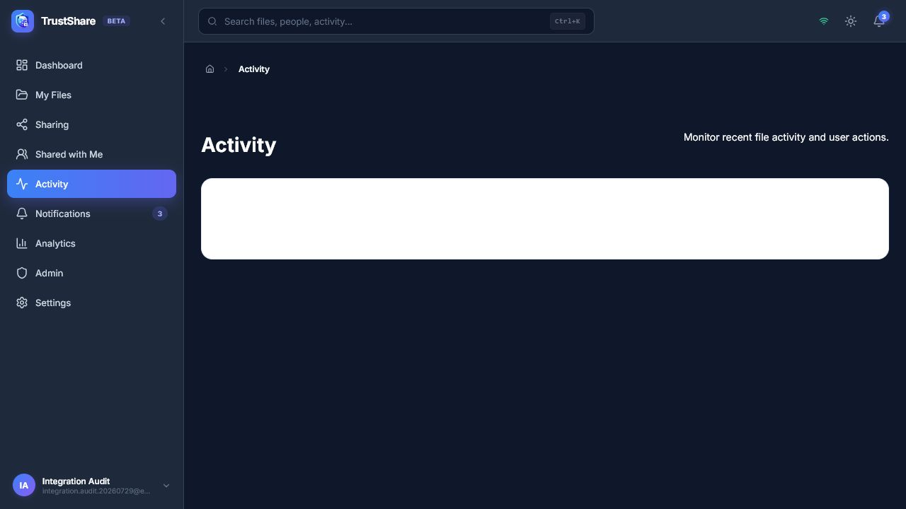
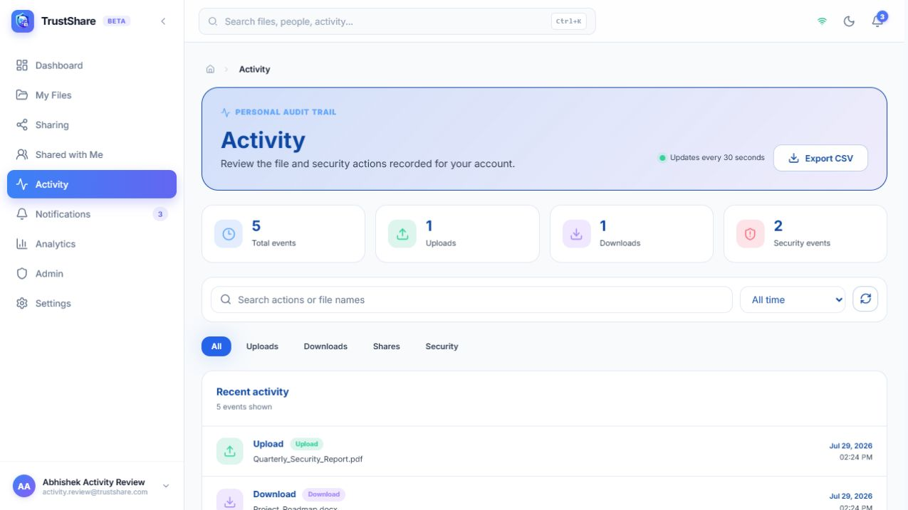
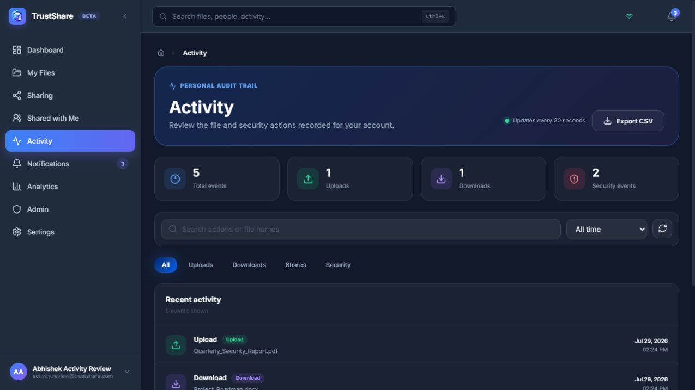
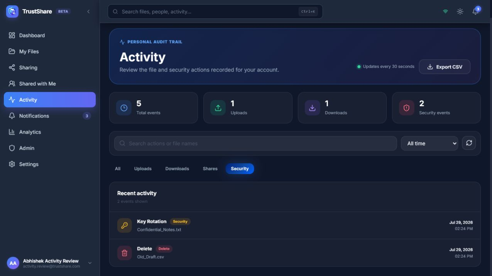

# Activity integration evidence

These screenshots were captured from locally running TrustShare builds on 29 July 2026. They are original browser screenshots, not generated mockups.

## Before: routed Activity page was a placeholder

The `main-group-D` route displayed only an empty placeholder. Existing upload, download, share, delete and security audit records were not connected to the page. In dark mode, the placeholder card also used an incompatible light background and made its empty-state text unreadable.

## After: real authenticated activity feed in light mode

The route now loads the real feature and reads the authenticated user's records from the existing shared audit trail. It provides event totals, file names, timestamps, search, date/type filters, refresh, CSV export and 30-second updates.

## After: readable dark theme

The complete Activity interface uses the existing TrustShare theme tokens, keeping the feed, controls and status badges readable in dark mode.

## After: working event filtering

The Security filter narrows the feed to security-relevant records while the totals continue to describe the complete authenticated activity set.

## Non-visual security fixes

- Every Activity endpoint now requires JWT authentication.
- Members can retrieve only their own activity; administrators retain the explicit compatibility route.
- The browser can no longer create fake/sample audit events or choose an arbitrary user ID.
- The frontend uses the shared Axios client and environment-based API URL instead of a hardcoded or mismatched base URL.
- Activity records come from the existing `audit_logs` source already used by file workflows, avoiding a second disconnected event system.
