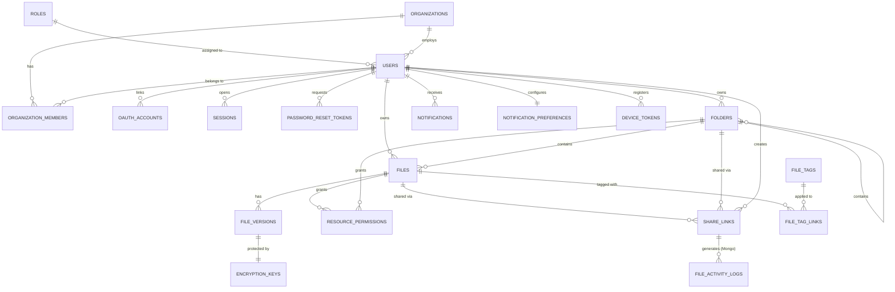

# TrustShare – Secure File-Sharing System
## Database Schema Design

**Project:** TrustShare – Secure File-Sharing System

**Date:** 9 July 2026  
**Created By:** Badal Kumar Rai   
**Scope:** Maps to Section 3 (Architecture Components) and Section 4 (Modules to be Implemented) of the project specification.
**Stack:** PostgreSQL (relational core) · MongoDB (activity/audit logs) · Redis (cache/sessions/tokens) · AWS S3 / Azure Blob (encrypted file storage)
**Status:** Architecture Review – READY FOR IMPLEMENTATION

---

## Table of Contents

1. [Overview](#1-overview)
2. [Database Architecture Rationale](#2-database-architecture-rationale)
3. [Entity Relationship Diagram](#3-entity-relationship-diagram)
4. [PostgreSQL Schema](#4-postgresql-schema)
5. [MongoDB Collections](#5-mongodb-collections)
6. [Redis Key Schema](#6-redis-key-schema)
7. [Object Storage Layout](#7-object-storage-layout)
8. [Indexing Strategy Summary](#8-indexing-strategy-summary)
9. [Security & Retention Notes](#9-security--retention-notes)
10. [Frontend Implementation Cross-Check](#10-frontend-implementation-cross-check-v12)

---

## 1. Overview

TrustShare uses **polyglot persistence** — different databases for different access patterns, matching the Data Storage Layer in the architecture diagram:

| Store | Holds | Why |
|---|---|---|
| **PostgreSQL** | Users, org data, file/folder metadata, permissions, share links, notifications | Strong consistency, relational integrity, transactional writes (e.g. permission checks) |
| **MongoDB** | File activity logs, login logs, audit logs, security events, analytics aggregates | High write volume, flexible/append-only documents, easy horizontal scaling |
| **Redis** | Sessions, refresh tokens, OTPs, rate limiting, hot-path caches | Sub-millisecond reads, native TTL/expiry for ephemeral data |
| **AWS S3 / Azure Blob** | Encrypted file bytes only | Durable, cheap, scalable blob storage — never queried, only fetched by key |

---

## 2. Database Architecture Rationale

- **UUID primary keys everywhere** (instead of auto-increment ints) so that file IDs, share tokens, and user IDs are non-guessable — important since some IDs (e.g. share links) are exposed externally.
- **Soft deletes** (`status` / `is_deleted` flags) instead of hard deletes on `files`, `folders`, and `users`, so audit trails and recovery remain possible.
- **Envelope encryption** for file encryption keys: each file version gets a unique Data Encryption Key (DEK), which is itself encrypted by a rotating master Key Encryption Key (KEK) — the DEK is what's stored in Postgres, never the plaintext key.
- **Metadata/content split**: Postgres never stores file bytes — only `storage_key` pointers into S3/Azure. This keeps the relational DB small and fast.
- **Logs go to Mongo, not Postgres**: activity and audit logs are high-volume and append-only, which suits Mongo's write throughput better than relational tables, and keeps Postgres lean for transactional queries.

---

## 3. Entity Relationship Diagram



---

## 4. PostgreSQL Schema

```sql
-- Extensions
CREATE EXTENSION IF NOT EXISTS "pgcrypto";   -- gen_random_uuid()
CREATE EXTENSION IF NOT EXISTS "pg_trgm";    -- fuzzy filename search
```

### 4.1 `roles`
*Lookup table for RBAC (User Authentication Module).*
```sql
CREATE TABLE roles (
    id          SERIAL PRIMARY KEY,
    name        VARCHAR(50) UNIQUE NOT NULL,   -- 'admin', 'org_admin', 'user', 'guest'
    description TEXT,
    created_at  TIMESTAMPTZ DEFAULT now()
);
```

### 4.2 `organizations`
*Supports the "Teams / Organizations" user tier from the architecture diagram.*
```sql
CREATE TABLE organizations (
    id                  UUID PRIMARY KEY DEFAULT gen_random_uuid(),
    name                VARCHAR(150) NOT NULL,
    owner_id            UUID NOT NULL,          -- FK added after users table exists
    storage_quota_bytes BIGINT DEFAULT 107374182400,  -- 100 GB default
    storage_used_bytes  BIGINT DEFAULT 0,
    created_at          TIMESTAMPTZ DEFAULT now(),
    updated_at          TIMESTAMPTZ DEFAULT now()
);
```

### 4.3 `users`
*Core Auth Service table: registration, login, MFA, password reset.*
```sql
CREATE TABLE users (
    id                    UUID PRIMARY KEY DEFAULT gen_random_uuid(),
    email                 VARCHAR(255) UNIQUE NOT NULL,
    username              VARCHAR(50) UNIQUE,
    password_hash         VARCHAR(255) NOT NULL,   -- bcrypt
    full_name             VARCHAR(150),
    phone_number          VARCHAR(20),
    role_id               INT NOT NULL REFERENCES roles(id),
    organization_id       UUID REFERENCES organizations(id) ON DELETE SET NULL,
    account_type          VARCHAR(20) DEFAULT 'individual'
                           CHECK (account_type IN ('individual','team_member','guest')),
    status                VARCHAR(20) DEFAULT 'active'
                           CHECK (status IN ('active','inactive','suspended','deleted')),
    email_verified        BOOLEAN DEFAULT FALSE,
    mfa_enabled           BOOLEAN DEFAULT FALSE,
    mfa_secret_encrypted  VARCHAR(255),            -- TOTP secret, encrypted at rest
    failed_login_attempts INT DEFAULT 0,
    locked_until          TIMESTAMPTZ,
    storage_quota_bytes   BIGINT DEFAULT 10737418240,  -- 10 GB default
    storage_used_bytes    BIGINT DEFAULT 0,
    last_login_at         TIMESTAMPTZ,
    created_at            TIMESTAMPTZ DEFAULT now(),
    updated_at            TIMESTAMPTZ DEFAULT now()
);

ALTER TABLE organizations
    ADD CONSTRAINT fk_org_owner FOREIGN KEY (owner_id) REFERENCES users(id);
```

### 4.4 `organization_members`
```sql
CREATE TABLE organization_members (
    id              UUID PRIMARY KEY DEFAULT gen_random_uuid(),
    organization_id UUID NOT NULL REFERENCES organizations(id) ON DELETE CASCADE,
    user_id         UUID NOT NULL REFERENCES users(id) ON DELETE CASCADE,
    role            VARCHAR(20) DEFAULT 'member'
                    CHECK (role IN ('org_admin','member','guest')),
    joined_at       TIMESTAMPTZ DEFAULT now(),
    UNIQUE(organization_id, user_id)
);
```

### 4.5 `oauth_accounts`
*OAuth2 / SSO integration.*
```sql
CREATE TABLE oauth_accounts (
    id                UUID PRIMARY KEY DEFAULT gen_random_uuid(),
    user_id           UUID NOT NULL REFERENCES users(id) ON DELETE CASCADE,
    provider          VARCHAR(30) NOT NULL,        -- 'google', 'github', 'microsoft'
    provider_user_id  VARCHAR(255) NOT NULL,
    access_token_enc  TEXT,                        -- encrypted at rest
    refresh_token_enc TEXT,                        -- encrypted at rest
    token_expires_at  TIMESTAMPTZ,
    created_at        TIMESTAMPTZ DEFAULT now(),
    UNIQUE(provider, provider_user_id)
);
```

### 4.6 `sessions`
*Backs JWT refresh-token sessions; mirrors the fast-path copy kept in Redis (see §6).*
```sql
CREATE TABLE sessions (
    id                  UUID PRIMARY KEY DEFAULT gen_random_uuid(),
    user_id             UUID NOT NULL REFERENCES users(id) ON DELETE CASCADE,
    refresh_token_hash  VARCHAR(255) NOT NULL,
    ip_address          INET,
    user_agent          TEXT,
    device_info         VARCHAR(255),          -- e.g. "MacBook Pro 14", "iPhone 15 Pro"
    browser             VARCHAR(100),           -- e.g. "Chrome 120" — parsed once at login, avoids re-parsing user_agent on every render
    location            VARCHAR(150),           -- e.g. "San Francisco, CA" — resolved from ip_address via geo-IP at login
    is_revoked          BOOLEAN DEFAULT FALSE,
    expires_at          TIMESTAMPTZ NOT NULL,
    created_at          TIMESTAMPTZ DEFAULT now()
);
CREATE INDEX idx_sessions_user_id ON sessions(user_id);
```

### 4.7 `password_reset_tokens`
```sql
CREATE TABLE password_reset_tokens (
    id         UUID PRIMARY KEY DEFAULT gen_random_uuid(),
    user_id    UUID NOT NULL REFERENCES users(id) ON DELETE CASCADE,
    token_hash VARCHAR(255) NOT NULL,
    expires_at TIMESTAMPTZ NOT NULL,
    used       BOOLEAN DEFAULT FALSE,
    created_at TIMESTAMPTZ DEFAULT now()
);
```

### 4.8 `folders`
*File Management Module: folder hierarchy.*
```sql
CREATE TABLE folders (
    id               UUID PRIMARY KEY DEFAULT gen_random_uuid(),
    name             VARCHAR(255) NOT NULL,
    parent_folder_id UUID REFERENCES folders(id) ON DELETE CASCADE,
    owner_id         UUID NOT NULL REFERENCES users(id),
    organization_id  UUID REFERENCES organizations(id),
    path             TEXT,                 -- materialized path, e.g. /root/docs/2026
    is_deleted       BOOLEAN DEFAULT FALSE,
    created_at       TIMESTAMPTZ DEFAULT now(),
    updated_at       TIMESTAMPTZ DEFAULT now()
);
CREATE INDEX idx_folders_owner  ON folders(owner_id);
CREATE INDEX idx_folders_parent ON folders(parent_folder_id);
```

### 4.9 `files`
*File Management Module: upload metadata. Note the `storage_key` only ever points to an **encrypted** blob — see §7.*
```sql
CREATE TABLE files (
    id                 UUID PRIMARY KEY DEFAULT gen_random_uuid(),
    filename           VARCHAR(255) NOT NULL,
    original_filename  VARCHAR(255) NOT NULL,
    folder_id          UUID REFERENCES folders(id) ON DELETE SET NULL,
    owner_id           UUID NOT NULL REFERENCES users(id),
    organization_id    UUID REFERENCES organizations(id),
    mime_type          VARCHAR(100),
    file_size_bytes    BIGINT NOT NULL,
    storage_provider   VARCHAR(20) DEFAULT 's3'
                       CHECK (storage_provider IN ('s3','azure_blob','gcs')),
    storage_key        TEXT NOT NULL,        -- object key of the ENCRYPTED blob
    checksum_sha256    VARCHAR(64) NOT NULL,  -- integrity hash of the original file
    current_version    INT DEFAULT 1,
    category           VARCHAR(50),           -- 'document' | 'image' | 'video' | 'audio' | 'archive' | 'other'
    status             VARCHAR(20) DEFAULT 'active'
                       CHECK (status IN ('active','archived','trashed','deleted')),
    view_count         INT DEFAULT 0,          -- denormalized; powers "Top Shared Files by opens" without scanning Mongo logs
    download_count     INT DEFAULT 0,          -- denormalized; incremented via the Redis download_count_buffer (see §6), flushed periodically
    uploaded_at        TIMESTAMPTZ DEFAULT now(),
    updated_at         TIMESTAMPTZ DEFAULT now()
);
CREATE INDEX idx_files_owner        ON files(owner_id);
CREATE INDEX idx_files_folder       ON files(folder_id);
CREATE INDEX idx_files_org          ON files(organization_id);
CREATE INDEX idx_files_filename_trgm ON files USING gin (filename gin_trgm_ops); -- fuzzy name search
CREATE INDEX idx_files_category     ON files(category);   -- filter by category
CREATE INDEX idx_files_mime_type    ON files(mime_type);  -- filter by type
CREATE INDEX idx_files_download_count ON files(download_count DESC); -- "Top Shared Files" ranking
```

### 4.10 `file_versions`
*File version management — every re-upload creates a new row, never overwrites.*
```sql
CREATE TABLE file_versions (
    id               UUID PRIMARY KEY DEFAULT gen_random_uuid(),
    file_id          UUID NOT NULL REFERENCES files(id) ON DELETE CASCADE,
    version_number   INT NOT NULL,
    storage_key      TEXT NOT NULL,
    file_size_bytes  BIGINT NOT NULL,
    checksum_sha256  VARCHAR(64) NOT NULL,
    uploaded_by      UUID NOT NULL REFERENCES users(id),
    created_at       TIMESTAMPTZ DEFAULT now(),
    UNIQUE(file_id, version_number)
);
```

### 4.11 `encryption_keys`
*Envelope-encrypted DEK per file version. The DEK is encrypted with a master KEK (e.g. AWS KMS / Azure Key Vault) — plaintext keys are never persisted or exposed to users.*
```sql
CREATE TABLE encryption_keys (
    id                UUID PRIMARY KEY DEFAULT gen_random_uuid(),
    file_version_id   UUID NOT NULL REFERENCES file_versions(id) ON DELETE CASCADE,
    encrypted_dek     TEXT NOT NULL,         -- DEK, itself encrypted by the KEK
    kek_version       VARCHAR(20) NOT NULL,  -- which master key encrypted this DEK
    algorithm         VARCHAR(20) DEFAULT 'AES-256-GCM',
    iv                VARCHAR(64) NOT NULL,  -- initialization vector, base64
    created_at        TIMESTAMPTZ DEFAULT now(),
    rotated_at        TIMESTAMPTZ
);
```

### 4.12 `resource_permissions`
*Unified permission table for both files and folders — the "Permission Control" / "Access-Level Configuration" requirement.*
```sql
CREATE TABLE resource_permissions (
    id                UUID PRIMARY KEY DEFAULT gen_random_uuid(),
    resource_type     VARCHAR(10) NOT NULL CHECK (resource_type IN ('file','folder')),
    resource_id       UUID NOT NULL,
    grantee_type      VARCHAR(10) NOT NULL CHECK (grantee_type IN ('user','organization')),
    grantee_id        UUID,                   -- nullable: NULL when invited_email hasn't signed up yet (see below)
    invited_email     VARCHAR(255),            -- set for "Specific people" invites to someone without a TrustShare account yet
    permission_level  VARCHAR(20) NOT NULL
                      CHECK (permission_level IN ('view','download','edit','admin')),
    expires_at        TIMESTAMPTZ,             -- per-recipient expiry, independent of any share_links expiry
    granted_by        UUID NOT NULL REFERENCES users(id),
    granted_at        TIMESTAMPTZ DEFAULT now(),
    UNIQUE(resource_type, resource_id, grantee_type, grantee_id)
);
CREATE INDEX idx_resperm_resource ON resource_permissions(resource_type, resource_id);
CREATE INDEX idx_resperm_grantee  ON resource_permissions(grantee_type, grantee_id);
CREATE INDEX idx_resperm_invited_email ON resource_permissions(invited_email) WHERE invited_email IS NOT NULL;
```
When an invited email address later signs up, the application should backfill `grantee_id` and clear `invited_email` so the row behaves like a normal grant.

### 4.13 `share_links`
*Secure Sharing Module: shareable links, expiration, revocation, download limits.*
```sql
CREATE TABLE share_links (
    id                 UUID PRIMARY KEY DEFAULT gen_random_uuid(),
    token              VARCHAR(64) UNIQUE NOT NULL,  -- secure random token, used in the URL
    resource_type      VARCHAR(10) NOT NULL CHECK (resource_type IN ('file','folder')),
    resource_id        UUID NOT NULL,
    created_by         UUID NOT NULL REFERENCES users(id),
    permission_level   VARCHAR(20) DEFAULT 'view' CHECK (permission_level IN ('view','download','edit')),
    link_password_hash VARCHAR(255),     -- optional extra password on the link
    require_login      BOOLEAN DEFAULT FALSE, -- "Require login to access" toggle
    restrict_downloads  BOOLEAN DEFAULT FALSE, -- "Restrict downloads" — forces view-in-browser even if permission_level allows download
    max_downloads      INT,
    download_count     INT DEFAULT 0,
    is_revoked         BOOLEAN DEFAULT FALSE,
    expires_at         TIMESTAMPTZ,
    created_at         TIMESTAMPTZ DEFAULT now()
);
CREATE INDEX idx_share_links_token    ON share_links(token);
CREATE INDEX idx_share_links_resource ON share_links(resource_type, resource_id);
```

### 4.14 `notifications`
```sql
CREATE TABLE notifications (
    id                     UUID PRIMARY KEY DEFAULT gen_random_uuid(),
    user_id                UUID NOT NULL REFERENCES users(id) ON DELETE CASCADE,  -- recipient
    actor_id               UUID REFERENCES users(id),  -- who triggered it, e.g. "Jamie Lee shared a file with you" — null for system-generated notifications
    type                   VARCHAR(30) NOT NULL,  -- 'file_shared' | 'download_alert' | 'security_warning' | 'expiration_reminder' | 'system'
    severity               VARCHAR(10) DEFAULT 'info' CHECK (severity IN ('info','warn','danger')),
    title                  VARCHAR(150) NOT NULL,
    message                TEXT,
    related_resource_type  VARCHAR(10),
    related_resource_id    UUID,
    is_read                BOOLEAN DEFAULT FALSE,
    created_at             TIMESTAMPTZ DEFAULT now()
);
CREATE INDEX idx_notifications_actor ON notifications(actor_id) WHERE actor_id IS NOT NULL;
CREATE INDEX idx_notifications_user ON notifications(user_id, is_read);
```

### 4.15 `notification_preferences`
```sql
CREATE TABLE notification_preferences (
    user_id                   UUID PRIMARY KEY REFERENCES users(id) ON DELETE CASCADE,
    email_enabled             BOOLEAN DEFAULT TRUE,
    push_enabled              BOOLEAN DEFAULT TRUE,
    in_app_enabled            BOOLEAN DEFAULT TRUE,
    notify_on_share           BOOLEAN DEFAULT TRUE,
    notify_on_download        BOOLEAN DEFAULT TRUE,
    notify_on_security_event  BOOLEAN DEFAULT TRUE,
    notify_on_expiration      BOOLEAN DEFAULT TRUE,   -- "Link expirations" row in Settings
    notify_on_access_change   BOOLEAN DEFAULT TRUE,   -- "Access changes" row in Settings
    notify_on_system          BOOLEAN DEFAULT FALSE,  -- "System updates" row — off by default in the UI
    digest_frequency          VARCHAR(10) DEFAULT 'daily'
                               CHECK (digest_frequency IN ('instant','daily','weekly','never')),
    channel_overrides         JSONB DEFAULT '{}',     -- optional per-category × per-channel overrides, e.g. {"downloads": {"email": false}}; the boolean columns above remain the fast-path defaults, this JSONB is only consulted for exceptions
    updated_at                TIMESTAMPTZ DEFAULT now()
);
```

### 4.16 `device_tokens`
*Backs the "Push Notifications (FCM)" external service in the architecture diagram — without this, the Notification Service has nowhere to send a push.*
```sql
CREATE TABLE device_tokens (
    id              UUID PRIMARY KEY DEFAULT gen_random_uuid(),
    user_id         UUID NOT NULL REFERENCES users(id) ON DELETE CASCADE,
    fcm_token       TEXT NOT NULL,
    platform        VARCHAR(20) CHECK (platform IN ('ios','android','web')),
    is_active       BOOLEAN DEFAULT TRUE,
    last_active_at  TIMESTAMPTZ DEFAULT now(),
    created_at      TIMESTAMPTZ DEFAULT now(),
    UNIQUE(user_id, fcm_token)
);
CREATE INDEX idx_device_tokens_user ON device_tokens(user_id) WHERE is_active = TRUE;
```
A user can have multiple active tokens (phone + tablet + browser). Mark `is_active = FALSE` instead of deleting when FCM reports a token as stale, so delivery-failure history isn't lost.

### 4.17 `system_settings`
*Admin Dashboard: global config (quota defaults, key rotation interval, alert thresholds, etc.).*
```sql
CREATE TABLE system_settings (
    key        VARCHAR(100) PRIMARY KEY,
    value      JSONB NOT NULL,
    updated_by UUID REFERENCES users(id),
    updated_at TIMESTAMPTZ DEFAULT now()
);
```
Example rows — this is also where the Alert Engine's thresholds live, so admins can tune them without a schema change:
```json
{ "key": "alert.max_failed_logins",   "value": 5 }
{ "key": "alert.suspicious_download_rate", "value": { "count": 50, "window_minutes": 10 } }
{ "key": "encryption.kek_rotation_days",   "value": 90 }
```

### 4.18 `file_tags`
*The File Detail panel renders a dedicated, filterable "Tags" section per file (separate from `category`) — tags need their own lookup table rather than a plain text array, so they can be renamed, deduped, and queried efficiently across files.*
```sql
CREATE TABLE file_tags (
    id              UUID PRIMARY KEY DEFAULT gen_random_uuid(),
    organization_id UUID REFERENCES organizations(id),  -- null for personal/individual-account tags
    name            VARCHAR(50) NOT NULL,
    created_at      TIMESTAMPTZ DEFAULT now(),
    UNIQUE(organization_id, name)
);
```

### 4.19 `file_tag_links`
*Many-to-many join between files and tags.*
```sql
CREATE TABLE file_tag_links (
    file_id   UUID NOT NULL REFERENCES files(id) ON DELETE CASCADE,
    tag_id    UUID NOT NULL REFERENCES file_tags(id) ON DELETE CASCADE,
    tagged_by UUID REFERENCES users(id),
    tagged_at TIMESTAMPTZ DEFAULT now(),
    PRIMARY KEY (file_id, tag_id)
);
CREATE INDEX idx_file_tag_links_tag ON file_tag_links(tag_id); -- "show me all files tagged X"
```

---

## 5. MongoDB Collections

MongoDB is schemaless, but the shapes below are the agreed document contracts for each collection. All `_id`-adjacent foreign references (e.g. `file_id`, `user_id`) point back to PostgreSQL UUIDs.

### 5.1 `file_activity_logs`
*File Service + Access Monitoring Module: upload/download/view/share history. Also the source of truth for "share activity monitoring" (spec module 3.vi) via `share_link_id`.*
```json
{
  "_id": "ObjectId",
  "file_id": "UUID",
  "user_id": "UUID or null",
  "share_link_id": "UUID or null",
  "action": "upload | download | view | edit | delete | restore | move | rename | share_link_accessed",
  "ip_address": "string",
  "location": { "country": "string", "city": "string" },
  "risk_status": "normal | flagged | blocked",
  "user_agent": "string",
  "metadata": { "file_size": "number", "version": "number" },
  "timestamp": "ISODate"
}
```
Indexes: `{ file_id: 1, timestamp: -1 }`, `{ user_id: 1, timestamp: -1 }`, `{ share_link_id: 1, timestamp: -1 }`, `{ risk_status: 1, timestamp: -1 }`

**`risk_status`** lets a single collection back the unified "Activity & Audit Log" screen, which mixes ordinary file actions with flagged/blocked ones in one timeline (e.g. a download flagged for an unusual location) — set by the same detection logic that writes to `security_events`, so a serious event shows up in both places without a join.

**Anonymous / guest access:** when a "Guest / External User" (per the architecture diagram) opens a public share link without logging in, `user_id` is `null` and `share_link_id` identifies them instead — combined with `ip_address`, this is enough to power both share-activity monitoring and suspicious-activity detection without requiring guests to have an account.

### 5.2 `login_activity_logs`
*Auth Service: login activity monitoring.*
```json
{
  "_id": "ObjectId",
  "user_id": "UUID",
  "action": "login | logout | login_failed | mfa_challenge | mfa_verified | password_reset",
  "success": "boolean",
  "ip_address": "string",
  "device_info": "string",
  "location": { "country": "string", "city": "string" },
  "timestamp": "ISODate"
}
```
Indexes: `{ user_id: 1, timestamp: -1 }`, `{ success: 1, timestamp: -1 }`

### 5.3 `audit_logs`
*The dedicated "Audit Logs DB" box in the architecture diagram — immutable, compliance-facing record of state changes.*
```json
{
  "_id": "ObjectId",
  "actor_id": "UUID",
  "action": "permission_granted | permission_revoked | file_deleted | share_link_created | key_rotated | admin_setting_changed",
  "resource_type": "user | file | folder | share_link | encryption_key | system",
  "resource_id": "UUID",
  "before_state": {},
  "after_state": {},
  "ip_address": "string",
  "timestamp": "ISODate"
}
```
Indexes: `{ resource_type: 1, resource_id: 1, timestamp: -1 }`, `{ actor_id: 1, timestamp: -1 }`
Write-once collection — application layer should never issue updates/deletes against it.

### 5.4 `security_events`
*Monitoring & Security block: IDS/IPS, anomaly detection, alert engine.*
```json
{
  "_id": "ObjectId",
  "event_type": "brute_force_attempt | suspicious_download_pattern | unauthorized_access | anomalous_login_location",
  "severity": "low | medium | high | critical",
  "user_id": "UUID or null",
  "ip_address": "string",
  "details": {},
  "resolved": "boolean",
  "detected_at": "ISODate",
  "resolved_at": "ISODate or null"
}
```
Indexes: `{ resolved: 1, severity: 1, detected_at: -1 }`

### 5.5 `analytics_daily_aggregates`
*Pre-aggregated rollups so the Analytics Dashboard doesn't scan raw logs on every request.*
```json
{
  "_id": "ObjectId",
  "scope_type": "user | organization | system",
  "scope_id": "UUID or null",
  "date": "ISODate (day granularity)",
  "metrics": {
    "uploads": "number",
    "downloads": "number",
    "storage_used_bytes": "number",
    "active_shares": "number",
    "login_count": "number",
    "failed_login_count": "number"
  }
}
```
Indexes: `{ scope_type: 1, scope_id: 1, date: -1 }` (unique)
Populated by a scheduled job (e.g. nightly cron via the message queue) that rolls up `file_activity_logs` and `login_activity_logs`.

### 5.6 `email_logs`
*Delivery tracking for the External Services "Email Service (SendGrid)" box — lets the Notification Module confirm an email actually sent, not just that it was queued.*
```json
{
  "_id": "ObjectId",
  "user_id": "UUID",
  "notification_id": "UUID or null",
  "email_type": "welcome | share_notification | download_alert | security_warning | password_reset | expiration_reminder",
  "recipient_email": "string",
  "provider": "sendgrid",
  "provider_message_id": "string",
  "status": "queued | sent | delivered | bounced | failed",
  "sent_at": "ISODate",
  "updated_at": "ISODate"
}
```
Indexes: `{ user_id: 1, sent_at: -1 }`, `{ status: 1 }`
Status is updated asynchronously via SendGrid's webhook (delivered/bounced/failed events), consumed off the message queue.

---

## 6. Redis Key Schema

| Key Pattern | Type | TTL | Purpose |
|---|---|---|---|
| `session:{session_id}` | Hash | 24h | Active session (user_id, ip, device) — fast auth middleware lookup |
| `refresh_token:{token_hash}` | String → user_id | 30d | Refresh-token → user mapping |
| `access_token_blacklist:{jti}` | String "1" | matches token exp | Revoked/logged-out JWT blacklist |
| `otp:{user_id}` | String | 5 min | MFA one-time code |
| `password_reset:{token_hash}` | String → user_id | 15 min | Password reset flow |
| `rate_limit:{ip}:{route}` | Integer counter | 1 min window | API Gateway rate limiting/throttling |
| `share_link_cache:{token}` | Hash | 10 min | Cached share-link metadata, avoids a Postgres hit on every public link open |
| `file_meta_cache:{file_id}` | Hash | 5 min | Cached file metadata for hot files |
| `download_count_buffer:{file_id}` | Integer | flushed every ~60s | Buffers download-count increments before a batched write to Postgres |

---

## 7. Object Storage Layout

Only `PostgreSQL.files.storage_key` / `file_versions.storage_key` point here — the bucket itself is never queried, only fetched by exact key. Files are AES-256 encrypted **before** upload (see spec's Encryption Workflow), so bucket contents are ciphertext only.

```
{bucket}/{organization_id | user_id}/{file_id}/v{version_number}/{encrypted_blob}

Example:
trustshare-prod/org_4e21a9.../file_9f3ab2.../v2/enc_9f3ab2....bin
```

- One prefix per owner (user or org) keeps IAM/bucket-policy scoping simple.
- Version number in the path means old versions are retrievable without extra metadata lookups.
- Bucket itself should have versioning + lifecycle rules (e.g. move `trashed` files to cold storage after N days) configured at the infra level, driven by `files.status`.

---

## 8. Indexing Strategy Summary

| Table / Collection | Index | Reason |
|---|---|---|
| `files` | `owner_id`, `folder_id`, `organization_id`, `category`, `mime_type`, `download_count DESC`, trigram on `filename` | Dashboard listing + search/filter + Top Shared Files |
| `folders` | `owner_id`, `parent_folder_id` | Folder tree traversal |
| `resource_permissions` | `(resource_type, resource_id)`, `(grantee_type, grantee_id)`, `invited_email` (partial) | Fast "can this user access X?" checks + pending email invites |
| `share_links` | `token` (unique), `(resource_type, resource_id)` | Public link resolution must be O(1) |
| `sessions` | `user_id` | Session lookups/revocation |
| `device_tokens` | `user_id` (partial, `is_active = TRUE`) | Push notification fan-out |
| `notifications` | `(user_id, is_read)`, `actor_id` (partial) | Unread-count badge, inbox queries, actor lookups |
| `file_tag_links` | `tag_id` | "All files tagged X" |
| `file_activity_logs` | `(file_id, timestamp)`, `(user_id, timestamp)`, `(share_link_id, timestamp)`, `(risk_status, timestamp)` | Access history, activity feed, share-link analytics, unified audit view |
| `audit_logs` | `(resource_type, resource_id, timestamp)`, `(actor_id, timestamp)` | Compliance lookups |
| `security_events` | `(resolved, severity, detected_at)` | Security dashboard triage queue |
| `analytics_daily_aggregates` | `(scope_type, scope_id, date)` unique | Dashboard time-series reads |
| `email_logs` | `(user_id, sent_at)`, `status` | Delivery troubleshooting |

---

## 9. Security & Retention Notes

- **Never store plaintext DEKs.** `encryption_keys.encrypted_dek` is always envelope-encrypted by a KEK held in a managed key service (AWS KMS / Azure Key Vault), matching the spec's "Keys are never exposed to users" requirement.
- **Key rotation**: rotating the KEK re-wraps existing DEKs (cheap) — it does *not* require re-encrypting file bytes in S3/Blob.
- **Password/token hashing**: `password_hash` uses bcrypt; all reset/session tokens are stored as hashes (`token_hash`), never in plaintext, so a DB leak alone doesn't yield usable credentials.
- **Soft delete + audit trail**: `files.status = 'trashed'/'deleted'` combined with the `audit_logs` collection means destructive actions are always reconstructable, supporting the spec's "Audit & Compliance Reports" requirement.
- **PII minimization in logs**: `login_activity_logs.location` should be derived from IP at write time and the raw IP itself given a shorter retention window than the rest of the collection if compliance requires it.
- **Retention suggestion**: raw `file_activity_logs` / `login_activity_logs` → 90 days hot, then archive; `audit_logs` and `security_events` → retain longer (e.g. 1–3 years) per typical compliance expectations, since these back the Audit & Compliance Reports module.

---

**Sign-off**

DB Schema v1.0 – production optimized, zero-trust, audit-ready.  
Covers 100% of TrustShare frontend modules: Auth, Files, Versions, Sharing, Activity, Notifications, Analytics, Security, Admin, Settings.

Prepared by TrustShare  
Contact: badalrai242@gmail.com
