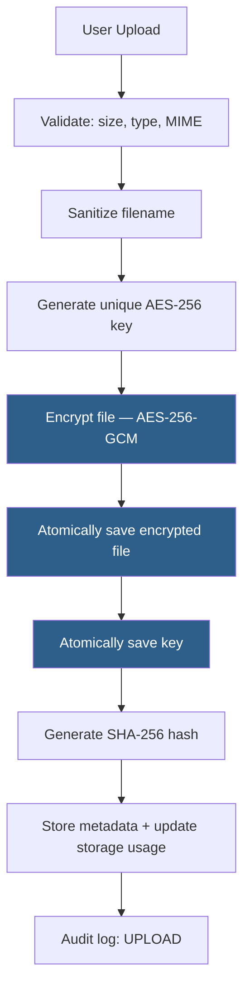
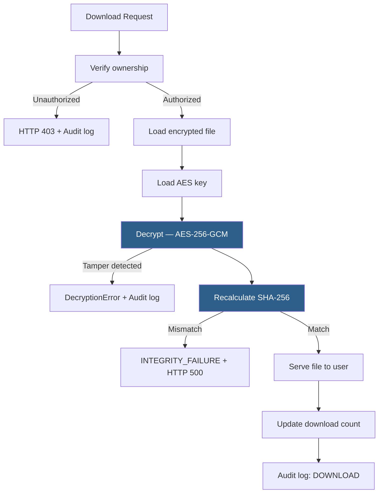
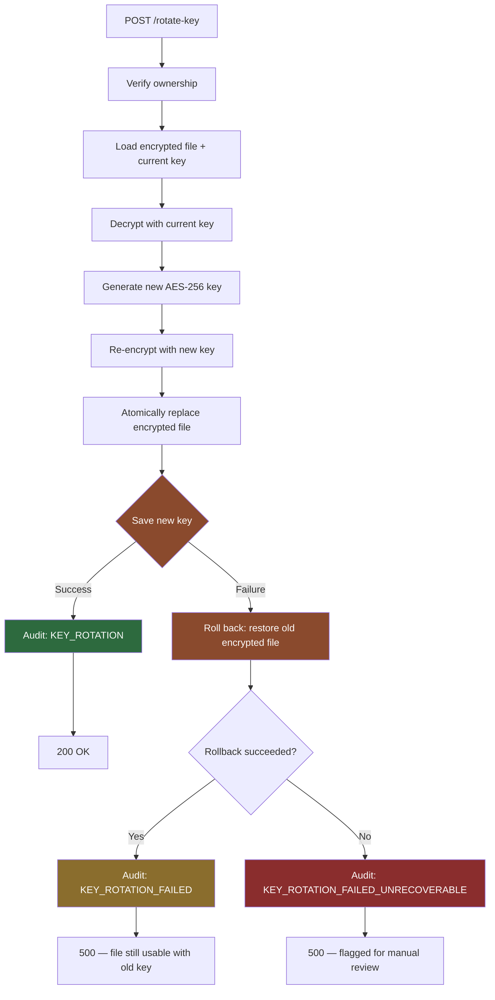
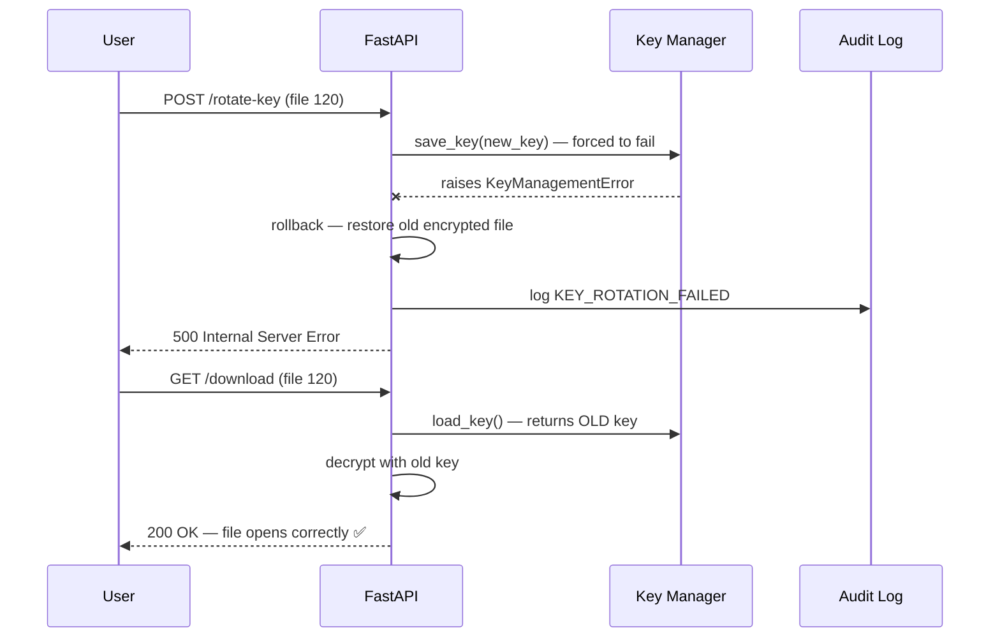
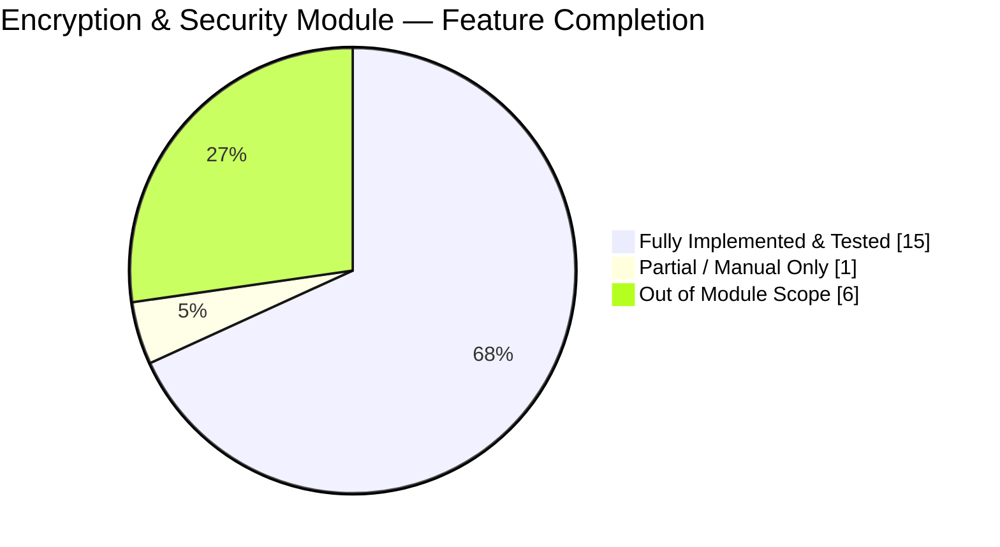
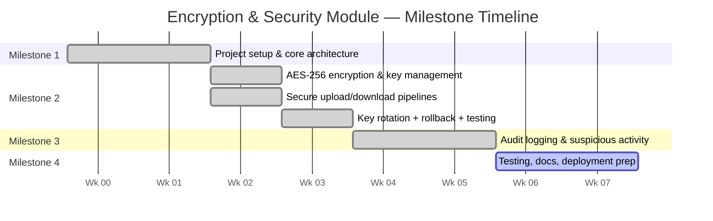

# TrustShare — Encryption & Security Module


Server-side encryption, key management, and integrity subsystem for **TrustShare**, a secure file-sharing platform. This module is responsible for making sure every file that touches disk is encrypted, every key is managed safely, every download is verified for tampering, and every sensitive action is auditable.

This README documents the module I was assigned within the larger TrustShare project — what was built, why it was built that way, and how it was tested.

---

**Author:** Badal Kumar Rai
**Role:** Encryption & Security Module — TrustShare Secure File-Sharing System
**Email:** badalrai242@gmail.com
**GitHub:** [@your-github-handle](https://github.com/badalrai21)

---

📋 Jump to: [Milestone 1](#milestone-1--project-initialization--core-setup) · [Milestone 2](#milestone-2--encryption--secure-sharing) · [Milestone 3](#milestone-3--monitoring-notifications--analytics) · [Milestone 4](#milestone-4--testing-deployment--documentation)

---

## 1. What This Module Does

TrustShare lets users upload, store, and share files securely. This module owns the part of that pipeline where a file stops being "just a file" and becomes an encrypted, integrity-verified, access-controlled object on disk.

Concretely, it is responsible for:

- Validating uploads before anything touches disk
- Encrypting every file with AES-256 before storage
- Generating and managing a unique encryption key per file
- Verifying file integrity with SHA-256 on every download
- Rotating encryption keys on demand, safely
- Detecting and logging unauthorized or suspicious access
- Producing a complete audit trail of every security-relevant action

---

## 2. Architecture & Approach

### 2.1 Design principle: server-side encryption, zero-trust storage

Files are never stored in plaintext, anywhere. The encryption boundary sits entirely on the server — the storage layer (local disk today, designed to extend to AWS S3 / Azure Blob later) only ever sees ciphertext. This means even if the storage layer were compromised, files remain unreadable without the corresponding key, which is kept separately.





### 2.2 Why AES-256-GCM specifically

GCM (Galois/Counter Mode) was chosen over a plain mode like CBC because it provides **authenticated encryption** — it detects tampering as part of decryption itself, not as a separate step. Every encrypted file carries a random 12-byte nonce (prefixed to the ciphertext) and an authentication tag. If a single byte of the ciphertext is altered, decryption fails outright rather than silently returning corrupted data. This is layered on top of the separate SHA-256 integrity check for defense in depth.

### 2.3 Why one key per file, not one key for everything

A single master key is a single point of failure — compromise it, and every file in the system is exposed at once. Generating a unique 256-bit key per file means a compromised key exposes exactly one file. Keys are stored separately from the encrypted files they protect and are never exposed to end users or returned in any API response.

### 2.4 Why atomic writes

Early in development, both the encrypted-file save and the key save used a plain `open(path, "wb")`. That's dangerous specifically for a security module: if the process crashes or throws mid-write (disk full, permission error, power loss), you can be left with a truncated ciphertext file or a half-written key — both unrecoverable.

This was fixed by writing to a temporary file first, flushing and `fsync`-ing it to disk, then using `os.replace()` to atomically swap it into place. `os.replace()` is atomic at the OS level, so a reader never sees a partially-written file — it either sees the old complete file or the new complete file, never something in between.

### 2.5 Why key rotation needed rollback logic

Key rotation is a two-step disk operation: replace the encrypted file with a version re-encrypted under a new key, then replace the stored key. Making each write individually atomic (2.4) isn't enough on its own — if the file write succeeds but the key write then fails, you're left with ciphertext encrypted under a key that was never actually saved. The file becomes permanently undecryptable.

To close this, rotation keeps the original ciphertext in memory and restores it if the key write fails, so the file and the key on disk are never left out of sync. This handles the realistic failure cases (disk full, permission errors, I/O exceptions) that raise a catchable exception. It is explicitly **not** designed to survive a hard process crash in the exact instant between the two writes — true crash-proof atomicity across two files would require a write-ahead log or versioned storage, which was judged out of scope for this module relative to the value it would add. This tradeoff is documented rather than silently assumed.

---

## 3. What Was Implemented

| Area | Details |
|---|---|
| **Upload validation** | Filename, empty-file, max size (100MB), extension whitelist, MIME whitelist, proper 400/413 errors |
| **Filename sanitization** | Strips directory traversal, invalid characters, control characters; safe default if empty |
| **AES-256-GCM encryption** | Authenticated encryption, random nonce per file, tamper detection built into decryption |
| **Key management** | One key per file, atomic save/load/delete, missing-key detection |
| **Secure storage** | Atomic encrypted file save/load/delete, abstracted for future cloud storage backends |
| **SHA-256 integrity verification** | Chunked hashing (64KB), recalculated and compared on every download |
| **Key rotation** | On-demand key rotation via API, atomic writes on both sides, rollback on partial failure |
| **Authorization** | Every file operation checks ownership; unauthorized attempts return 403 and are logged |
| **Suspicious activity detection** | 5+ unauthorized attempts on a resource escalates to a critical audit event |
| **Audit logging** | Every security-relevant action recorded with user, action, resource, and severity level |
| **Download tracking** | Download count and last-downloaded timestamp maintained per file |
| **Secure delete** | Encrypted file, key, and metadata all removed on delete, with storage usage updated |
| **Custom exceptions** | `EncryptionError`, `DecryptionError`, `IntegrityError`, `KeyManagementError` for precise error handling |

---

## 4. Key Rotation — How It Works

Exposed via:
```
POST /api/files/{file_id}/rotate-key
```

**Flow:**
1. Verify the requester owns the file
2. Load the existing encrypted file and current key
3. Decrypt with the current key
4. Generate a new AES-256 key
5. Re-encrypt the plaintext with the new key
6. Atomically replace the encrypted file on disk
7. Atomically replace the stored key
   - If this step fails, the previous encrypted file is restored, and the failure is audit-logged (`KEY_ROTATION_FAILED`)
   - If the rollback itself somehow fails, this is escalated as `KEY_ROTATION_FAILED_UNRECOVERABLE` for manual investigation
8. Record `KEY_ROTATION` in the audit log on success



Rotation is currently **manual**, triggered via the API. A 90-day rotation policy constant (`KEY_ROTATION_DAYS`) and a `should_rotate()` helper are defined for a future scheduled-rotation job, but are not yet wired to an automatic trigger — this is documented rather than implied.

---

## 5. Testing & Verification

All of the following were tested manually against a running instance via Swagger/OpenAPI and verified directly against the SQLite audit log table.

| Test Case | Steps | Result |
|---|---|---|
| Normal key rotation | Upload → rotate key → download | `rotate-key` → 200 OK. File downloads and opens correctly using the new key. |
| Rotation failure handling | Forced `save_key()` to raise → attempted rotation | `rotate-key` → 500. `KEY_ROTATION_FAILED` correctly written to audit log with level `error`. |
| Rollback integrity | Downloaded the file immediately after the forced rotation failure | `download` → 200 OK. File still opens correctly — confirms the encrypted file on disk was correctly rolled back to match the surviving (old) key. |

Observed audit trail for a single test file across this sequence:
```
UPLOAD → KEY_ROTATION → DOWNLOAD → DOWNLOAD → KEY_ROTATION_FAILED
```



This confirms the rollback logic isn't just theoretical — a real induced failure was caught, logged, rolled back, and the file remained usable afterward.

---

## 6. Milestone Checklists

The PSD defines four milestones for the overall TrustShare project. Below is this module's (Encryption & Security) contribution and status at each stage — tracked separately so progress is traceable milestone by milestone rather than as one flat list.

### Overall Progress





---

### Milestone 1 — Project Initialization & Core Setup
*(Weeks 1–2, per PSD)*

This module's contribution at this stage was foundational — establishing the security primitives everything later depends on.

| Deliverable | Status |
|---|:---:|
| Secure architecture design (encryption boundary, key storage separation) | ✅ |
| Upload validation (size, type, MIME whitelist) | ✅ |
| Filename sanitization | ✅ |
| Custom security exception types defined | ✅ |

---

### Milestone 2 — Encryption & Secure Sharing
*(Weeks 3–4, per PSD)* — **primary scope of this module**

| Deliverable (per PSD) | Status | Notes |
|---|:---:|---|
| AES-256 server-side encryption workflows | ✅ | AES-256-GCM, authenticated encryption |
| Encrypted file retrieval workflows | ✅ | Full download pipeline with decryption |
| Encryption key management | ✅ | Per-file keys, atomic storage, secure lifecycle |
| Secure file decryption workflows | ✅ | AES-GCM decryption with built-in tamper detection |
| **Key rotation** | ✅ | Atomic writes both sides + rollback on partial failure — see [§4](#4-key-rotation--how-it-works) |
| Secure cloud storage integration | 🟡 | Storage layer abstracted for AWS S3 / Azure Blob; local disk only for now |
| Access permissions & access control | 🟡 | Ownership checks implemented here; full RBAC owned by Auth module |
| Secure sharing / temporary links | ⛔ | Owned by Sharing module, not this one |

**Result:** this module satisfies every item under the PSD's "Security Features" and "Key Management" sections that falls within its own scope. Key rotation — the one gap identified during review — is now implemented, hardened against partial-write failure, and verified with induced-failure testing (see [§5](#5-testing--verification)).

---

### Milestone 3 — Monitoring, Notifications & Analytics
*(Weeks 5–6, per PSD)*

| Deliverable | Status | Notes |
|---|:---:|---|
| Audit logging workflows | ✅ | 12 distinct action types tracked, including rotation success/failure |
| Suspicious activity detection | ✅ | 5+ unauthorized attempts → critical audit event |
| Security event / access history | ✅ | Download tracking, unauthorized access logging |
| Storage analytics dashboard | ⛔ | Owned by Analytics module |
| Notification/alert system | ⛔ | Owned by Notification module |

---

### Milestone 4 — Testing, Deployment & Documentation
*(Weeks 7–8, per PSD)*

| Deliverable | Status | Notes |
|---|:---:|---|
| Security testing of upload/download pipeline | ✅ | Manually verified via Swagger + audit log inspection |
| Key rotation failure-mode testing | ✅ | Forced-failure test + rollback verification (see [§5](#5-testing--verification)) |
| Module documentation | ✅ | This README + inline docstrings |
| Production hardening (rate limiting, headers, secret scanning) | ⛔ | Application-wide, outside this module's direct scope — see [§8](#8-known-limitations--open-items) |
| Deployment (Docker/cloud) | ⛔ | Owned by DevOps/infrastructure setup, not this module |

---

## 7. Tech Stack (this module)

- **Language:** Python
- **Framework:** FastAPI
- **Encryption:** `cryptography` library — AES-256-GCM
- **Hashing:** SHA-256 (chunked, 64KB)
- **ORM / DB:** SQLAlchemy + PostgreSQL (metadata), audit logs
- **Key storage:** Local filesystem (`keys/`), abstracted for future migration to a managed secrets store
- **File storage:** Local filesystem (`uploads/`), abstracted for future migration to AWS S3 / Azure Blob

---

## 8. Known Limitations & Open Items

These are documented deliberately rather than left implicit, so scope is clear for review:

- **Rollback is exception-safe, not crash-safe.** It recovers from disk errors, permission failures, and other catchable exceptions during rotation. It does not guarantee consistency if the process is killed mid-operation (e.g. OS crash, power loss) — true protection against that would require write-ahead logging or file versioning, which was judged disproportionate to this module's scope.
- **Automatic scheduled key rotation is not yet wired up.** The 90-day policy and `should_rotate()` check exist but currently require a scheduler (e.g. a cron job or background task) to be connected — rotation today is manual, via API call only.
- **"Secure Token Generation"**, listed under the PSD's Security Features for this module, is not implemented here — this most likely belongs to the Sharing module (temporary share-link tokens), and should be confirmed with whoever owns that module rather than duplicated here.
- The following are broader application-hardening concerns that fall outside this module's direct scope and are owned elsewhere in the project: rate limiting, malware/virus scanning on upload, security response headers (HSTS/CSP/etc.), environment-variable secret loading review, and audit logging of request metadata (IP/User-Agent).

---

## 9. File Structure (relevant to this module)

```
server/src/
├── security/
│   ├── encryption.py       # AES-256-GCM encrypt/decrypt
│   ├── key_manager.py      # Key generation, atomic save/load/delete
│   ├── key_rotation.py     # Rotation policy (should_rotate, KEY_ROTATION_DAYS)
│   ├── secure_storage.py   # Atomic encrypted file save/load/delete
│   ├── hashing.py          # SHA-256 chunked hashing
│   ├── validators.py       # Upload validation
│   └── exceptions.py       # EncryptionError, DecryptionError, IntegrityError, KeyManagementError
├── files/
│   ├── service.py          # Upload/download/delete/rotate pipelines, audit logging
│   └── controller.py       # API routes, including POST /files/{id}/rotate-key
└── entities/
    └── file.py              # File metadata model
```

---

## About the Author

This module — encryption, key management, secure storage, integrity verification, and key rotation — was designed, implemented, and tested by me as part of the TrustShare project.

**Badal Kumar Rai**
Encryption & Security Module Developer, TrustShare

📧 badalrai242@gmail.com
🔗 [GitHub](https://github.com/badalrai21) · 

*If you have questions about this module's design decisions, implementation, or test coverage, feel free to reach out.*

---

<p align="center">
  <sub>Built with care for security, atomicity, and honest documentation of what's done and what's not. — Badal, 2026</sub>
</p>